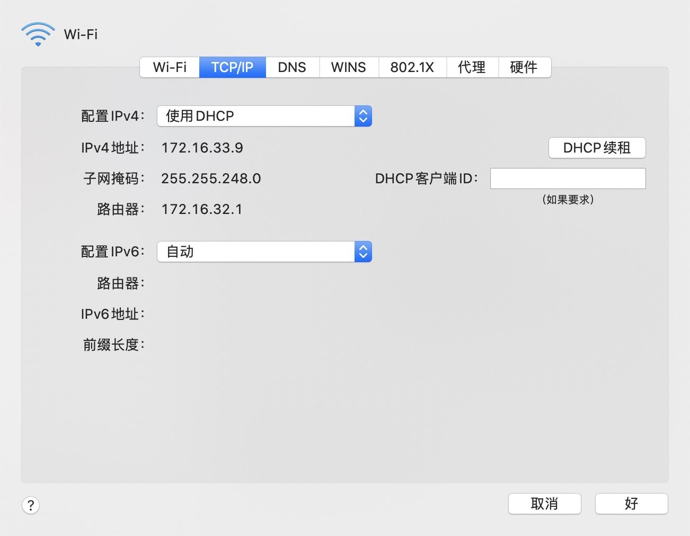

# HDFS安装2.0部署流程(超详细)

## 一、Linux环境安装

​		Linux环境安装不是本地文章重点, 如果需要了解可以参考下面连接内容

### 1.1 windows环境安装Centos7

​		https://blog.csdn.net/babyxue/article/details/80970526

### 1.2 MAC环境安装Centos7

​		https://www.jianshu.com/p/b1698c7ee770

## 二、下载安装Jdk

​		具体下载哪个版本, 可以查询下面官方连接

> https://cwiki.apache.org/confluence/display/HADOOP/Hadoop+Java+Versions

> https://cwiki.apache.org/confluence/display/HADOOP2/HadoopJavaVersions

​	本篇文章下载的是 jdk-8u231-linux-x64.tar.gz , 读者可以根据需要下载适合自己的版本

### 2.1 下载jdk(系统是Mac)

​		https://www.oracle.com/cn/java/technologies/javase-jdk8-downloads.html 选择适合自己操作系统的jdk

### 2.2 上传文件到Linux服务器

		> scp /Users/username/Downloads/jdk-8u231-linux-x64.tar.gz root@172.16.193.131:/root/

### 2.3 解压缩、安装jdk文件

- 解压缩文件到当前目录	<font color="#f0f">tar -zxvf jdk-8u231-linux-x64.tar.gz</font>

- 移动文件到指定目录  <font color="#f0f">mv  jdk1.8.0_231/ /usr/local/jdk8</font>

- 添加jdk配置 <font color="#f0f">vi /etc/profile</font>

  添加下面配置到文件末尾

  ```shell
  export JAVA_HOME=/usr/local/jdk8
  export JRE_HOME=${JAVA_HOME}/jre
  export CLASSPATH=.:${JAVA_HOME}/lib:${JRE_HOME}/lib
  export PATH=${JAVA_HOME}/bin:$PATH
  ```

- 重新加载配置文件

  > source /etc/profile

- 查看jdk是否激活

  ```shell
  [root@localhost ~]# java -version
  java version "1.8.0_231"
  Java(TM) SE Runtime Environment (build 1.8.0_231-b11)
  Java HotSpot(TM) 64-Bit Server VM (build 25.231-b11, mixed mode)
  ```

  

## 三、调整服务器时间

- ntpdate time.nist.gov

- 如果提示	-bash: ntpdate: 未找到命令  , 执行命令  yum install ntpdate , 进行软件安装


## 四、配置服务器为固定ip地址

​		参考文章 https://blog.51cto.com/driver2ice/2432011

### 4.1 调整虚拟机和Mac主机连接方式为 -- 桥接方式

		

### 4.2 获取本机Mac相关网络配置



### 4.3 获取本机DNS配置


### 4.4 配置虚拟机网卡信息

```shell
// 1. 进入网卡目录, 并打开网卡文件
# cd /etc/sysconfig/network-scripts/
# vim ifcfg-ens33

// 2. 修改网卡内容如下
  TYPE=Ethernet
  PROXY_METHOD=none
  BROWSER_ONLY=no
  BOOTPROTO=static
  DEFROUTE=yes
  IPV4_FAILURE_FATAL=no
  IPV6INIT=yes
  IPV6_AUTOCONF=yes
  IPV6_DEFROUTE=yes
  IPV6_FAILURE_FATAL=no
  IPV6_ADDR_GEN_MODE=stable-privacy
  NAME=ens33
  UUID=f47bde51-fa78-4f79-b68f-d5dd90cfc698
  DEVICE=ens33
  ONBOOT=yes
  
  IPADDR=192.168.1.100
  NETMASK=255.255.255.0
  GATEWAY=192.168.1.1
  DNS1=114.114.114.114
  DNS2=221.12.1.227
```

### 4.5 重启网卡

```shell
# systemctl restart network
```

### 4.6 检测网络是否可用 

​	执行ping 命令, 如果可以正常访问, 说明配置成功

```shell
# ping baidu.com
```


## 五、关闭防火墙

### 5.1 查看防火墙状态

```shell
# firewall-cmd --state
```

### 5.2 关闭防火墙

```shell
# systemctl stop firewalld.service
```

### 5.3 禁止防火墙启动

```shell
# systemctl disable firewalld.service
```


## 六、配置host

​	**集群整体架构如下**

|        | IP            | NameNode | JournalNode | DataNode | Zookeeper | Zookeeper Failover Config | Resource Manager |
| ------ | ------------- | -------- | ----------- | -------- | --------- | ------------------------- | ---------------- |
| master | 192.168.1.100 | 是       | 是          | 是       | 是        | 是                        |                  |
| node01 | 192.168.1.101 | 是       | 是          | 是       | 是        | 是                        | 是               |
| node02 | 191.168.1.102 |          | 是          | 是       | 是        |                           | 是               |


```shell
//1. 进入、打开hosts文件
# cd /etc
# vim hosts

//2. 在文件末尾添加配置
master 192.168.1.100
node01 192.168.1.101
node02 192.168.1.102

```


## 七、配置集群之间免密钥登陆

### 7.1 配置免密钥 ssh-keygen

```shell
// 进入根目录
# cd ~
# ssh-keygen
// 回车三次即可, 可以通过 ls -a 进行查看
```

### 7.2 将生成的文件拷贝到其它节点

```shell
# ssh-copy-id master
# ssh-copy-id node01
# ssh-copy-id node02
```

### 7.3 验证免密钥登陆正常

```shell
# ssh master
# ssh node01
# ssh node02
```


## 八、配置Zookeeper信息

### 8.1 解压缩zookeeper到指定目录

```shell
# tar -zxvf apache-zookeeper-3.5.7-bin.tar.gz -C /usr/local/
```

### 8.2 配置zookeeper相关配置信息

​		先进入配置文件所在的目录 ${ZOOKEEPER_HOME}/conf

```shell
# 1. 创建配置文件信息 
cp zoo-example.cfg zoo.cfg
# 2. 配置数据文件存放位置
dataDir=/usr/local/apache-zookeeper-3.5.7/data
# 3. 配置集群信息
server.1=master:2888:3888
server.2=node01:2888:3888
server.3=node02:2888:3888
# 4. 配置当前节点在集群中的身份
# 4.1 在 dataDir 所在的文件夹内创建文件
touch myid
# 4.2 配置当前节点的身份
echo 1 > myid
```


## 九、配置hadoop相关配置文件

​	进入hadoop安装目录下配置文件位置, ${HADOOP_HOME}/etc/hadoop/

### 9.1 配置 hadoop-env.sh 文件

```shell
// 打开 hadoop 环境配置文件
# vim hadoop-env.sh
// 配置JAVA_HOME
export JAVA_HOME=/usr/local/jdk8
```

### 9.2 配置core-site.xml

```xml
<configuration>
        <property>
                <name>fs.defaultFS</name>
                <value>hdfs://ityongman</value>
        </property>
        <property>
                 <name>ha.zookeeper.quorum</name>
                 <value>master:2181,node01:2181,node02:2181</value>
        </property>
        <property>
                 <name>hadoop.tmp.dir</name>
                 <value>/usr/local/hadoop-2.10.0/data</value>
        </property>
  			
  			<!-- 如果NameNode启动后, 隔短暂时间又停止了, 可以配置下面的两个参数, 默认情况下可以不配置 -->
        <property>
                <name>ipc.client.connect.max.retries</name>
                <value>10</value>
        </property>
        <property>
                <name>ipc.client.connect.retry.interval</name>
                <value>5000</value>
        </property>
</configuration>

```

### 9.3 配置hadoop-site.xml

```xml
<configuration>
        <property>
                <name>dfs.nameservices</name>
                <value>ityongman</value>
        </property>
        <property>
                <name>dfs.ha.namenodes.ityongman</name>
                <value>nn1,nn2</value>
        </property>
        <property>
                <name>dfs.namenode.rpc-address.ityongman.nn1</name>
                <value>master:8020</value>
        </property>
        <property>
                <name>dfs.namenode.rpc-address.ityongman.nn2</name>
                <value>node01:8020</value>
        </property>
        <property>
                <name>dfs.namenode.http-address.ityongman.nn1</name>
                <value>master:50070</value>
        </property>
        <property>
                <name>dfs.namenode.http-address.ityongman.nn2</name>
                <value>node01:50070</value>
        </property>
        <property>
                <!-- 指定namenode元数据存储在journalnode中的路径 -->
                <name>dfs.namenode.shared.edits.dir</name>
                <value>qjournal://master:8485;node01:8485;node02:8485/ityongman</value>
        </property>
        <property>
                <!-- 指定HDFS客户端连接active namenode的java类 -->
                <name>dfs.client.failover.proxy.provider.ityongman</name>
                <value>org.apache.hadoop.hdfs.server.namenode.ha.ConfiguredFailoverProxyProvider</value>
        </property>
        <property>
                <!-- 配置隔离机制为ssh 防止脑裂 -->
                <name>dfs.ha.fencing.methods</name>
                <value>sshfence</value>
        </property>
        <property>
                <!-- 指定秘钥的位置 -->
                <name>dfs.ha.fencing.ssh.private-key-files</name>
                <value>/root/.ssh/id_dsa</value>
        </property>
        <property>
                <!-- 指定journalnode日志文件存储的路径 -->
                <name>dfs.journalnode.edits.dir</name>
                <value>/usr/local/hadoop-2.10.0/data</value>
        </property>
        <property>
                <!-- 开启自动故障转移 -->
                <name>dfs.ha.automatic-failover.enabled</name>
                <value>true</value>
        </property>
</configuration> 
```

### 9.4 配置mapred-site.xml

```xml
<configuration>
        <property>
                <name>mapreduce.framework.name</name>
                <value>yarn</value>
        </property>
</configuration>
```

### 9.5 配置yarn-site.xml

```xml
<configuration>
  <property>
          <name>yarn.nodemanager.aux-services</name>
          <value>mapreduce_shuffle</value>
      </property>
  <property>
     <name>yarn.resourcemanager.ha.enabled</name>
     <value>true</value>
   </property>
   <property>
     <name>yarn.resourcemanager.cluster-id</name>
     <value>mr_ityongman</value>
   </property>
   <property>
     <name>yarn.resourcemanager.ha.rm-ids</name>
     <value>rm1,rm2</value>
   </property>
   <property>
     <name>yarn.resourcemanager.hostname.rm1</name>
     <value>node01</value>
   </property>
   <property>
     <name>yarn.resourcemanager.hostname.rm2</name>
     <value>node02</value>
   </property>
   <property>
     <name>yarn.resourcemanager.zk-address</name>
     <value>master:2181,node01:2181,node02:2181</value>
   </property>
 </configuration>
```


### 9.6 配置slavers(就是DataNode)节点信息

```shell
# vim slavers
# 填写下面信息(注意每个数据一行)
master
node01
node02
```


## 十、配置Hadoop环境变量, 并启动、关闭服务器

### 10.1 配置hadoop环境变量

```shell
// 进入根目录
# cd ~
# vim .bash_profiles
// 在文件末尾添加下面信息
export HADOOP_HOME=/usr/local/hadoop-2.10.0
export PATH=$PATH:$HADOOP_HOME/bin:$HADOOP_HOME/sbin
export ZOOKEEPER_HOME=/usr/local/apache-zookeeper-3.5.7
export PATH=$PATH:$ZOOKEEPER_HOME/bin
// 激活新配置的内容
# source .bash_profiles
```

### 10.2 将相关文件copy到其它服务节点

```shell
# scp -r /usr/local/apache-zookeeper-3.5.7 root@node01:/usr/local
# scp -r /usr/local/hadoop-2.10.0 root@node01:/usr/local
# scp ~.bash_profile root@node01:/root
```


### 10.3 启动hadoop集群

```shell
// 1. 启动三个zookeeper
# zkServer.sh start
// 2. 启动三个JournalNode
# hadoop-daemon.sh start journalnode
// 3. 在其中一个namenode上格式化
# hdfs namenode -format
// 4. 把刚刚格式化之后的元数据拷贝到另外一个namenode上
// 4.1 启动刚刚格式化的namenode
# hadoop-daemon.sh start namenode
// 4.2 在没有格式化的namenode上执行
# hdfs namenode -bootstrapStandby
// 4.3 启动第二个namenode    
# hadoop-daemon.sh start namenode
// 5. 在其中一个namenode上初始化zkfc
# hdfs zkfc -formatZK
// 6. 停止上面节点
# stop-dfs.sh
// 7. 全面启动
# start-dfs.sh
// 8. 启动ResourceManager (只需要在需要启动的服务节点上进行启动)
# yarn-daemon.sh start resourcemanager
```

​	通过浏览器查询节点是否可以正常访问 http://192.168.1.100:50070 , 如果可以打开, 说明可以正常访问

### 10.4 可能的问题

#### 10.4.1 hadoop HA 集群namenode无法自动切换为active

> 可能是 无法进行fence , 即下面的配置没有生效
>
> ```shell
>  <property>
>  		<!-- 配置隔离机制为ssh 防止脑裂 -->
>  		<name>dfs.ha.fencing.methods</name>
>  		<value>sshfence</value>
>  </property>
> ```
>
> 原因是: 未找到fuster程序, 通过下面的命令安装相关程序
>
> ```shell
> yum install psmisc
> ```
>
> 

#### 10.4.2 拒绝连接

> 可以访问下面的地址排查 https://cwiki.apache.org/confluence/display/HADOOP2/ConnectionRefused

> 如果在指定的地址处有一台计算机，但是没有程序在客户端使用的特定TCP端口上侦听-并且没有防火墙以静默方式丢弃TCP连接请求的方式，则会出现[ConnectionRefused](https://cwiki.apache.org/confluence/display/HADOOP2/ConnectionRefused) Exception。如果您不知道什么是TCP连接请求，请查阅[规范](http://www.ietf.org/rfc/rfc793.txt)。

> 除非两端都出现配置错误，否则导致此错误的常见原因是Hadoop服务未运行。

> 当集群关闭时，这种堆栈跟踪非常常见-因为那时Hadoop服务正在集群中拆除，这对于那些尚未关闭的服务和应用程序是可见的。无需在群集关闭期间看到此错误消息。

> 如果应用程序或群集无法正常运行，并且此消息出现在日志中，则情况更为严重。

> 异常文本声明连接失败的主机名和端口。该端口可用于识别服务。例如，端口9000是HDFS端口。请查阅[Ambari端口参考](https://ambari.apache.org/1.2.5/installing-hadoop-using-ambari/content/reference_chap2.html)和/或Hadoop管理工具供应商的[参考](https://ambari.apache.org/1.2.5/installing-hadoop-using-ambari/content/reference_chap2.html)。

1. 检查客户端使用的主机名是否正确。如果在Hadoop配置选项中：请仔细检查，尝试手动执行ping操作。
2. 检查客户端尝试与之交谈的IP地址以确保主机名正确。
3. 确保异常中的目标地址不是0.0.0.0-这意味着您实际上并未为客户端配置该服务的真实地址，而是选择了服务器端属性来告诉其监听每个连接端口。
4. 如果错误消息表明远程服务位于“ 127.0.0.1”或“ localhost”上，则表示配置文件告诉客户端该服务位于本地服务器上。如果您的客户端尝试与远程系统通信，则您的配置已损坏。
5. 检查主机名中是否没有映射到127.0.0.1或127.0.1.1的主机名`/etc/hosts`（Ubuntu对此很出名）。
6. 使用服务器正在提供服务的匹配项，检查客户端尝试与之通信的端口。该`netstat`命令在那里有用。
7. 在服务器上，尝试尝试`telnet localhost `查看端口是否在其中打开。
8. 在客户端上，尝试尝试`telnet  `查看该端口是否可以远程访问。
9. 尝试从另一台计算机连接到服务器/端口，以查看它是否只是单个客户端的行为异常。
10. 如果您的客户端和服务器位于不同的子域中，则可能是该服务的配置仅发布基本主机名，而不发布完全合格的域名。另一个子域中的客户端可能会无意间尝试绑定到本地子域中的主机，并且会失败。
11. 如果您使用的是第三方提供的基于Hadoop的产品，请使用供应商提供的支持渠道。
12. 请不要提交与您的问题相关的错误报告，因为它们将因[无效](http://wiki.apache.org/hadoop/InvalidJiraIssues)而关闭