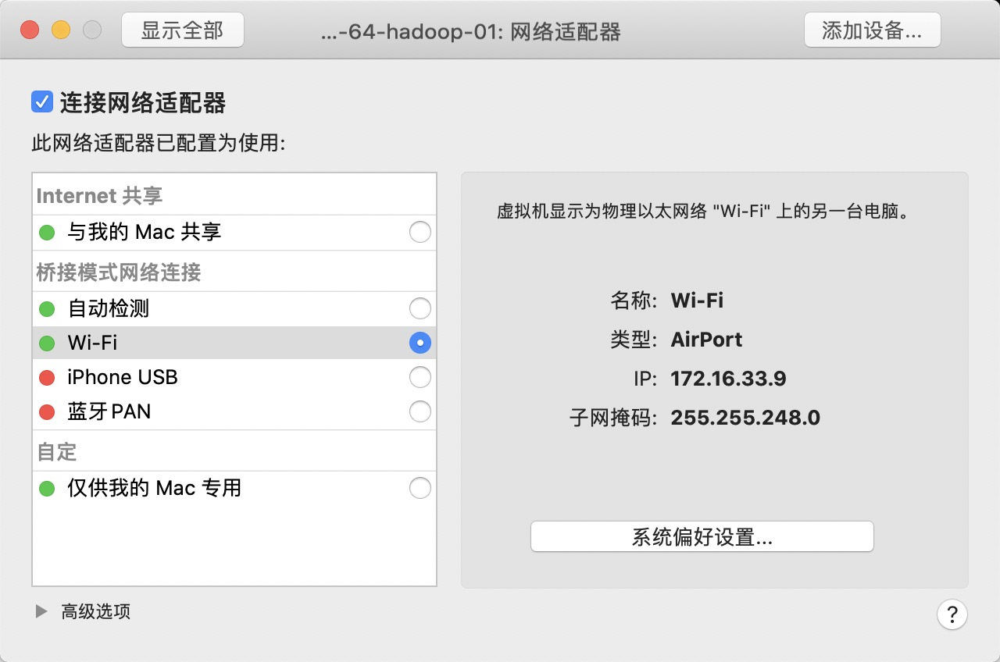
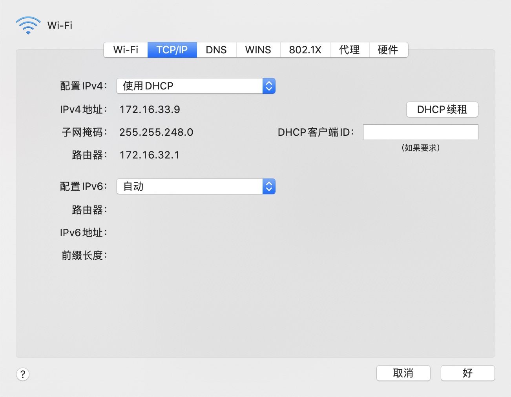
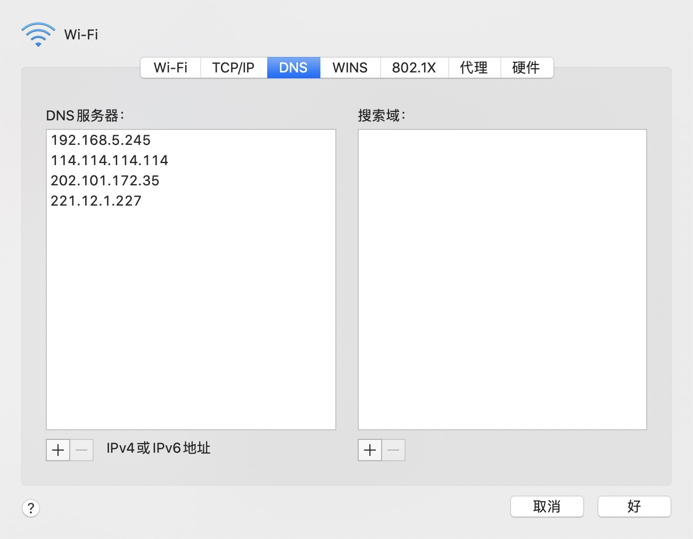
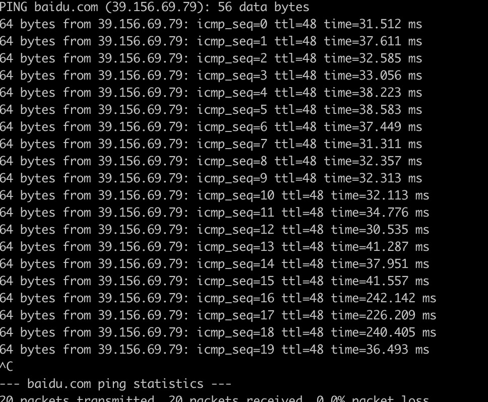

# HDFS安装1.0流程(超详细)

## 一、Linux环境安装

​		Linux环境安装不是本地文章重点, 如果需要了解可以参考下面连接内容

### 1.1 windows环境安装Centos7

​		https://blog.csdn.net/babyxue/article/details/80970526

### 1.2 MAC环境安装Centos7

​		https://www.jianshu.com/p/b1698c7ee770

## 二、下载安装Jdk

​		具体下载哪个版本, 可以查询下面官方连接

> https://cwiki.apache.org/confluence/display/HADOOP/Hadoop+Java+Versions

> https://cwiki.apache.org/confluence/display/HADOOP2/HadoopJavaVersions

​	本篇文章下载的是 jdk-8u231-linux-x64.tar.gz , 读者可以根据需要下载适合自己的版本

### 2.1 下载jdk(系统是Mac)

​		https://www.oracle.com/cn/java/technologies/javase-jdk8-downloads.html 选择适合自己操作系统的jdk

### 2.2 上传文件到Linux服务器

		> scp /Users/username/Downloads/jdk-8u231-linux-x64.tar.gz root@172.16.193.131:/root/

### 2.3 解压缩、安装jdk文件

- 解压缩文件到当前目录	<font color="#f0f">tar -zxvf jdk-8u231-linux-x64.tar.gz</font>

- 移动文件到指定目录  <font color="#f0f">mv  jdk1.8.0_231/ /usr/local/jdk8</font>

- 添加jdk配置 <font color="#f0f">vi /etc/profile</font>

  添加下面配置到文件末尾

  ```shell
  export JAVA_HOME=/usr/local/jdk8
  export JRE_HOME=${JAVA_HOME}/jre
  export CLASSPATH=.:${JAVA_HOME}/lib:${JRE_HOME}/lib
  export PATH=${JAVA_HOME}/bin:$PATH
  ```

- 重新加载配置文件

  > source /etc/profile

- 查看jdk是否激活

  ```shell
  [root@localhost ~]# java -version
  java version "1.8.0_231"
  Java(TM) SE Runtime Environment (build 1.8.0_231-b11)
  Java HotSpot(TM) 64-Bit Server VM (build 25.231-b11, mixed mode)
  ```

  

## 三、调整服务器时间

- ntpdate time.nist.gov

- 如果提示	-bash: ntpdate: 未找到命令  , 执行命令  yum install ntpdate , 进行软件安装


## 四、配置服务器为固定ip地址

​		参考文章 https://blog.51cto.com/driver2ice/2432011

### 4.1 调整虚拟机和Mac主机连接方式为 -- 桥接方式

		

### 4.2 获取本机Mac相关网络配置



### 4.3 获取本机DNS配置



### 4.4 配置虚拟机网卡信息

```shell
// 1. 进入网卡目录, 并打开网卡文件
# cd /etc/sysconfig/network-scripts/
# vim ifcfg-ens33

// 2. 修改网卡内容如下
  TYPE=Ethernet
  PROXY_METHOD=none
  BROWSER_ONLY=no
  BOOTPROTO=static
  DEFROUTE=yes
  IPV4_FAILURE_FATAL=no
  IPV6INIT=yes
  IPV6_AUTOCONF=yes
  IPV6_DEFROUTE=yes
  IPV6_FAILURE_FATAL=no
  IPV6_ADDR_GEN_MODE=stable-privacy
  NAME=ens33
  UUID=f47bde51-fa78-4f79-b68f-d5dd90cfc698
  DEVICE=ens33
  ONBOOT=yes
  
  IPADDR=192.168.1.100
  NETMASK=255.255.255.0
  GATEWAY=192.168.1.1
  DNS1=114.114.114.114
  DNS2=221.12.1.227
```

### 4.5 重启网卡

```shell
# systemctl restart network
```

### 4.6 检测网络是否可用 

​	执行ping 命令, 如果可以正常访问, 说明配置成功

```shell
# ping baidu.com
```




## 五、关闭防火墙

### 5.1 查看防火墙状态

```shell
# firewall-cmd --state
```

### 5.2 关闭防火墙

```shell
# systemctl stop firewalld.service
```

### 5.3 禁止防火墙启动

```shell
# systemctl disable firewalld.service
```


## 六、配置host

​	集群整体架构如下

|        | IP            | NameNode | SecondNameNode | DataNode |
| ------ | ------------- | -------- | -------------- | -------- |
| master | 192.168.1.100 | 是       | 否             | 是       |
| node01 | 192.168.1.101 | 否       | 是             | 是       |
| node02 | 191.168.1.102 | 否       | 否             | 是       |


```shell
//1. 进入、打开hosts文件
# cd /etc
# vim hosts

//2. 在文件末尾添加配置
master 192.168.1.100
node01 192.168.1.101
node02 192.168.1.102

```


## 七、配置集群之间免密钥登陆

### 7.1 配置免密钥 ssh-keygen

```shell
// 进入根目录
# cd ~
# ssh-keygen
// 回车三次即可, 可以通过 ls -a 进行查看
```

### 7.2 将生成的文件拷贝到其它节点

```shell
# ssh-copy-id master
# ssh-copy-id node01
# ssh-copy-id node02
```

### 7.3 验证免密钥登陆正常

```shell
# ssh master
# ssh node01
# ssh node02
```


## 八、配置hadoop相关配置文件

​	进入hadoop安装目录下配置文件位置, ${HADOOP_HOME}/etc/hadoop/

### 8.1 配置 hadoop-env.sh 文件

```shell
// 打开 hadoop 环境配置文件
# vim hadoop-env.sh
// 配置JAVA_HOME
export JAVA_HOME=/usr/loca/jdk8
```

### 8.2 配置core-site.xml

```xml
<configuration>
    <property>
        <name>fs.defaultFS</name>
        <value>hdfs://master:9000</value>
    </property>
    <property>
        <name>hadoop.tmp.dir</name>
        <value>/usr/local/hadoop-2.10.0</value>
    </property>
</configuration>
```

### 8.3 配置hadoop-site.xml

```xml
<configuration>
  	<property>
      <name>dfs.replication</name>
      <value>3</value> <!-- 可以不配置, 默认就是3三个备份--> 
 		</property>
 		<property>
        <name>dfs.namenode.secondary.http-address</name>
        <value>node01:50090</value>
    </property>
		<property>
        <name>dfs.namenode.secondary.https-address</name>
        <value>node01:50091</value>
    </property>
</configuration>
```

### 8.4 配置SecondaryNameNode节点位置

```shell
//创建masters文件, 并配置 SecondaryNameNode 节点信息
# touch masters
# vim masters
// 在masters中填写SNN节点信息, 博主这里是 node01
```


### 8.5 配置slavers(就是DataNode)节点信息

```shell
# vim slavers
# 填写下面信息(注意每个数据一行)
master
node01
node02
```


## 九、配置Hadoop环境变量, 并启动、关闭服务器

### 9.1 配置hadoop环境变量

```shell
// 进入根目录
# cd ~
# vim .bash_profiles
// 在文件末尾添加下面信息
export HADOOP_HOME=/usr/local/hadoop-2.10.0
export PATH=$PATH:$HADOOP_HOME/bin:$HADOOP_HOME/sbin
// 激活新配置的内容
# source .bash_profiles
```


### 9.2 启动hadoop

```shell
# start-dfs.sh
```

​	通过浏览器查询节点是否可以正常访问 http://192.168.1.100:50070 , 如果可以打开, 说明可以正常访问

### 9.3 停止hadoop

```shell
# stop-dfs.sh
```


