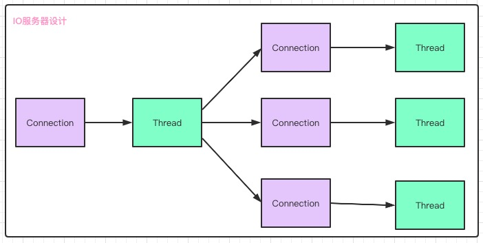
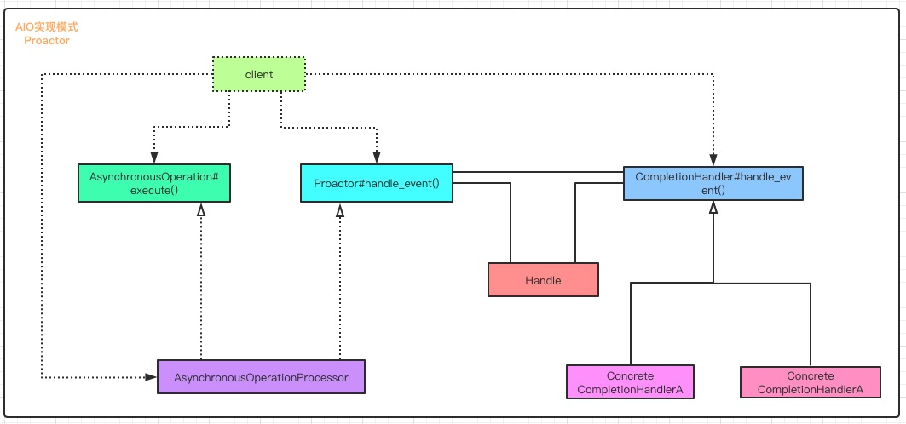

# IO 发展历程(BIO、NIO、AIO)

## 一、包含的知识点

- IO基本概念
  - 阻塞(Block)和非阻塞(Non-Block)
  - 同步(Synchronization)和异步(Asynchronous)
- BIO和NIO对比
- AIO基本原理


## 二、IO相关的基本概念

### 2.1 阻塞(Block)和非阻塞(Non-Block)

​		阻塞和非阻塞是进程进行数据访问时, 如果数据没有准备好时的一种处理方式

> 阻塞: 需要等待缓冲区中的数据准备好后才处理其它事情, 否则一直等待

> 非阻塞: 当进程访问缓冲区中的数据, 如果数据没有准备好直接返回, 不会等待


### 2.2 同步(Synchronization)和异步(Asynchronous)

​		同步和异步是根据**<font color="#f00">应用程序和操作系统</font>**交互方式来确定的

- **同步方式**: 应用程序需要直接参与IO读写操作 , 处理IO的时候, 会阻塞到read、write方法上面, 等待IO事件完成, 这个时候不能处理其它事情, 只能等待IO事件完成; 

- **异步方式**: 应用程序不需要参与, 所有的IO读写都交给操作系统, 应用程序可以处理其它, 并不需要同步等待IO完成, 只需操作系统完成后给应用程序一个通知。


## 三、BIO和NIO对比

### 3.1 面向流(Stream)和面向缓冲区(Buffer)

- 面向流: BIO是面向流的, 意味着每次从流中读取一个或多个字节，直至读取所有字节, 并没有对数据进行缓存, 也不能前后移动流中的数据。
- 面向缓存: NIO是面向缓存区的, 程序可以在缓存区中前后移动, 增加了处理过程的灵活性, 但是同时也带来了**复杂性**
  - 需要检查缓冲区中是否包含了所有需要的数据
  - 需要确保更多数据读入缓冲区时, 不能覆盖尚未处理的数据


### 3.2 通道(Channel)

​		Channel是通信载体, 它和流有些像, 但是有几点区别

- 通道可以读也可以写, 是双向的, 流一般是单向的，只能读或写
- 通道可以异步读写, 流只能阻塞读写
- 通道是基于Buffer来读写的


Java 提供下面几种比较常见的Channel实现，一个单独的线程可以管理多个输入、输出通道

- FileChannel
- DatagramChannel
- SocketChannel
- ServerSocketChannel


### 3.3 选择器(Selector)

​		选择器(Selector)允许一个单独的线程监视多个输入通道, 可以将多个通道(Channel)注册到一个Selector上, 然后用一个线程从Selector选择通道, 这些被选择的通道已经可以处理输入。这种选择机制可以使用更少的线程管理更多的通道, 解决阻塞问题。


### 3.4 NIO和BIO区别

​		首先看下下面代码, 从代码可以看出, BIO和NIO在代码使用、数据处理上存在区别

```java
//BIO调用
/**
 * 测试数据
 companyName: 开源节流公司
 companyAge: 10
 phoneNumber: 13912345678
 */
FileInputStream input = new FileInputStream("/Users/ityongman/test.txt") ;
BufferedReader reader = new BufferedReader(new InputStreamReader(input)) ;
String companyName = reader.readLine() ;
String companyAge = reader.readLine() ;
String phoneNumber = reader.readLine() ;

//NIO调用
ByteBuffer buffer = ByteBuffer.allocate(1024) ;
int count = channel.read(buffer) ;
```

​	

- API调用
- 数据处理


​		NIO是非阻塞的, 可以使用一个线程管理多个管道用于处理多个管道或文件, BIO一个线程只能处理一个流文件的read、write操作, 那么如何确定使用NIO、BIO呢 ?

- NIO
  - 连接多、数据量少, 例如: 聊天服务器，NIO管理服务器比较好
  - 单线程管理多个连接, 例如: 持续打开多个连接用于连接到其它计算机上
- BIO
  - 一个连接通过一个线程处理


下面是常见的IO服务器设计

​	

### 3.5 BIO、NIO对比

| IO模型   | BIO            | NIO                      |
| -------- | -------------- | ------------------------ |
| 通信方式 | 面向流(Stream) | 面向缓冲(Buffer)         |
| 处理     | 阻塞IO(多线程) | 非阻塞IO(Reactor)        |
| 触发     | 无             | 选择器轮询机制(Selector) |


## 四. AIO基本原理

### 4.1 基本原理

​		jdk1.7之后, 提供了异步IO(AIO)功能, 异步IO需要操作系统更强的支持, 在IO多路复用模型中, 事件循环将文件句柄状态通知给用户线程, 由用户线程自行读取数据、处理数据; **<font color="#f00">异步IO模型中, 如果数据在内核中读取完, 会放在用户指定的缓冲区内,  再给用户线程发送通知, 此时用户线程可以直接使用</font>**。 

​	jdk提供的AIO常用雷包含

- 服务端, AsynchronousServerSocketChannel
- 客户端, AsynchronousSocketChannel
- 用户处理器, CompletionHandler


​	


### 4.2 BIO、NIO、AIO对比

| 属性               | 同步阻塞IO(BIO) | 伪异步IO | 非阻塞IO(NIO)  | 异步IO(AIO) |
| ------------------ | --------------- | -------- | -------------- | ----------- |
| 客户端数:IO 线程数 | 1:1             | M:N(M>N) | M:1            | M:0         |
| 阻塞类型           | 阻塞            | 阻塞     | 非阻塞         | 非阻塞      |
| 同步               | 同步            | 同步     | 同步(多路复用) | 异步        |
| API 使用难度       | 简单            | 简单     | 复杂           | 一般        |
| 调试难度           | 简单            | 简单     | 复杂           | 复杂        |
| 可靠性             | 非常差          | 差       | 高             | 高          |
| 吞吐量             | 低              | 中       | 高             | 高          |

