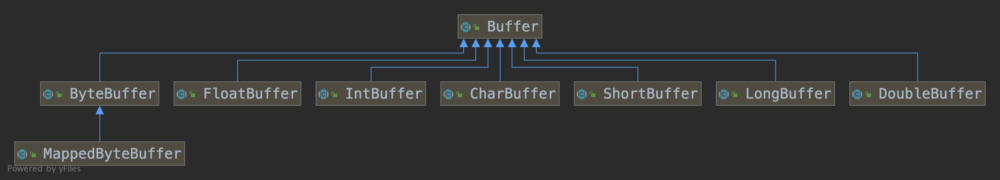
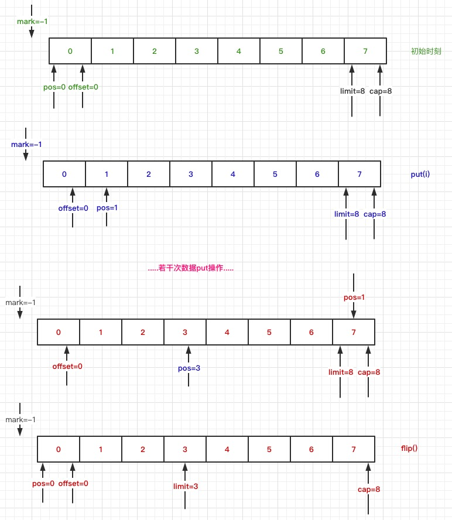
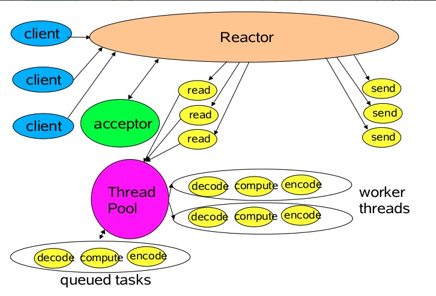
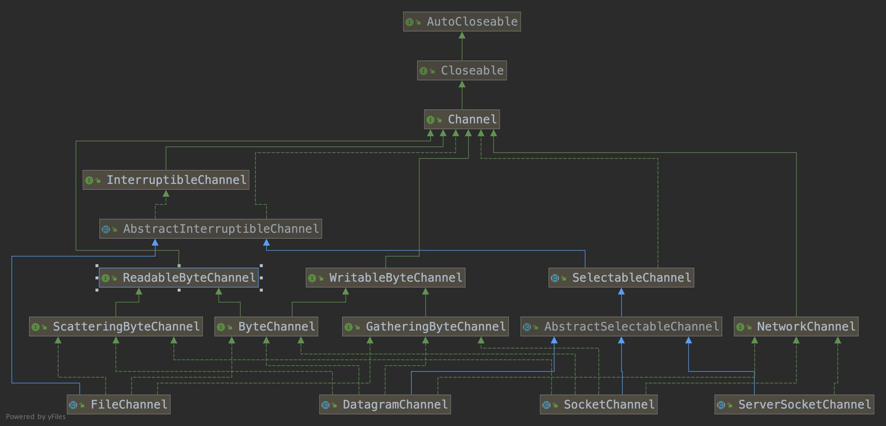
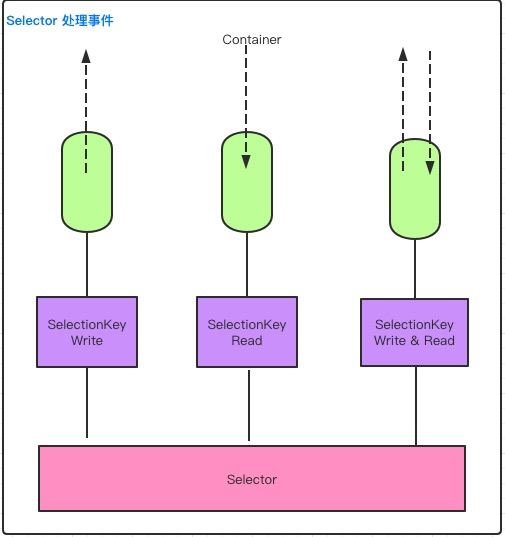

# NIO核心Buffer、Selector、Channel分析

​		上一篇文章中我们简单的说明了BIO、NIO、AIO之间的关系和区别, 本篇文章主要讲解NIO核心buffer、selector、channel原理

## 一、包含知识点

- Buffer的基本原理
- 缓冲区的分配
- 缓冲区分片
- 只读缓冲区
- 直接缓冲区
- 内存映射
- 选择器Selector
- 通道Channel


## 二、缓冲区Buffer

### 2.1 基本原理

​		NIO主要包含Buffer、Selector、Channel三个核心组件, 本小节主要讲解buffer。首先看下buffer的类继承图




​		缓冲区是一个容器对象, 底层通过数组来实现, 在NIO中, 无论数据的读取还是写入都需要先经过缓冲区, 其中最常用的是ByteBuffer, 从上面类继承图, Java常用的基本类型都有具体的ByteBuffer和它对应。

​		缓冲区Buffer底层是通过数组来实现的, 那么在进行数据的读取、写入操作时，它是怎么记录缓冲区状态变化的呢 ？查看Buffer类, 有下面几个重要字段, 0 <= position <= limit <= capacity

```java
private int mark = -1;
private int position = 0;
private int limit;
private int capacity;
```

- position: 数据索引位置，初始化为0
  - get() 读取数据时, position表示读取数据的位置
  - put() 写入数据时, position表示可以写入数据的起始位置
- limit: 剩余可读取的数据量或剩余可插入数据的空间
  - 读取操作, 表示最大可读取的数据量
  - 查询操作, 表示最大可插入数据量
- capcity: 缓冲区容量, 即底层数组长度


### 2.2 缓冲区基本操作

​		首先看下缓冲区基本操作的逻辑代码

```java
ByteBuffer buffer = ByteBuffer.allocate(10);
//写入数据
buffer.put((byte)i);
//获取数据
buffer.get() ;
//刷新缓存区
buffer.flip() ;
```



- 缓冲区分配

  创建缓冲区对象时, 通过allocate()方法指定缓存的容量, 实际是创建了指定大小的数组, 将其包装成缓冲区对象

  ```java
  //1. ByteBuffer.allocate
  public static ByteBuffer allocate(int capacity) {
    if (capacity < 0)
      throw createCapacityException(capacity);
    return new HeapByteBuffer(capacity, capacity);
  }
  
  //2. HeapByteBuffer
  HeapByteBuffer(int cap, int lim) {            // package-private
    super(-1, 0, lim, cap, new byte[cap], 0); // new byte[cap] 创建数组, 作为缓冲区对象
    /*
          hb = new byte[cap];
          offset = 0;
          */
    this.address = ARRAY_BASE_OFFSET;
  }
  
  //3. ByteBuffer
  ByteBuffer(int mark, int pos, int lim, int cap,   // package-private
                   byte[] hb, int offset){
    super(mark, pos, lim, cap);
    this.hb = hb; // 缓存区对象
    this.offset = offset;
  }
  ```

  

- put操作

  当通过put()方法向缓冲区添加数据时, 每次添加操作position的值都会自增1,position < limit,  如果position >= limit会抛出BufferOverflowException异常, 添加过程limit、capacity值不变化

  ```java
  //1. put操作
  public ByteBuffer put(byte x) {
    hb[ix(nextPutIndex())] = x;
    return this;
  }
  
  //2. 获取下个可添加数据的下标
  final int nextPutIndex() {                          // package-private
    if (position >= limit)
      throw new BufferOverflowException();
    return position++;
  }
  ```

- flip操作

  flip有种切换的意思，当需要从写入操作转换为读取操作时, 需要修改position、limit的值, 前面我们提到了Buffer读取、写入是共用position、limit、capacity字段, 不同操作时表示不同意思。

  ```java
  public Buffer flip() {
    limit = position;
    position = 0;
    mark = -1;
    return this;
  }
  ```

- get操作

  在执行flip操作后, position、limit发生了变化, 分别表示可读取数据的起始位置、缓冲区中可读数据数量, 每次执行get操作, 都会使position的值增1, position < limit， 如果position >= limit, 会抛出BufferOverflowException异常, 获取过程中limit、capacity值不发生变化

  ```java
  //1. get操作
  public byte get() {
    return hb[ix(nextGetIndex())];
  }
  
  //2. 获取下个可添加数据的下标
  final int nextPutIndex() {                          // package-private
    if (position >= limit)
      throw new BufferOverflowException();
    return position++;
  }
  ```

- clear操作

  如果需要对position、limit进行复位操作, 可以执行clear方法

  ```java
  //1. ByteBuffer.clear()
  ByteBuffer clear() {
    super.clear();
    return this;
  }
  
  //2. Buffer.clear()
  public Buffer clear() {
    position = 0;
    limit = capacity;
    mark = -1;
    return this;
  }
  ```


### 2.3 缓冲区分片

​		在NIO中, 除了可以分配或着包装缓冲区之外, 还可以基于现有的缓冲区创建一个子缓冲区, 子缓冲区和原缓冲区在底层数据共享， 当共享部分有数据变化时, 子缓冲区与原缓冲区都会发生变化, 下面是测试代码


```java
public class BufferSlice {  
    static public void main( String args[] ) throws Exception {
        ByteBuffer buffer = ByteBuffer.allocate( 10 );
          
        // 缓冲区中的数据0-9  
        for (int i=0; i<buffer.capacity(); ++i) {  
            buffer.put( (byte)i );  
        }  
        buffer.flip();
        while (buffer.remaining() > 0) { // limit - position
            System.out.print(buffer.get() + "  ");
        }
        System.out.println();
        // 创建子缓冲区  
        buffer.position( 3 );  
        buffer.limit( 7 );  
        ByteBuffer slice = buffer.slice();  
          
        // 改变子缓冲区的内容  
        for (int i=0; i<slice.capacity(); ++i) {  
            byte b = slice.get( i );  // 直接通过索引获取数据, 没有通过position来获取数据
            b *= 10;  
            slice.put( i, b );  
        }
        // 复位
        buffer.position( 0 );  
        buffer.limit( buffer.capacity() );  
          
        while (buffer.remaining()>0) {  
            System.out.print( buffer.get() + "  ");
        }  
    }  
}
```

 

### 2.4 只读缓冲区

​		只读缓冲区如字面意思, 缓存的内容只能读取，不能进行写入操作, 可以使用asReadOnlyBuffer方法创建只读缓冲区, 有下面几点需要注意

1. 创建的只读缓冲区和旧缓冲区共享底层空间
2. asReadOnlyBuffer创建只读缓冲区时，position、limit和原缓存一样, 如果执行get操作需要手动更新读取数据的位置


```java
/**
 * 只读缓冲区
 */
public class ReadOnlyBuffer {  
	static public void main( String args[] ) throws Exception {  
		ByteBuffer buffer = ByteBuffer.allocate( 10 );  
	    
		// 缓冲区中的数据0-9  
		for (int i=0; i<buffer.capacity(); ++i) {  
			buffer.put( (byte)i );  
		}  
	
		// 创建只读缓冲区
		// 基于原buffer创建新的buffer
		//position、limit、capcitu 和原缓存一致
		ByteBuffer readonly = buffer.asReadOnlyBuffer();
	    
		// 改变原缓冲区的内容  
		for (int i=0; i<buffer.capacity(); ++i) {  
			byte b = buffer.get( i );  
			b *= 10;  
			buffer.put( i, b );  
		}

		//position、limit保持和旧缓存值一致
		System.out.println(readonly.position());
		System.out.println(readonly.limit());
		System.out.println();

		readonly.position(0);  
		readonly.limit(buffer.capacity());  
	    
		// 只读缓冲区的内容也随之改变  
		while (readonly.remaining()>0) {  
			System.out.print( readonly.get() + "\t");
		}
		System.out.println();

		//修改制度缓存
		readonly.put(0,(byte)-1); //java.nio.ReadOnlyBufferException
	}
}
```


### 2.5 直接缓冲区

​		在2.2节中，我们知道普通分配缓存的方式是通过静态方法ByteBuffer.allocate()来创建的，如果需要加快IO速度, 可以创建直接缓冲区, 它会在每次调用底层操作系统进行IO操作时, <font color="#f00">1) 避免将直接缓冲区中的数据copy到中间缓冲区,  2) 避免从中间缓冲区copy数据到直接缓冲区</font>

```java
//1. 普通创建缓冲区的方式
ByteBuffer buffer = ByteBuffer.allocate(10);

//2. 创建直接缓存的方式
ByteBuffer buffer = ByteBuffer.allocateDirect(1024);

public static ByteBuffer allocateDirect(int capacity) {
  return new DirectByteBuffer(capacity);
}

DirectByteBuffer(int cap) {                   // package-private
  super(-1, 0, cap, cap);
  boolean pa = VM.isDirectMemoryPageAligned();
  int ps = Bits.pageSize();
  long size = Math.max(1L, (long)cap + (pa ? ps : 0));
  Bits.reserveMemory(size, cap);

  long base = 0;
  try {
    base = UNSAFE.allocateMemory(size);
  } catch (OutOfMemoryError x) {
    Bits.unreserveMemory(size, cap);
    throw x;
  }
  UNSAFE.setMemory(base, size, (byte) 0);
  if (pa && (base % ps != 0)) {
    // Round up to page boundary
    address = base + ps - (base & (ps - 1));
  } else {
    address = base;
  }
  cleaner = Cleaner.create(this, new Deallocator(base, size, cap));
  att = null;
}
```


### 2.6 内存映射

​		内存映射是一种**<font color="#f00">读和写文件</font>**数据的方法，内存映射文件IO是通过使文件中的数据为数组的内容完成的，不会将整个文件内容进行读取, 只有实际读取或者写入的部分才会映射到内存中, 看下示例代码

```java
public class MappedBuffer {  
    static private final int start = 0;
    static private final int size = 26;
      
    static public void main( String args[] ) throws Exception {
        String rootPath = MappedBuffer.class.getClassLoader().getResource("").getPath();

        RandomAccessFile raf = new RandomAccessFile( rootPath + "test.txt", "rw" );
        FileChannel fc = raf.getChannel();
        
        //把缓冲区跟文件系统进行一个映射关联
        //只要操作缓冲区里面的内容，文件内容也会跟着改变
        MappedByteBuffer mbb = fc.map(FileChannel.MapMode.READ_WRITE,start, size );
          
        mbb.put( 0, (byte)97 );  //a
        mbb.put( 25, (byte)122 );   //z

        raf.close();  
    }  
}
```


## 三、选择器Selector

### 3.1 传统会话模式TPR(Thread Per Request)

​		传统的Server/Client会话模式是TPR(Thread Per Request),

1. 服务端会为每个请求创建一个新的Thread来处理逻辑, 如果请求并发过大，会同时创建过多的线程来处理Client的请求, 大量的线程会增加服务器压力, 容易带来性能问题
2.  为了解决线程的不断增长, 通常会使用线程池来控制线程数量上限, 但是可能会带来新的问题, 如果线程池线程都在处理耗时操作, 比如: 文件上传、下载操作, 如果有个耗时很短的请求过来，会被阻塞不能及时被处理


### 3.2 Reactor模式

​	NiO通过Reactor模式来实现非阻塞需求, IO调用不会被阻塞, 只会注册特定的IO操作, 当特定的事件到来时会发出通知, NIO基于Selector实现非阻塞IO，当有读或者写等任何注册事件发生时, 可以从Selector中获得相应SelectionKey, 通过这个SelectionKey找到发生事件的SelectableChannel, 然后获得客户端发送过来的数据。处理的基本顺序可以分为下面几个步骤

- 向 Selector 对象注册感兴趣的事件
- 从 Selector 中获取感兴趣的事件
- 根据不同的事件进行相应的处理

下面是Reactor模式图示




下面通过下面的示例代码熟悉Selector

```java
package com.gupaoedu.vip.netty.io.nio;

import java.io.IOException;
import java.net.InetSocketAddress;
import java.nio.ByteBuffer;
import java.nio.channels.SelectionKey;
import java.nio.channels.Selector;
import java.nio.channels.ServerSocketChannel;
import java.nio.channels.SocketChannel;
import java.util.Iterator;
import java.util.Set;

/**
 * NIO的操作过于繁琐，于是才有了Netty
 * Netty就是对这一系列非常繁琐的操作进行了封装
 *
 * Created by Tom.
 */
public class NIOServerDemo {

    private int port = 8080;

    //轮询器 Selector 
    private Selector selector;
    //缓冲区 Buffer 
    private ByteBuffer buffer = ByteBuffer.allocate(1024);

    //初始化完毕
    public NIOServerDemo(int port){
        try {
            this.port = port;
            ServerSocketChannel server = ServerSocketChannel.open();
            //IP/Port
            server.bind(new InetSocketAddress(this.port));
            //BIO 升级版本 NIO，为了兼容BIO，NIO模型默认是采用阻塞式
            server.configureBlocking(false);
            selector = Selector.open();
            server.register(selector, SelectionKey.OP_ACCEPT);
        } catch (Exception e) {
            e.printStackTrace();
        }
    }

    public void listen(){
        System.out.println("listen on " + this.port + ".");
        try {
            //轮询主线程
            while (true){
                //大堂经理再叫号
                selector.select();
                Set<SelectionKey> keys = selector.selectedKeys();
                Iterator<SelectionKey> iter = keys.iterator();
                //不断地迭代，就叫轮询
                //同步体现在这里，因为每次只能拿一个key，每次只能处理一种状态
                while (iter.hasNext()){
                    SelectionKey key = iter.next();
                    iter.remove();
                    //每一个key代表一种状态
                    //没一个号对应一个业务
                    //数据就绪、数据可读、数据可写
                    process(key);
                }             
            }
        } catch (IOException e) {
            e.printStackTrace();
        }
    }

    //每一次轮询就是调用一次process方法，而每一次调用，只能干一件事
    //在同一时间点，只能干一件事
    private void process(SelectionKey key) throws IOException {
        //针对于每一种状态给一个反应
        if(key.isAcceptable()){
            ServerSocketChannel server = (ServerSocketChannel)key.channel();
            //这个方法体现非阻塞，不管你数据有没有准备好
            //你给我一个状态和反馈
            SocketChannel channel = server.accept();
            //一定一定要记得设置为非阻塞
            channel.configureBlocking(false);
            //当数据准备就绪的时候，将状态改为可读
            key = channel.register(selector,SelectionKey.OP_READ);
        }
        else if(key.isReadable()){
            //key.channel 从多路复用器中拿到客户端的引用
            SocketChannel channel = (SocketChannel)key.channel();
            int len = channel.read(buffer);
            if(len > 0){
                buffer.flip();
                String content = new String(buffer.array(),0,len);
                key = channel.register(selector,SelectionKey.OP_WRITE);
                //在key上携带一个附件，一会再写出去
                key.attach(content);
                System.out.println("读取内容：" + content);
            }
        }
        else if(key.isWritable()){
            SocketChannel channel = (SocketChannel)key.channel();

            String content = (String)key.attachment();
            channel.write(ByteBuffer.wrap(("输出：" + content).getBytes()));

            channel.close();
        }
    }

    public static void main(String[] args) {
        new NIOServerDemo(8080).listen();
    }
}
```


## 四、Channel

### 4.1 channel基本知识

​		通道是一个对象, 数据的读取和写入都需要经过通道(Channel)，但是需要注意的是数据的直接操作并不是Channel而是Buffer, NIO中提供了多种通道对象, 请看下图







> **使用 NIO 读取数据**

- 从 FileInputStream 获取 Channel
- 创建 Buffer
- 将数据从 Channel 读取到 Buffer 中


> 使用 NIO 写入数据

- 从 FileInputStream 获取 Channel
- 创建 Buffer
- 将数据从 Channel 写入到 Buffer 中


### 4.2 IO多路复用

​		多路复用 IO 技术最适用的是“高并发”场景，以满足 短时间内至少同时有上千个连接请求准备好。其他情 

况下多路复用 IO 技术发挥不出来它的优势。另一方面，使用 JAVA NIO 进行功能实现，相对于传统的 Socket 套接字 

实现要复杂一些，所以实际应用中，需要根据自己的业务需求进行技术选择。

​		常见多路复用技术

| IO模型 | 相对性能 | 关键思路         | 操作系统  | Java支持                                                     |
| ------ | -------- | ---------------- | --------- | ------------------------------------------------------------ |
| select | 较高     | Reactor          | Win/Linux | 支持,Reactor 模式(反应器设计模式)。Linux 操作系统的 kernels 2.4 内核版本之前，默认使用select；而目前 windows 下对同步 IO 的支持，都是 select 模型 |
| pool   | 较高     | Reactor          | Linux     | Linux 下的 JAVA NIO 框架，Linux kernels 2.6 内核版本之前使用 poll 进行支持。也是使用的Reactor 模式 |
| epoll  | 高       | Reactor/Proactor | Linux     | Linux kernels 2.6 内核版本及以后使用 epoll 进行支持；Linux kernels 2.6 内核版本之前使用 poll进行支持；另外一定注意，由于 Linux 下没有Windows 下的 IOCP 技术提供真正的 异步 IO 支持，所以 Linux 下使用 epoll 模拟异步 IO |
| Kqueue | 高       | Proactor         | Linux     |                                                              |


## 五、NIO源码分析

​	在3.2节中我们知道, Selector的创建方式, 那么它具体实现逻辑是什么呢 ?

- 创建Provider

```java
//Selector
public static Selector open() throws IOException {
  return SelectorProvider.provider().openSelector(); // 创建Selector入口
}

//SelectorProvider
public static SelectorProvider provider() {
  synchronized (lock) { // 加锁避免并发问题
    if (provider != null)
      return provider; // 如果已经创建, 返回创建好的provider , 保证整个Server只有一个provider
    return AccessController.doPrivileged(
      new PrivilegedAction<>() {
        public SelectorProvider run() {
          if (loadProviderFromProperty()) //从配置属性java.nio.channels.spi.SelectorProvider家在provider
            return provider;
          if (loadProviderAsService()) // 通过SPI机制家在provider
            return provider;
          
          /** 
           * 这里以PollSelectorImpl为例说明, 注意这里会根据不同操作系统创建不同的Provider
           * 1. windows, WindowSelectorProvider
           * 2. Linux: EpoolSelectorProvider
           * 可以将 ${JAVA_HOME}/lib/rt.jar 进行解压, 解压后进入 sun.nio.ch目录, 查看DefaultSelectorProvider.class文件, 
           * 内容实现会根据系统不一样创建对应的Provider
           */
          provider = sun.nio.ch.DefaultSelectorProvider.create(); // 创建一个基于当前操作系统的provider
          return provider;
        }
      });
  }
}
```

- ​	创建Selector

  查看DefaultSelectorProvider类, 当需要Selector对象时, provider通过openSelector创建对应的selector对象

```java
//DefaultSelectorProvider
public static SelectorProvider create() {
   /** 
   * 这里以PollSelectorImpl为例说明, 注意这里会根据不同操作系统创建不同的Provider
   */
  return new PollSelectorImpl() ;
}

//PollSelectorImpl
PollSelectorImpl(SelectorProvider var1) {
  super(var1, 1, 1);
  long var2 = IOUtil.makePipe(false); //native方法, 返回文件两个描述符, 用long来存储
  this.fd0 = (int)(var2 >>> 32); //高位, read描述符
  this.fd1 = (int)var2; //低位, write描述符

  try {
    this.pollWrapper = new PollArrayWrapper(10);
    this.pollWrapper.initInterrupt(this.fd0, this.fd1);
    this.channelArray = new SelectionKeyImpl[10];
  } catch (Throwable var8) {
    try {
      FileDispatcherImpl.closeIntFD(this.fd0);
    } catch (IOException var7) {
      var8.addSuppressed(var7);
    }

    try {
      FileDispatcherImpl.closeIntFD(this.fd1);
    } catch (IOException var6) {
      var8.addSuppressed(var6);
    }

    throw var8;
  }
}
```

```java
// 反编译后的 DefaultSelectorProvider 文件
public class DefaultSelectorProvider {
    private DefaultSelectorProvider() {
    }

    private static SelectorProvider createProvider(String var0) {
        Class var1;
        try {
            var1 = Class.forName(var0);
        } catch (ClassNotFoundException var4) {
            throw new AssertionError(var4);
        }

        try {
            return (SelectorProvider)var1.newInstance();
        } catch (InstantiationException | IllegalAccessException var3) {
            throw new AssertionError(var3);
        }
    }

    public static SelectorProvider create() {
        String var0 = (String)AccessController.doPrivileged(new GetPropertyAction("os.name"));
        if (var0.equals("SunOS")) {
            return createProvider("sun.nio.ch.DevPollSelectorProvider");
        } else {
            return (SelectorProvider)(var0.equals("Linux") ? createProvider("sun.nio.ch.EPollSelectorProvider") : new PollSelectorProvider());
        }
    }
}
```


- 创建Pipe

  如果selector需要打开创建pipe, 可以通过openPipe来创建Pipe对象

```java
//SelectorProviderImpl
public Pipe openPipe() throws IOException {
  return new PipeImpl(this);
}

//PipeImpl
PipeImpl(SelectorProvider var1) {
  long var2 = IOUtil.makePipe(true); //native方法, 返回文件两个描述符, 用long来存储
  int var4 = (int)(var2 >>> 32); //高位, read描述符
  int var5 = (int)var2; //低位, write描述符
  FileDescriptor var6 = new FileDescriptor();
  IOUtil.setfdVal(var6, var4);
  this.source = new SourceChannelImpl(var1, var6);
  FileDescriptor var7 = new FileDescriptor();
  IOUtil.setfdVal(var7, var5);
  this.sink = new SinkChannelImpl(var1, var7);
}
```

- 创建Channel

  这里以创建ServerSocketChannel说明, 从provider创建流程我们知道, 一个应用只有一个provider, Channel的创建是通过这个provider创建的

```java
//SelectorProviderImpl
public ServerSocketChannel openServerSocketChannel() throws IOException {
  return new ServerSocketChannelImpl(this);
}

//ServerSocketChannelImpl
ServerSocketChannelImpl(SelectorProvider var1) throws IOException {
  super(var1);
  this.fd = Net.serverSocket(true);
  this.fdVal = IOUtil.fdVal(this.fd);
  this.state = 0;
}

//AbstractSelectableChannel
protected AbstractSelectableChannel(SelectorProvider provider) {
	this.provider = provider;
}
```


- ServerSocketChannel.register()

  从3.2节示例代码我们知道, channel和selector通过 channel.register(selector,SelectionKey.OP_READ) 绑定在一起, 即创建ServerSocketChannel时创建的FD和selector绑定在一起。

```java
//AbstractSelectableChannel
public final SelectionKey register(Selector sel, int ops,
                                       Object att)
        throws ClosedChannelException
    {
        synchronized (regLock) {
            if (!isOpen()) // 管道是否已经打开, false抛错
                throw new ClosedChannelException();
            if ((ops & ~validOps()) != 0) // 是否支持当前 SelectionKey, 如果不支持，抛错
                throw new IllegalArgumentException();
            if (blocking)
                throw new IllegalBlockingModeException();
            SelectionKey k = findKey(sel); // 遍历SelectionKey集合, 找到属于当前selector的SelectorKey
            if (k != null) {// 查询到key, 更新selector
                k.interestOps(ops);
                k.attach(att);
            }
            if (k == null) { // 没查询到, 新注册，将Channel和Selector绑定
                // New registration
                synchronized (keyLock) {
                    if (!isOpen())
                        throw new ClosedChannelException();
                    k = ((AbstractSelector)sel).register(this, ops, att);
                    addKey(k);
                }
            }
            return k;
        }
    }
```


- Selector.doSelect()

```java
protected int doSelect(long var1) throws IOException {
        if (this.channelArray == null) {// 没有SelectorKey信息, 抛异常
            throw new ClosedSelectorException();
        } else {
            this.processDeregisterQueue();

            try {
                this.begin();
                this.pollWrapper.poll(this.totalChannels, 0, var1); // 核心方法, 轮询pollWrapper中保存的FD
            } finally {
                this.end();
            }

            this.processDeregisterQueue();
            int var3 = this.updateSelectedKeys(); // 更新SelectedKey
            if (this.pollWrapper.getReventOps(0) != 0) {
                this.pollWrapper.putReventOps(0, 0);
                synchronized(this.interruptLock) {
                    IOUtil.drain(this.fd0);
                    this.interruptTriggered = false;
                }
            }

            return var3;
        }
    }

//PollArrayWrapper
int poll(int var1, int var2, long var3) {
  return this.poll0(this.pollArrayAddress + (long)(var2 * 8), var1, var3);
}

private native int poll0(long var1, int var3, long var4);
```

​		<font color="#f00">这个 poll0（）会监听 pollWrapper 中的 FD 有没有数据进出，这会造成 IO 阻塞，直到有数据读写事件发生。比如，由于 pollWrapper 中保存的也有 ServerSocketChannel 的 FD，所以只要 ClientSocket 发一份数据到 ServerSocket,那么 poll0（） 就会返回；又由于 pollWrapper 中保存的也有 pipe 的 write 端的 FD，所以只要 pipe 的 write 端向 FD 发一份数据，也会造 成 poll0（）返回；如果这两种情况都没有发生，那么 poll0（）就一直阻塞，也就是 selector.select()会一直阻塞；如果有任 何一种情况发生，那么 selector.select()就会返回，所有在 OperationServer 的 run()里要用 **while** (**true**) {，这样就可以保证在 selector 接收到数据并处理完后继续监听 poll();</font>

