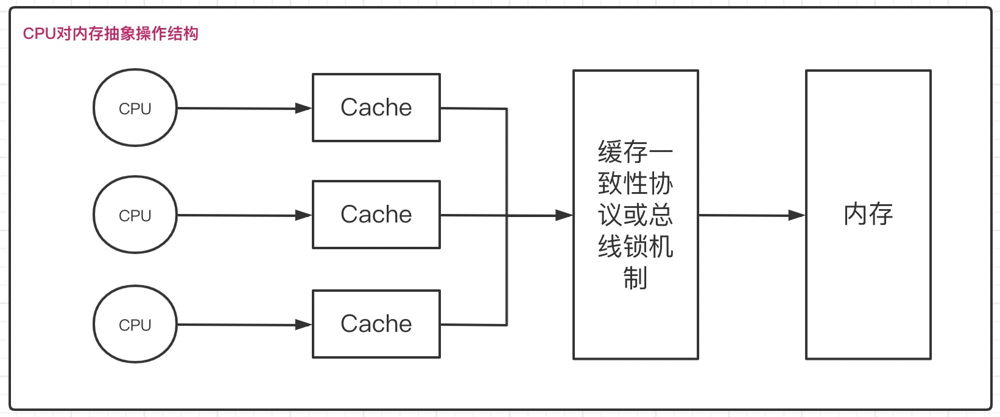
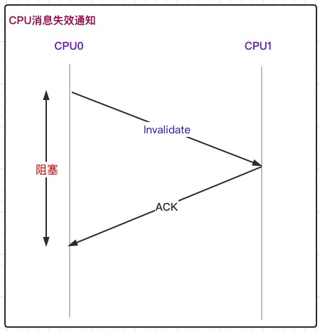
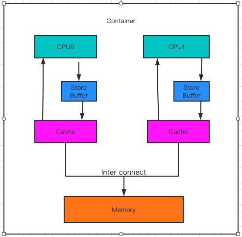

#  多线程原理分析(二)

​		上篇文章, 我们从锁的存储格式(Header、Mark Word)、锁升级(偏向锁、轻量级锁、重量级锁)的角度分析了多线程的原理, 这片文章我们从数据修改/加载、JMM、happen-before角度继续说明多线程原理。

## 一、包含的知识点

- 如何保证共享变量的可见性
- volatile关键字是如何保证可见性的
- 缓存一致性和缓存一致性协议
- 缓存一致性协议存在的问题(MESI)
- CPU内存屏障
- JMM内存模型
- happens before


## 二、如何保证共享变量的可见性

### 2.1 <font color="#f00">可见性问题</font>	

​	  单线程环境下, 如果向一个共享变量写入一个值, 在没有其它线程写干涉的情况下,读取这个变量的值和写入的值是一样的。 但是在多线程操作的情况下, 可能出现**读线程**不能及时读取到其它线程**写入**的最新值, 这就是所谓的可见性问题。

​		并发问题产生的原因是对共享变量并发访问导致的, 那么共享变量修改后，如何对其它线程保持可见性呢 , 即如何实现跨线程写入的内存可见性 ？

- volatile(可见性)
- synchronized(可见性、有序性、原子性)


### 2.2 volatile 关键字是如何保证可见性的


## 三、可见性本质

​		操作系统处理能力由CPU、内存、IO设备决定, 而这三者之间对数据的处理能力相差很大, 为了最大化的利用CPU资源, 计算机从多方面做了很多优化, 包含下面内容

- CPU增加了高速缓存
- 操作系统增加了进程、线程, 通过CPU时间片切换, 提升CPU利用率
- 编译器指令优化, 更合理的利用好CPU高速缓存


​	上面的优化提升了计算机的性能, 但是也同时带来了线程安全问题。

### 3.1 缓存一致性

​		计算机绝大部分运算不能只依赖处理器完成, 还需要和内存进行交互, 这个操作是很难避免的, 但是存储设备和处理器之间运算速度相差很大, 为了减少这种冲突, 增加了一层**<font color="#3f3">高速缓存</font>**,通过高速缓存很好的解决了处理器和内存速度差异的矛盾，但是更高的复杂性带来了缓存一致性问题。

​		在多CPU中, 线程可能运行在不同的CPU中, 并且每个线程都有自己的高速缓存, 同一份原始数据可能被缓存到多个CPU中, 在不同CPU中执行的不同线程, 可能看到的缓存值不一样, 这就是**<font color="#ab3">缓存一致性问题</font>**，操作系统通过下面的方式来解决缓存一致性问题

- 总贤锁

  在多CPU情况下, 当其中一个处理器要对共享内存进行操作时, 会对总线发出LOCK信号, 这个信号会使得其它处理器无法访问共享内存,  同时也不能访问其它内存地址的数据, 锁的力度有点大, 开销比较大

- 缓存锁

  相对于总线锁, 锁的粒度过大,缓存锁很好的控制了锁的粒度。缓存锁基于**<font color="#0b3">缓存一致性协议</font>**, 保证被多个CPU缓存的同一份数据是一致的。


### 3.2 缓存一致性协议

​		为了保证数据访问的一致性, 处理器在访问缓存时, 需要遵循一些协议, 包括MSI、MESI、MOSI, 其中最常见是MESI。MESI表示缓存行四种状态的缩写, 每个缓存的缓存控制器不仅知道自己的读写操作, 也监听其它Cache的读写操作。

- M(Modify) 表示共享数据只缓存在当前 CPU 缓存中，并且是被修改状态，也就是缓存的数据和主内存中的数据不一致
- E(Exclusive) 表示缓存的独占状态，数据只缓存在当前CPU 缓存中，并且没有被修改
- S(Shared) 表示数据可能被多个 CPU 缓存，并且各个缓存中的数据和主内存数据一致
- I(Invalid) 表示缓存已经失效


​	**<font color="#2df">对于MESI协议, 从CPU的读写角度会遵循以下原则</font>**, 

- CPU 读请求, 缓存处于 M、E、S 状态都可以被读取，I 状 态 CPU 只能从主存中读取数据
- CPU 写请求, 缓存处于 M、E 状态才可以被写。对于 S 状态的写，需要将其他 CPU 中缓存行置为无效才可写


​	抽象的操作数据结构如下:




### 3.3 MESI存在的问题

​		**<font color="#2df">CPU缓存行状态变更是如何通知其它CPU的呢 ？</font>**

​		如果一个CPU要对缓存在缓存中的共享变量进行写入操作, 会通过**消息传递**的方式，发送一个失效消息给其它缓存了该数据的CPU, 并且需要等到他们的ACK, 但是在这个时间段内，当前线程都是处于阻塞状态。

​		为了避免阻塞带来的资源浪费, CPU中引入了Store Buffer；当CPU需要写入共享变量时, 会直接先将数据写入Store Buffer中, 等接收到所有其它CPU的ACK后, 再将缓存在Store Buffer中的数据同步到主内存。

​		





​		引入Store Buffer之后, 带来了下面的问题

1. 数据从Store Buffer写入主内存时机不确定, 需要等到缓存失效ACK全部确认后才会数据同步, 而这是一个异步操作。
2. 引入Store Buffer后, 处理器先尝试从store buffer中读取值, 如果store buffer中有数据, 则直接从store buffer中读取, 否则从缓存行中读取 。
3. 系统会对指令进行重排序, 重排序会带来可见性问题。


### 3.4 CPU内存屏障

​		内存屏障是将store buffer中指令写入到内存, 使得其它访问同一共享内存的线程具有可见性。CPU内存屏障分类

- 读屏障(Load Memory Barrier)

  读屏障之后的读操作都在读屏障之后执行, 配合写屏障, 使得写屏障之前对内存的更新操作都对读操作可见。

- 写屏障(Store Memory Barrier)

  告诉处理器在写入屏障之前, 所有存储在存储缓存(Store Buffer)中的数据需要同步到主内存，即写屏障之前的指令对屏障之后的读或写操作是可见的。

- 全屏障(Full Memory Barrier)

  只有屏障之前的内存读写操作都提交到内存后, 才会执行屏障之后的读写操作。


请查看下面关于cpu内存屏障使用的伪代码,

```java
value = 0 ;
void cpu01() {
  value = 1 ;
  storeMemoryBarrier();
  terminal = true ;
}

void cpu02() {
  if (terminal) {
    loadMemoryBarrier();
    assert value = 1 ;
  }
}
```


## 四. Java内存模型

​		多线程情况下，**<font color="#f00">数据的不一致的根本问题是: 缓存、指令重排序</font>**,  为了解决重排序问题, 提出了JMM(Java Memory Model)，通过合理的禁用缓存、禁止重排序, 以达到可见性、有序性的目的。

​		JMM定义了共享内存中多线程读写操作的行为规范, 实现了共享变量存储到内存以及从内存读取共享变量的细节, 通过这些规范来保证指令执行的正确性, 解决了CPU多级缓存、处理器优化、指令重排序导致内存访问问题, 确保并发场景下的可见性 。

​		JMM把底层问题抽象到JVM层面, **<font color="#7788dd">基于CPU层面提供的内存屏障指令、限制编译器重排序</font>**来解决并发问题 。

​		JMM抽象模型, 将内存分为主内存、工作内存, 

- **主内存**, 所有线程共享的, 包含: 实例对象、静态字段、数组对象等存储在堆内存中的变量。
- **工作内存**, 线程独占的, 线程对变量的所有操作都在工作内存中进行, 不能直接读写主内存中的变量, 线程之间共享变量值的传递基于主内存来完成 。


#### 4.1 JMM解决的问题

**<font color="#f00">JMM 是如何解决可见性、有序性问题 ?</font>**

​		JMM提供了一些禁用缓存、禁止重排序方式，来解决可见性、有序性问题。比如: volatile、synchronized


**<font color="#f00">JMM 是如何解决顺序一致性问题 ?</font>**

​		为了提高程序的执行性能, 编译器、处理器会对指令做重排序, 重排序包含三个方面

- 编译器优化重排序
- 指令并行重排序
- 内存系统重排序


​		**<font color="#7788dd">编译器重排序</font>**, JMM禁止了特定类型编译器重排序 。

​		**<font color="#7788dd">处理器重排序</font>**, JMM要求编译器生成指令时，需要插入内存屏障来禁止处理器重排序 。

#### 4.2 JMM内存屏障分类

| 屏障类型            | 指令示例                     | 说明                                                         |
| ------------------- | ---------------------------- | ------------------------------------------------------------ |
| LoadLoad Barriers   | load01; LoadLoad; load02     | 确保load01数据加载优先于load02及所有后续加载指令             |
| StoreStore Barriers | store01; StoreStore; store02 | 确保store01数据存储优先于store02及所有后续存储指令           |
| LoadStore Barriers  | load01; LoadStore; store02   | 确保load01数据加载优先于store02及后续存储指令                |
| StoreLoad Barriers  | store01; StoreLoad; load02   | 确保store01数据存储优先于load02及所有后续加载指令，这条内存屏障指令是一个全能型屏障 |


## 五、happen before

​		定义: 表示前一个操作的结果对于后续操作是可见的(它是一种表达多线程之间对于内存的可见性), 也就是如果一个操作结果对另一个操作可见, 那么这两个操作之间必须存在happens-before关系, 这两个操作可以是同一个线程也可以是不同线程 。


**<font color="#f00">Happen-before程序顺序规则</font>**

- as-if-serial 原则。线程中每个操作happens-before于该线程中的任意后续操作，单线程中代码顺序不管怎么变, 执行结果都是不变的。
- volatile原则。对volatile修饰的变量进行写操作, 一定happens-before后续对这个变量的读操作。
- 传递性原则。如果 1 happens-before 2 , 2 happens-before 3 ; 那么 1 happens-before 3
- start原则。如果ThreadA执行ThreadB.start()操作, 那么ThreadA的操作 happens-before ThreadB中任意操作。
- join原则。如果ThreadA执行ThreadB.join()操作, 那么ThreadB的任意操作 happens-before ThreadA操作。
- 监视器锁原则。对一个锁的解锁操作 一定 happens-before 之后对这个锁的加锁。


​				


