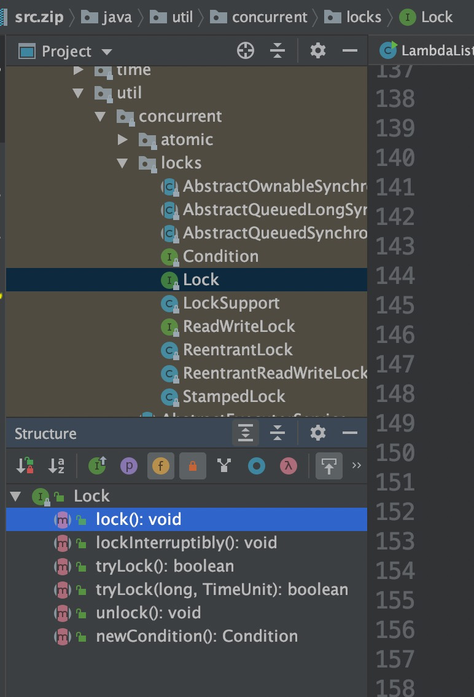
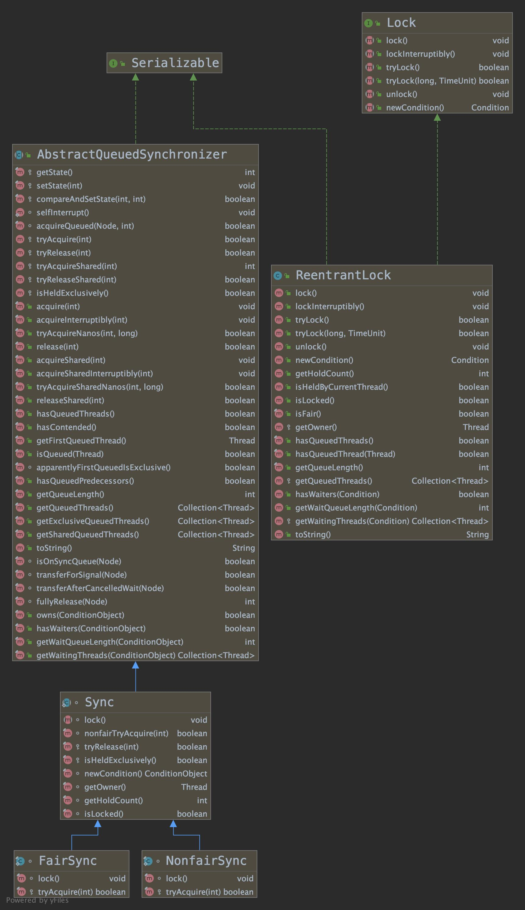
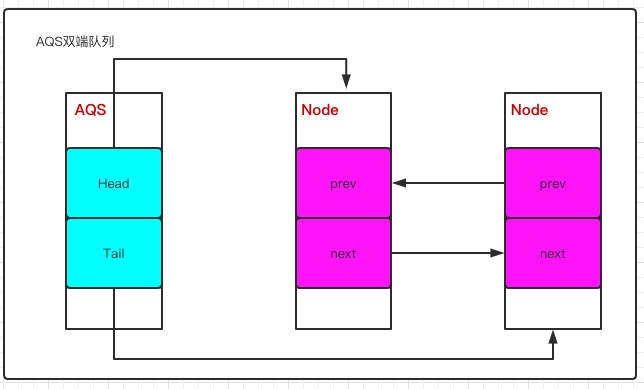
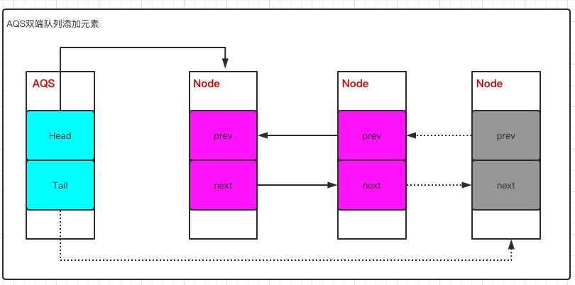
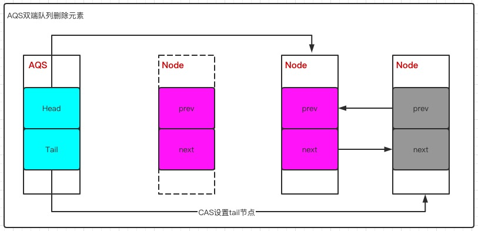
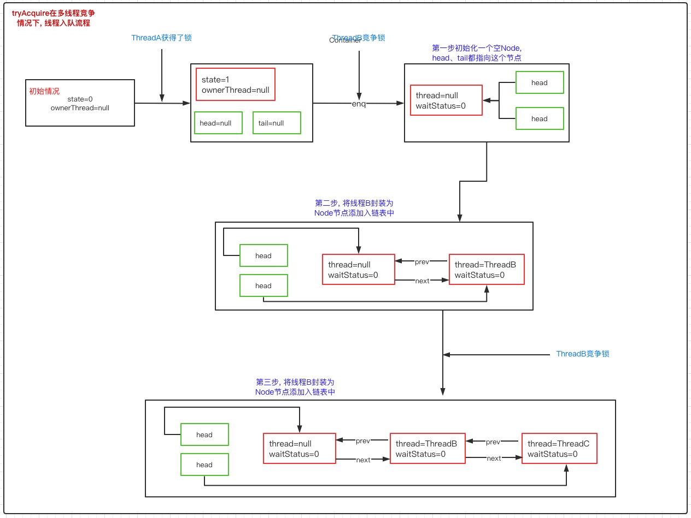

#  ReentrantLock原理分析

## 一、包含的知识点

- Lock
- ReentrantLock 重入锁
- ReentrantLock 加锁源码分析
- ReentrantLock 解锁源码分析


## 二、Lock

​		前面文章我们讲解了在多线程情况下，synchronized是如何保证线程安全的。在Java5之前, 只能通过synchronized来解决多线程并发安全问题,并且synchronized在某些场景下存在短板,  Java5(含)之后出现的Lock，很好的弥补了synchronized存在的短板，它比synchronized更灵活。

synchronized短板:

- synchronized是不可中断锁, lock是可中断锁
- synchronized由JVM控制锁的获取/释放, lock由开发者控制锁的获取、释放


### 2.1 常见的锁的实现

​		Lock本质上是一个接口，它定义了释放锁、获取锁的抽象方法(意味着定义了一个规范)，请看下面的截图




​		Lock的实现类有很多, 以下是几个常见的锁实现

- **ReentrantLock**：表示重入锁，实现了 Lock 。重入锁指的是线程在获得锁之后，再次获取该锁不需要阻塞，而是直接关联一次计数器增加重入次数

- **ReentrantReadWriteLock**：重入读写锁，它实现了 ReadWriteLock 接口，在这个类中维护了两个锁，一个是 ReadLock，一个是 WriteLock，他们都分别实现了 Lock接口。读写锁是一种适合读多写少的场景

  ```java
  ReentrantReadWriteLock
  
    
  ```

- **StampedLock**:  JDK8引入的新的锁机制，是读写锁的一个改进版本，ReentrantReadWriteLock在大量读线程场景下, 可能引起写线程饥饿, StampedLock通过乐观锁策略, 使得乐观锁不会阻塞写线程。


### 2.2 Lock类关系图




​	下面对Lock常见接口进行简单说明

- void lock(), 如果锁可用就获得锁, 如果锁不可用就阻塞直到锁释放
- void lockInterruptibly(), 和lock()方法类似, 但是阻塞线程可以中断, 抛出InterruptedException异常
- boolean tryLock(), 非阻塞获取锁, 如果成功返回true
- boolean tryLock(long timeout, TimeUnit timeUnit), 带有超时时间获取锁
- void unlock(), 锁释放方法


## 三、**ReentrantLock 重入锁**

### 3.1 **<font color="#f00">为什么需要重入锁?</font>** 

​		在进行讲解前请先看下下面代码

```java
public class ReentrantDemo{
  public synchronized void method01(){
    System.out.println("method01");
    method02();
  }
  public void method02(){
    System.out.println("method02");
    synchronized (this){
    } 
  }
  public static void main(String[] args) {
    ReentrantDemo rd=new ReentrantDemo();
    new Thread(rd::demo).start();
  } 
}
```

​		如果调用method01方法获取了当前对象的锁, 但是如果锁不具有重入性情况下, 执行method02时因无法获取对象锁会被阻塞, 会产生死锁, 而重入锁解决了这个问题，如果是同一个线程需要获取锁对象，会直接获取锁，避免死锁, 这就是锁重入性的必要性。


### 3.2 **ReentrantReadWriteLock**

​		根据多线程是否能共享一把锁，可以将锁分为

- 共享锁

  同一时刻允许多个线程进行访问

- 排它锁

  同一时刻只允许一个线程进行访问，其它线程会被阻塞


ReentrantReadWriteLock维护了一对**<font color="#8a9">读写锁(其中读是共享锁、写是排它锁)</font>**， 因为大多数场景下读多于写, 使用读写锁 比 使用排它锁并发性、吞吐量高

```java
private final ReentrantReadWriteLock.ReadLock readerLock;
private final ReentrantReadWriteLock.WriteLock writerLock;
```


**读操作**, 获取读锁, 在并发访问情况下, 读锁不会被阻塞, 因为读操作不会影响操作结果,

**写操作**, 需先获取写锁, 当已经有线程获取了写锁的情况下，其它写操作线程必须被阻塞 , 只有当锁释放后才能继续执行。

- 读锁和读锁可以共享
- 读锁和写锁不可以共享(排它)
- 写锁和写锁不可以共享(排它)


### 3.3 AQS(AbstractQuenedSynchronized)

​		AQS(AbstractQueuedSynchronized)是Lock用来实现线程同步的核心组件, AQS从功能的角度分为:

- 独占

  每次只能有一个线程持有锁, 比如:  ReentrantLock 就是以独占方式实现的互斥锁

- 共享

  允许多个线程同时获取锁, 并发访问资源, 比如：ReentrantReadWriteLock 读锁就是共享方式实现的共享锁


**<font color="#f00">AQS内部实现</font>** 

​		AQS内部维护了一个<font color="#bbcc">**FIFO的双向队列**</font>, 这种结构含有两个指针, 分别指向当前节点的后继节点、前驱节点, 双向队列可以从任意一个节点方便的访问前驱、后继

1) 当线程竞争锁失败后会被封装成Node, 然后加入到AQS队列中去, 

2) 当获取锁的线程释放锁后, 会从队列唤醒一个阻塞节点(即线程)


下面是Node节点包含元素的截图 和 双向队列结构图




​		

**<font color="#f00">AQS添加节点</font>** 

​		当出现竞争锁资源失败情况时, 需要构造一个Node节点, 然后添加到AQS队列中, 这里会涉及到下面的变化

- 新的线程封装成Node节点追加到同步队列中, 当前节点设置prev节点、修改前置节点的后继节点指向自己
- 通过CAS 将tail重新指向新的队尾节点


下面是添加节点的图示




**<font color="#f00">AQS删除节点</font>** 

​		head指向的节点表示当前获取锁的节点, 当前节点在释放同步状态时, 会唤醒后继节点, 如果后继节点获取锁成功, 会将当前节点设置为新的head节点(即设置为头节点)

- 修改head节点指向下一个获得锁的节点
- 新的获得锁的节点，将prev设置为null


**<font color="#bbcc">Note: 设置head节点不需要通过CAS, 因为设置head节点是通过获得锁的线程来完成的, 而同步锁只能由一个线程获得, 不需要CAS保证。</font>**

下面是删除节点图示




## 四、ReentrantLock 加锁源码分析

### 4.1 加锁的入口

​		根据ReentrantLock的使用方式和源码内容, 获取锁的入口是lock()方法, 代码如下，其中Sync是继承自AbstractQueuedSynchronizer的抽象类

```java
public void lock() {
  sync.lock(); // private final Sync sync;
}

//Sync是继承自AbstractQueuedSynchronizer的抽象类
abstract static class Sync extends AbstractQueuedSynchronizer {
 		abstract void lock(); 
}  
```

​		AQS(AbstractQueuedSynchronizer) 是一个同步队列, 它能够实现线程的阻塞和唤醒, 但是并不具有业务能力, 根据不同场景Sync有两个具体的实现类

- NonFairSync 非公平锁

  不管当前队列上是否存在其它等待线程, 新线程都会尝试抢占锁

- FairSync

  所有线程都需要严格按照队列FIFO规则来获取锁

### 4.2 NonfairSync.lock()

​		这里以非公平锁实现来说明lock， **<font color="#f00">NonfairSync.lock()</font>**

- 非公平锁和公平锁最大的区别在于, 非公平锁在抢占锁时不管有没有线程队列, 都会通过CAS进行锁获取操作
- CAS成功, 表示成功获得了锁
- CAS失败, 调用acquire(1) 走锁竞争逻辑

```java
final void lock() {
  if (compareAndSetState(0, 1))
    setExclusiveOwnerThread(Thread.currentThread());
  else
    acquire(1);
}
```


**<font color="#f00">compareAndSetState实现原理</font>**

首先看下CAS实现代码

```java
protected final boolean compareAndSetState(int expect, int update) {
  // See below for intrinsics setup to support this
  return unsafe.compareAndSwapInt(this, stateOffset, expect, update);
}
```

​		这个操作的意思是, 如果当前内存中state的值和期望的expect值相同，则修改值为update, 更新成功返回true, 失败返回false，这个操作是原子的，不会出现线程安全问题。

​		state是AQS中的一个属性, 对于重入锁来说, 其含义表示

- state = 0 ，表示无锁状态
- state > 0 , 表示已经有线程获取到了锁, 但是因为ReentrantLock允许重入，如果同一个线程多次获得同步锁的时候，state会递增， 比如重入3次, 则state = 3； 在释放锁的时候, 同样需要释放3次, 直到state=0


​		compareAndSetState调用了底层unsafe类的compareAndSwapInt方法, 将state值和expect进行比较, 进行值修改, 下面是unsafe、compareAndSwapInt 说明

- **<font color="#f00">Unsafe 类</font>**, 提供了一些低层次操作，如直接内存访问、线程的挂起和恢复、CAS、线程同步、内存屏障

- **<font color="#f00">compareAndSwapInt</font>**, 在unsafe.cpp 文件中可以找到 compareAndSwapInt方法, 下面是具体代码

  ```java
  UNSAFE_ENTRY(jboolean, Unsafe_CompareAndSwapInt(JNIEnv *env, jobject unsafe, jobject obj, jlong offset, jint e, jint x))
    UnsafeWrapper("Unsafe_CompareAndSwapInt");
    oop p = JNIHandles::resolve(obj); // 将java对象解析为jvm的oop
    jint* addr = (jint *) index_oop_from_field_offset_long(p, offset);//根据对象p和地址偏移找到地址
    return (jint)(Atomic::cmpxchg(x, addr, e)) == e; // 基于cas比较并替换, x表示需要替换的新值，addr表示state在内存中的地址, e表示预期值
  UNSAFE_END
  ```

  

### 4.3 AQS.acquire

​		4.2 节我们分析了线程成功竞争到锁资源的处理方式(compareAndSetState() == true)， 如果没有竞争到锁资源则调用acquire(1)方法, 本小节我们分析acquire方法。

​		如果CAS不成功, 说明state != 0, 且当前线程非持有锁的线程, 又acquire是AQS中的方法, 它的主要逻辑是

- 通过 tryAcquire 尝试获取独占锁，如果成功返回 true，失败返回 false
- 如果 tryAcquire 失败，则会通过 addWaiter 方法将当前线程封装成 Node 添加到 AQS 队列尾部
- acquireQueued，将 Node 作为参数，通过自旋去尝试获取锁


下面是具体代码

```java
public final void acquire(int arg) {
  if (!tryAcquire(arg) &&
      acquireQueued(addWaiter(Node.EXCLUSIVE), arg))
    selfInterrupt();
}
```

​		acquire是抽象方法, 作用是尝试获取锁，如果成功返回 true，不成功返回 false，它的具体实现如下,

**<font color="#f00">NonfairSync.tryAcquire</font>**

```java
protected final boolean tryAcquire(int acquires) {
  return nonfairTryAcquire(acquires);
}

final boolean nonfairTryAcquire(int acquires) {
  final Thread current = Thread.currentThread(); // 获取当前执行线程
  int c = getState(); // 获取state的值
  if (c == 0) { // 表示无锁状态
    if (compareAndSetState(0, acquires)) { // cas 替换 state 的值，cas 成功表示获取锁成功
      setExclusiveOwnerThread(current); // 保存当前获得锁的线程,下次再来的时候不要再尝试竞争锁
      return true;
    }
  }
  else if (current == getExclusiveOwnerThread()) { // 如果同一个线程来获得锁，直接增加重入次数
    int nextc = c + acquires;
    if (nextc < 0) // overflow
      throw new Error("Maximum lock count exceeded");
    setState(nextc);
    return true;
  }
  return false;
}
```


### 4.4 AQS.addWaiter

​		当tryAcquire获取锁失败(即返回false), 则会调用 addWaiter方法, 将线程封装成Node节点, 并添加到等待队列中，下面是方法具体代码, 其中入参mode表示当前节点状态, 这里传递的是 Node.EXCLUSIVE, 表示独占状态, 意味着重入锁用到了AQS的独占锁功能。

```java
private Node addWaiter(Node mode) {// mode， 表示当前节点状态, 这里传递的是 Node.EXCLUSIVE
  Node node = new Node(Thread.currentThread(), mode); // 把当前线程封装成node节点
  // Try the fast path of enq; backup to full enq on failure
  Node pred = tail; // 表示AQS队列中的队尾, 初始值为null
  if (pred != null) { // tail != null 说明队列中存在节点
    node.prev = pred; // 把当前节点node的prev指向tail
    if (compareAndSetTail(pred, node)) { // 通过cas方式将node加入AQS队列, 也就是设置为tail
      pred.next = node; // 设置成功后, 原tail节点的next指向当前node节点
      return node;
    }
  }
  enq(node); // tail==null或cas失败, 把node添加到同步队列
  return node;
}
```

​		代码逻辑表示

- 将当前线程封装成Node节点
- 判断tail节点是否为空, 如果不为空, 将当前节点的prev节点指向tail节点, 并通过CAS操作把当前节点node添加到AQS队列, 最后将原tail节点的next节点指向node节点
- 如果tail节点为空或CAS操作失败, 调用enq方法将node节点添加到同步队列(AQS)中


**<font color="#f00">enq逻辑</font>**

```java
private Node enq(final Node node) {
  for (;;) {
    Node t = tail;
    if (t == null) { // Must initialize
      if (compareAndSetHead(new Node()))
        tail = head;
    } else {
      node.prev = t;
      if (compareAndSetTail(t, node)) {
        t.next = node;
        return t;
      }
    }
  }
}

```


- 如果tail节点为空, 创建空节点Node, 通过cas设置head节点, 并让tail、head置向同一节点
- 如果tail节点不为空, 通过cas将当前节点设置为tail节点


这里我们通过三个线程获取锁的流程图来说明acquire方法锁竞争情况,




### 4.5 AQS.acquireQueued

​		通过 addWaiter 方法把线程添加到链表后，接着会把 Node 作为参数传递给acquireQueued 方法，去竞争锁

```java
final boolean acquireQueued(final Node node, int arg) {
  boolean failed = true;
  try {
    boolean interrupted = false;
    for (;;) {
      final Node p = node.predecessor(); //获得当前节点的prev节点
      if (p == head && tryAcquire(arg)) { // 如果p节点是头节点, 尝试竞争锁
        setHead(node); // 获得锁成功, 设置当前节点是head节点
        p.next = null; // help GC //把原head节点从链表中移除
        failed = false;
        return interrupted;
      }
      // p不是head节点或尝试获取锁失败
      if (shouldParkAfterFailedAcquire(p, node) &&
          parkAndCheckInterrupt())
        interrupted = true; // 返回当前线程在等待过程中有没有中断过
    }
  } finally {
    if (failed)
      cancelAcquire(node); //取消获取锁
  }
}
```

- 获取当前节点的prev节点
- 如果prev节点是head节点, 那么执行tryAcquire方法尝试获取锁
- 抢占锁成功后, 把获得锁的节点设置为head, 并且移除原来的head节点
- 如果获取锁失败, 执行shouldParkAfterFailedAcquire方法根据waitStatus决定是否需要挂起线程, 执行parkAndCheckInterrupt方法决定是否需要响应中断
- 最后通过cancelAcquire取消获取锁的操作


<font color="#f00">**shouldParkAfterFailedAcquire**</font>

​		我们以4.4节中 **图 -- tryAcquire多线程竞争情况下线程入队流程** 来分析说明, 如果ThreadA的锁还没有释放的情况下, AQS队列中 ThreadB、ThreadC竞争锁肯定会失败, 失败后会调用 shouldParkAfterFailedAcquire 方法, 下面是具体代码

```java
private static boolean shouldParkAfterFailedAcquire(Node pred, Node node) {
  int ws = pred.waitStatus; // 前置节点的waitStatus
  if (ws == Node.SIGNAL) // 如果前置节点为SIGNAL, 意味着需要等待其它前置节点线程被释放
    return true; // 可以将节点挂起
  if (ws > 0) { // ws>0, 意味着prev节点取消了排队, 直接移除这个节点就行
    do {
      node.prev = pred = pred.prev;
    } while (pred.waitStatus > 0); //循环遍历, 从双向队列移除 CANCELLED 节点
    pred.next = node;
  } else {
    compareAndSetWaitStatus(pred, ws, Node.SIGNAL); // 利用CAS方式, 将prev状态设置为 SIGNAL
  }
  return false;
}
```

​		Node有5种状态, 下面是源码中对相关状态的说明

```java
/** waitStatus value to indicate thread has cancelled */
static final int CANCELLED =  1;
/** waitStatus value to indicate successor's thread needs unparking */
static final int SIGNAL    = -1;
/** waitStatus value to indicate thread is waiting on condition */
static final int CONDITION = -2;
/**
 * waitStatus value to indicate the next acquireShared should
 * unconditionally propagate
 */
static final int PROPAGATE = -3;


/**
         * Status field, taking on only the values:
         *   SIGNAL:     The successor of this node is (or will soon be)
         *               blocked (via park), so the current node must
         *               unpark its successor when it releases or
         *               cancels. To avoid races, acquire methods must
         *               first indicate they need a signal,
         *               then retry the atomic acquire, and then,
         *               on failure, block.
         *   CANCELLED:  This node is cancelled due to timeout or interrupt.
         *               Nodes never leave this state. In particular,
         *               a thread with cancelled node never again blocks.
         *   CONDITION:  This node is currently on a condition queue.
         *               It will not be used as a sync queue node
         *               until transferred, at which time the status
         *               will be set to 0. (Use of this value here has
         *               nothing to do with the other uses of the
         *               field, but simplifies mechanics.)
         *   PROPAGATE:  A releaseShared should be propagated to other
         *               nodes. This is set (for head node only) in
         *               doReleaseShared to ensure propagation
         *               continues, even if other operations have
         *               since intervened.
         *   0:          None of the above
         *
         * The values are arranged numerically to simplify use.
         * Non-negative values mean that a node doesn't need to
         * signal. So, most code doesn't need to check for particular
         * values, just for sign.
         *
         * The field is initialized to 0 for normal sync nodes, and
         * CONDITION for condition nodes.  It is modified using CAS
         * (or when possible, unconditional volatile writes).
         */
```

- CANCELLED: 即结束状态, 同步队列中的线程<font color="#e00">**等待超时或者被中断**</font>， 会从同步队列中取消该Node节点，进入该状态的节点状态不会再发生变化
- SIGNAL: 只要前置节点释放锁, 就会通知标志为SIGNAL状态的后续线程节点
- CONDITION: 和Condition有关系
- PROPAGATE: 共享模式下, PROPAGATE**状态的线程处于可运行状态**
- 0: 初始状态


​		有了上面的知识, 我们来分析shouldParkAfterFailedAcquire方法, 确定ThreadB竞争锁失败后是否需要被挂起

- 如果ThreadB的prev节点状态为SIGNAL，那么表示当前线程可以被挂起
- 通过do...while 方式将状态为CANCELLED的节点移除
- 修改prev节点的状态SIGNAL, 返回false<font color="#e00">**(false 表示不用挂起, true 表示需要通过parkAndCheckInterrupt方法挂起)**</font>


<font color="#e00">**parkAndCheckInterrupt**</font>

​		方法作用, 对当前线程进行挂起操作

```java
private final boolean parkAndCheckInterrupt() {
  LockSupport.park(this);
  return Thread.interrupted();
}
```

1) LockSupport.park , 挂起当前线程

2) LockSupport.park , 返回当前线程是否被其他线程触发过中断请求(即thread.interrupt())， 如果有触发过中断请求，那么这个方法会返回当前的中断标识为true，并且对中断标识进行复位，标识已经响应过中断请求


## 五、ReentrantLock 解锁源码分析

### 5.1 释放锁的入口

​		根据ReentrantLock使用方式和源码分析, 释放锁的入口是unlock(), 代码如下，其中Sync是继承自AbstractQueuedSynchronizer的抽象类

```java
public void unlock() {
  sync.release(1);
}

public final boolean release(int arg) {
  if (tryRelease(arg)) { // 释放锁
    Node h = head; // 释放锁成功, 得到AQS中head节点
    if (h != null && h.waitStatus != 0) // 如果head节点不为空，并且 waitStatus != 0, 唤醒后续节点
      unparkSuccessor(h);
    return true;
  }
  return false; // 释放锁失败
}
```

​		<font color="#e00">**tryRelease**</font>

​		这个方法作用是设置锁的状态, 通过将state值减掉参数arg值(这里是1), 查看结果状态是否为0，如果是0, 就将ownerThread设置为null, 这样其它线程就有机会竞争锁然后执行。

​		在排它锁中, 加锁的时候state加1, 解锁的时候state减1, 同一个锁重入N次后, state被叠加为N, 解锁的时候只有unlock次数和重入(lock)次数相对应，ownerThread才会被设置为null, 同时只有这种情况下才会返回true

下面是tryRelease源码

```java
protected final boolean tryRelease(int releases) {
  int c = getState() - releases; // state值减去释放参数releases
  if (Thread.currentThread() != getExclusiveOwnerThread()) //锁以独占的方式占有, 如果不是同一个线程, 抛出异常
    throw new IllegalMonitorStateException();
  boolean free = false; // 默认释放状态为false
  if (c == 0) { // 状态state=0， 表示其它线程可以获取锁
    free = true;
    setExclusiveOwnerThread(null); // 设置owenerThread=null
  }
  setState(c);
  return free;
}
```


<font color="#e00">**unparkSuccessor**</font>

​		这个方法的作用是, 在head节点不为空，并且 waitStatus != 0, 唤醒后续节点, 下面是具体的代码

```java
/**
  * Wakes up node's successor, if one exists.
  */
private void unparkSuccessor(Node node) {
  int ws = node.waitStatus; // 获得head节点的状态
  if (ws < 0)
    compareAndSetWaitStatus(node, ws, 0); // 设置head节点状态为0
  
  Node s = node.next;
  if (s == null || s.waitStatus > 0) { // 如果下一个节点为null 或 waitStatus>0 表示 CANCELLED状态
    s = null;
    for (Node t = tail; t != null && t != node; t = t.prev) // 从尾部开始扫描, 找到距离head最近的一个 waitStatus<0的节点
      if (t.waitStatus <= 0)
        s = t;
  }
  if (s != null) //next节点不为空, 直接唤醒这个线程
    LockSupport.unpark(s.thread);
}
```

​		从上面的代码, 可以看出AQS队列是从尾部开始扫描的, 那么为什么需要从尾部开始扫描呢?

在4.4节, 我们分析了Node添加到队列的流程, 其中原尾节点的后继节点(next)的指定是最后一步, 如果从首节点遍历, 可能后继节点还没有构建好, 可能会出现问题, 但是prev节点已经构建好了, 所以这里从尾节点开始遍历。这里我们再整理一下节点Node添加到AQS流程

- 将新的节点的prev指向tail
- 通过cas将tail设置为新节点, 因为cas是原子操作所以能够保证线程安全性
- 将原tail的next节点指向新的节点


​		从操作流程看, 在cas操作之后, tail的next指定之前, 如果存在其它节点unlock操作, 从head节点开始遍历的话，可能存在节点“中断”问题


### 5.2 挂起的线程被唤醒后从何处执行

​		在4.5节我们分析了在addWaiter之后需要通过acquireQueued尝试竞争锁, 锁释放后, 后续获取到锁的线程会从这里继续执行, 我们再看下这部分代码

```java
final boolean acquireQueued(final Node node, int arg) {
  boolean failed = true;
  try {
    boolean interrupted = false;
    for (;;) {
      final Node p = node.predecessor(); //获得当前节点的prev节点
      if (p == head && tryAcquire(arg)) { // 如果p节点是头节点, 尝试竞争锁
        setHead(node); // 获得锁成功, 设置当前节点是head节点
        p.next = null; // help GC //把原head节点从链表中移除
        failed = false;
        return interrupted;
      }
      // p不是head节点或尝试获取锁失败
      if (shouldParkAfterFailedAcquire(p, node) &&
          parkAndCheckInterrupt())
        interrupted = true; // 返回当前线程在等待过程中有没有中断过
    }
  } finally {
    if (failed)
      cancelAcquire(node); //取消获取锁
  }
}
```


### 5.3 公平锁和非公平锁的区别

​		锁的公平性是相对于获取锁的顺序而言的，如果是公平锁，那么锁的获取顺序就应该符合请求的绝对时间顺序，也就是 FIFO。下面是区别

- 非公平锁在获取锁之前会先通过CAS进行抢占, 公平锁不会
- 公平锁在tryAquire时会多执行hasQueuedPredecessors方法, 用于判断同步队列AQS中当前节点是否有前驱节点