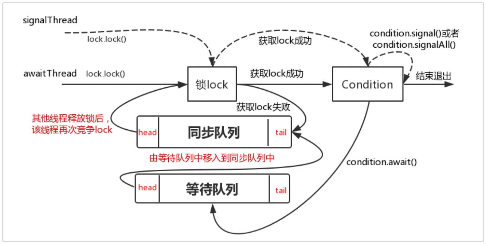
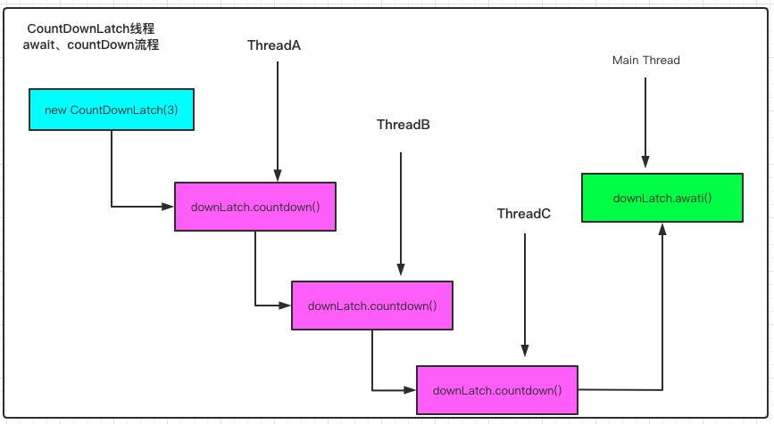
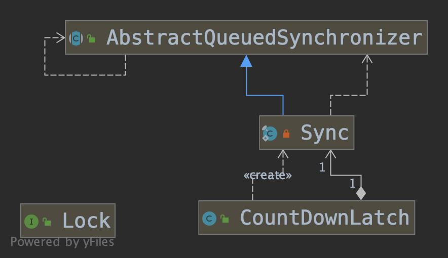
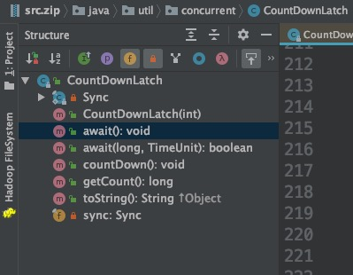
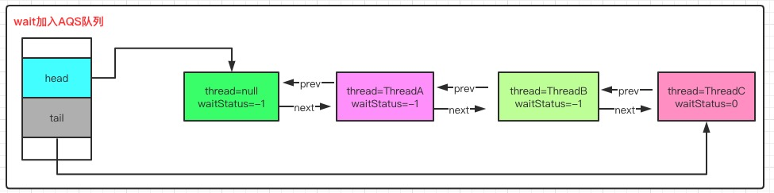
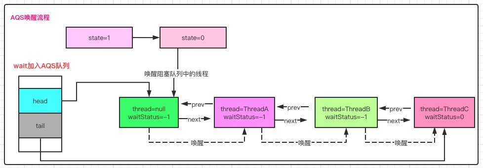

# 常用并发工具原理分析(Condition、CountDownLatch、CyclicBarrier、Semaphore)

## 一、包含的知识点

- Condition原理
- CountDownLatch原理
- CyclicBarrier原理
- Semaphore原理


## 二、Condition原理

### 2.1 Condition简单使用

​		没有Lock之前, 线程间通信可以通过wait()/notify()、notifyAll()来进行通信, 在Doug Lea提供了Lock之后, 有没有新的方式进行线程间通信了呢 ? 答案肯定是有的。 它的实现方式可以参考下面的代码

```java
//await实现
public class ConditionWait implements Runnable{
    private Lock lock ;
    private Condition condition ;

    public ConditionWait(Lock lock, Condition condition) {
        this.lock = lock;
        this.condition = condition;
    }

    @Override
    public void run() {
        System.out.println("ConditionWait start ...");

        try {
            lock.lock();
            condition.await();
            System.out.println("ConditionWait await ...");
        } catch (InterruptedException e) {
            e.printStackTrace();
        } finally {
            lock.unlock();
        }

        System.out.println("ConditionWait end ...");
    }
}

//signal实现
public class ConditionSignal implements Runnable {
    private Lock lock ;
    private Condition condition ;

    public ConditionSignal(Lock lock, Condition condition) {
        this.lock = lock;
        this.condition = condition;
    }

    @Override
    public void run() {
        System.out.println("ConditionSignal start ...");

        try{
            lock.lock();
            condition.signal();
            System.out.println("ConditionSignal signal ...");
        } catch (Exception e) {
            e.printStackTrace();
        } finally {
            lock.unlock();
        }

        System.out.println("ConditionSignal end ...");
    }
}

//main
public class ConditionMain {
    public static void main(String[] args) throws InterruptedException {
        Lock lock = new ReentrantLock();
        Condition condition = lock.newCondition() ;

        ConditionWaitDemo waitDemo = new ConditionWaitDemo(lock, condition) ;
        ConditionSignalDemo signalDemo = new ConditionSignalDemo(lock, condition) ;

        new Thread(waitDemo).start();
        new Thread(signalDemo).start();

        Thread.sleep(3000);
    }
}
```

​		Condition调用await方法后, 当前线程会释放锁并等待, 当其它线程调用Condition.signal/signalAll方法，会通知被阻塞的线程, 被唤醒的线程在获得锁之后会继续执行。

​		上面的代码是通过Condition实现wait/notify功能, 除此之外，也可以通过Condition实现生产者(Producer)/消费者(Consumer)等其它功能， 具体实现逻辑大家可以Google查询一下。


### 2.2 Condition await源码分析

​		从2.1节ConditionWait代码可以看到, 线程执行await之前需要获得锁, 执行wait操作时, 再调用await方法 

```java
lock.lock();
condition.await();
```


<font color="#f00">**condition.await()**</font>

​		首先我们看下await()的实现逻辑

```java
public final void await() throws InterruptedException {
  if (Thread.interrupted()) // 检测当前线程是否被中断了
    throw new InterruptedException();
  Node node = addConditionWaiter(); // 创建一个状态为CONDITION的节点
  int savedState = fullyRelease(node); //释放当前线程持有的锁, 因为锁具有重入性, 这里释放锁时会将state清0, savedState保存重入次数记录
  int interruptMode = 0;
  while (!isOnSyncQueue(node)) { // 如果当前线程没有在同步队列上, 就将当前线程挂起
    LockSupport.park(this); // 挂起当前线程
    if ((interruptMode = checkInterruptWhileWaiting(node)) != 0)
      break;
  }
  /** 
  	* 当线程被唤醒时, 会尝试拿锁
  	* 如果获取锁成功, 并且中断模式 != THROW_IE(-1)， 将中断模式设置为REINTERRUPT(1)
    */
  if (acquireQueued(node, savedState) && interruptMode != THROW_IE)
    interruptMode = REINTERRUPT;
  // 如果当前节点存在后续节点, 会将后续节点中CANCELLED状态的给清理掉
  if (node.nextWaiter != null) // clean up if cancelled
    unlinkCancelledWaiters();
  if (interruptMode != 0) // 如果线程被中断, 需要抛出异常或重新中断
    reportInterruptAfterWait(interruptMode);
}
```

- 首先会检测当前线程是否被中断了, 如果中断了会抛出异常
- 创建一个状态为CONDITION的节点, 并释放当前线程持有的锁
- 如果当前线程没有在同步队列上, 就将当前线程挂起
- 如果唤醒的线程获取锁成功, 并且中断模式 != THROW_IE(-1)， 就将中断模式设置为REINTERRUPT(1)
- 如果当前节点存在后续节点, 会将后续节点中CANCELLED状态的给清理掉


<font color="#f00">**addConditionWaiter()**</font>

​		将当前线程创建为节点状态为CONDITION的新Node, , 并添加到等待队列中, 这个队列是单向链表, firstWaiter指向队列首节点, lastWaiter指向队列的尾节点

```java
/**
	* Adds a new waiter to wait queue.
  * @return its new wait node
  */
private Node addConditionWaiter() {
  Node t = lastWaiter; // 获取链表中尾节点
  // If lastWaiter is cancelled, clean out.
  if (t != null && t.waitStatus != Node.CONDITION) { // 如果尾节点不是CONDITION类型, 清除CANCELLED状态节点
    unlinkCancelledWaiters();
    t = lastWaiter;
  }
  Node node = new Node(Thread.currentThread(), Node.CONDITION); // 将当前线程创建为状态为CONDITION的新节点
  if (t == null) // 链表是空链表
    firstWaiter = node;
  else // 链表非空, 原尾节点指向当前新节点
    t.nextWaiter = node;
  lastWaiter = node; // 将当前节点设置为新的尾节点
  return node;
}
```


<font color="#f00">**fullyRelease()**</font>

​		释放当前线程锁, 并清除重入记录state， 返回当前线程的重入记录值savedState, 注意和tryRelease()方法的区别

```java
/**
	* Invokes release with current state value; returns saved state.
  * Cancels node and throws exception on failure.
  * @param node the condition node for this wait
  * @return previous sync state
  */
final int fullyRelease(Node node) {
  boolean failed = true;
  try {
    int savedState = getState(); // 获取重入次数
    if (release(savedState)) { //释放锁, 并唤醒同步队列中下一个线程
      failed = false;
      return savedState;
    } else {
      throw new IllegalMonitorStateException();
    }
  } finally {
    if (failed) // 如果释放锁失败, 将当前设置为CANCELLED状态
      node.waitStatus = Node.CANCELLED;
  }
}

//ReentrantLock原理分析.md 已经分析了这个方法
public final boolean release(int arg) {
  if (tryRelease(arg)) {
    Node h = head;
    if (h != null && h.waitStatus != 0)
      unparkSuccessor(h); // 释放锁成功, 同步队列唤醒后续节点
    return true;
  }
  return false;
}
```


<font color="#f00">**isOnSyncQueue()**</font>

```java
final boolean isOnSyncQueue(Node node) {
  if (node.waitStatus == Node.CONDITION || node.prev == null)
    return false;
  if (node.next != null) // If has successor, it must be on queue
    return true;
  return findNodeFromTail(node);
}

```

​		从前面的知识点, 我们知道Condition会维护一个自己的单向链表, 将创建的等待节点Node存入链表中, 如果Condition调用了signal方法，会将等待队列中的节点加入到同步队列中, 然后尝试获取锁, isOnSyncQueue方法的作用是校验节点是否在同步队列中

- 如果return false , 表示节点不在AQS中, 当前节点在等待队列中，没有被唤醒去争抢锁, 需要等待其它线程调用signal方法来唤醒(**<font color="#987">注: node.prev == null 表示当前节点已经获取了锁资源</font>**
- 如果return true, 意味着节点在AQS队列中, 需要去竞争锁资源


具体代码分析逻辑是

- node.waitStatus == Node.CONDITION, 节点状态是CONDITION, 在等待队列中
- node.prev == null, 是head节点， 当前节点已经获取了锁
- node.next != null, 说明当前节点的状态不是CONDITION，存在后继节点, 则肯定在AQS队列中
- findNodeFromTail, 从AQS队列尾部开始查询节点是否存在于双端队列中, 如果发现说明存在AQS中


<font color="#f00">**reportInterruptAfterWait()**</font>

​		根据interruptMode中断标识, 来进行中断上报

- THROW_IE，则抛出中断异常
- REINTERRUPT，则重新响应中断


acquireQueued()方法在 **ReentrantLock原理分析.md** 文章中已经讲解, 这里不再分析。

### 2.3 Condition signal源码分析

​		执行Condition.await方法后, 线程会加入等待队列, 调用Condition.signal方法来激活, 下面是signal方法的入口, 核心方法是doSignal

```java
public final void signal() {
  if (!isHeldExclusively()) // 当前线程是否以独占方式持有监视器锁, 如果不是抛出异常
    throw new IllegalMonitorStateException();
  Node first = firstWaiter; // 等待队列首节点
  if (first != null)
    doSignal(first); // 存在首节点, 找到第一个CONDITION节点进行signal操作
}
```


<font color="#f00">**doSignal()**</font>

```java
private void doSignal(Node first) {
  do {
    if ( (firstWaiter = first.nextWaiter) == null)
      lastWaiter = null;
    first.nextWaiter = null; //first节点已经处理过了, 将nextWaiter设置为null
  } while (!transferForSignal(first) &&
           (first = firstWaiter) != null);
}

// 如果节点类型是CONDITION, 加入到AQS队列中
final boolean transferForSignal(Node node) {
  if (!compareAndSetWaitStatus(node, Node.CONDITION, 0))//更新节点状态为0, 如果更新失败说明节点是CANCELLED状态
    return false;

  Node p = enq(node); // 将当前节点添加到AQS队列中, 并且返回原队列的尾节点
  int ws = p.waitStatus;
  // 如果节点是CANCELLED状态 或者CAS设置节点为SIGNAL失败, 唤醒当前线程
  if (ws > 0 || !compareAndSetWaitStatus(p, ws, Node.SIGNAL))
    LockSupport.unpark(node.thread);
  return true;//如果node的prev节点是signal状态, 那么被阻塞线程的唤醒操作由AQS来完成
}
```

​		从Condition队列首部开始, 查找一个类型是CONDITION的节点, 执行transferForSignal方法, 将节点从Condition等待队列移入到AQS等待队列中，同时修改原同步队列尾节点的状态。

​		transferForSignal方法通过CAS方式修改节点状态, 如果成功从CONDITION状态修改为默认状态(0), 将节点添加到AQS队列中, 然后唤醒这个节点对应的线程, 线程重新执行。


### 2.4 被阻塞的线程唤醒后的操作

​		在2.2节讲解await方法时checkInterruptWhileWaiting逻辑没有具体分析,  那么它的作用是什么呢 ？分析逻辑: 如果当前线程不在同步队列中, 那么该线程会被挂起, 然后检测线程在等待过程中有没有被其它线程触发过中断请求 。

```java
while (!isOnSyncQueue(node)) {
  LockSupport.park(this);
  if ((interruptMode = checkInterruptWhileWaiting(node)) != 0)
    break;
}
```

​		执行Condition.signal方法后, 被唤醒的线程会执行if逻辑, 校验当前线程的中断情况， 下面我们来分析方法checkInterruptWhileWaiting

```java
private int checkInterruptWhileWaiting(Node node) {
  return Thread.interrupted() ? // 如果线程被中断了, 执行transferAfterCancelledWait方法判断是抛出异常(THROW_IE)还是重新中断(REINTERRUPT)
    (transferAfterCancelledWait(node) ? THROW_IE : REINTERRUPT) : 
  0;
}

final boolean transferAfterCancelledWait(Node node) {
  // 使用CAS修改节点状态, 如果成功，对node节点进行入队操作
  if (compareAndSetWaitStatus(node, Node.CONDITION, 0)) {
    enq(node);
    return true;
  }

  /**
  	* 如果CAS失败, 判断当前node节点是否已经在AQS队列上
  	* 如果不在, yield操作
  	* 如果在, 返回false
  	*/ 
  while (!isOnSyncQueue(node)) 
    Thread.yield();
  return false;
}
```

​		transferAfterCancelledWait在进行CAS操作的时候可能会失败, 但是它的失败可能是:

- 发生了中断操作
- 发生了signal操作


​		为了确定具体的操作，需要先将当前节点通过enq方法入队, 然后返回false给checkInterruptWhileWaiting, 再返回REINTERRUPT(1), 用于后续重新中断。

​		checkInterruptWhileWaiting方法代表当前线程是否在park的时候被中断唤醒, 

- 如果为true,	表示中断在signal之前, 需要抛出InterruptedException	
- 如果为false, 表示执行了signal操作, 需要重新中断


### 2.5 总结

​		线程 awaitThread 通过lock.lock()方法获取锁成功后调用了 condition.await 方法进入等待队列，而另一个线程signalThread 通过 lock.lock()方法成功获取锁后, 执行condition.signal 或者 signalAll 方法，使得awaitThread线程能够有机会移入到同步队列，当其他线程释放 lock 后，使得awaitThread线程能够有机会获取 lock，从而使得awaitThread线程能够从 await 方法中退出，进行后续操作。如果 awaitThread 获取 lock 失败会直接进入到同步队列



​		对上面流程图做下面说明

- 阻塞，await方法中, 线程释放锁资源后, 如果节点不在AQS同步队列, 则阻塞当前节点, 如果在同步队列, 则通过自旋方式尝试获取锁
- 释放, signal后, 节点会从Condition等待队列进入AQS同步队列, 进入正常的锁获取流程


## 三、CountDownLatch

### 3.1 CountDownLatch作用

​		CountDownLatch是一个工具类, 调用await方法后, 它允许一个或者多个线程一直等待, 直到其它线程操作执行结束, c中核心方法

- countdown

  每调用一次, state的值就减1, 当state=0时, 会唤醒AQS队列中的线程

- await

  调用了await方法, 如果state不为0, 线程将加入AQS队列进行等待


​		之前我们有提到AQS.state这个字段，它在不同并发类中有不同的作用, 比如重入锁中, state表示重入次数；那CountDownLatch中是什么意思，它是怎么指定的呢 ？

```java
//1. 创建对象
CountDownLatch downLatch = new CountDownLatch(3);

//2. CountDownLatch构造函数
public CountDownLatch(int count) {
  if (count < 0) throw new IllegalArgumentException("count < 0");
  this.sync = new Sync(count);
}

//3. Sync构造函数
Sync(int count) {
  setState(count);
}

protected final void setState(int newState) {
  state = newState;
}
```

​		从上面创建CountDownLatch的代码, 可以看出state就是入参的值, 用作计数器, 通过countdown来进行递减。下面是相关图示




### 3.2 CountDownLatch await源码分析

​		在进行源码讲解前, 请先看下类继承图和CountDownLatch类结构图，








​		针对CountDownLatch类，其核心方法是await、countDown，这里我们先讲解await方法

```java
//1. await方法入口
public void await() throws InterruptedException {
  sync.acquireSharedInterruptibly(1);
}

//2. 中断方式获取共享锁
public final void acquireSharedInterruptibly(int arg)
  throws InterruptedException {
  if (Thread.interrupted()) // 中断了就抛出异常
    throw new InterruptedException();
  if (tryAcquireShared(arg) < 0)
    doAcquireSharedInterruptibly(arg); // wait核心逻辑, state !- 0 , 当前线程需要加入共享锁队列
}
```

- 首先检测线程是否被中断过, 如果被中断了, 抛出中断异常

- 尝试获取锁, 即校验 state 是否等于 0 , true 返回1，false返回-1

  ```java
  protected int tryAcquireShared(int acquires) {
    return (getState() == 0) ? 1 : -1;
  }
  ```

- 获取锁失败, state !=0 , 将线程加入AQS队列


<font color="#f87">**doAcquireSharedInterruptibly**</font>

​		**<font color="#a45123">注: 在执行锁匙放时, 如果unparkSuccessor成功, 说明有新的线程占有了锁, 代码会重新回到doAcquireSharedInterruptibly中执行,被唤醒的线程进入下一次循环判断; state=0时, 会执行setHeadAndPropagate方法</font>**

```java
/**
	* Acquires in shared interruptible mode.
	* 以共享中断方式获取锁
  */
private void doAcquireSharedInterruptibly(int arg)
  throws InterruptedException {
  final Node node = addWaiter(Node.SHARED); // 创建SHARED模式的节点, 并加入共享队列(AQS)末尾
  boolean failed = true;
  try {
    for (;;) {
      final Node p = node.predecessor(); //获取当前节点的前序节点
      if (p == head) {
        int r = tryAcquireShared(arg); // 如果前序节点是head节点, 尝试获取锁
        if (r >= 0) {
          setHeadAndPropagate(node, r); // 如果state=0, 设置头节点并继续唤醒队列中的其它节点
          p.next = null; // help GC
          failed = false;
          return;
        }
      }
      if (shouldParkAfterFailedAcquire(p, node) &&
          parkAndCheckInterrupt()) //阻塞线程
        throw new InterruptedException();
    }
  } finally {
    if (failed)
      cancelAcquire(node);
  }
}
```

​		针对上面逻辑代码， 如果state不为0, 此时有3个线程调用了awat方法, 那么这三个线程都会加入AQS队列, 并处于阻塞状态, 下面是AQS图解




<font color="#f87">**setHeadAndPropagate**</font>

​		这个方法的作用是把被唤醒的节点，设置成head节点, 然后唤醒队列中的后续节点, 假如await队列中有ThreadA -> ThreadB -> ThreadC三个等待线程, 如果ThreadA被唤醒, 且设置为head节点, 会唤醒ThreadB节点; 如果ThreadB被唤醒且设置为头节点, 会唤醒ThreadC节点, 依次类推，请看下面图解




### 3.3 CountDownLatch countdown源码分析

​		线程调用awati方法阻塞后, 需要调用countDowan方法使得state=0，才能被再次唤醒。

```java
//1. countDown方法入口
public void countDown() {
  sync.releaseShared(1);
}

//2. Sync.releaseShared 方法释放锁逻辑
public final boolean releaseShared(int arg) {
  if (tryReleaseShared(arg)) { // 尝试释放共享锁
    doReleaseShared(); // 执行锁释放逻辑
    return true;
  }
  return false;
}

//3. 尝试释放锁
protected boolean tryReleaseShared(int releases) {
  // Decrement count; signal when transition to zero
  for (;;) {
    int c = getState();
    if (c == 0)
      return false;
    int nextc = c-1;
    if (compareAndSetState(c, nextc))
      return nextc == 0;
  }
}
```

- 当state=0时, 直接返回false, 否则state-1, 通过CAS方式更新state, 再将更新后的state和0比较, 并返回。
- 如果state=0,   调用doReleaseShared方法进行锁匙放


<font color="#f87">**doReleaseShared**</font>

```java
private void doReleaseShared() {
  for (;;) {
    Node h = head;
    if (h != null && h != tail) {
      int ws = h.waitStatus;
      if (ws == Node.SIGNAL) {
        if (!compareAndSetWaitStatus(h, Node.SIGNAL, 0))
          continue;            // loop to recheck cases
        unparkSuccessor(h); // 唤醒线程
      }
      else if (ws == 0 &&
               !compareAndSetWaitStatus(h, 0, Node.PROPAGATE)) // 如果CAS失败, 可能是这个时候刚好有个节点入队, 入队时, 会将ws修改为-1
        continue;                // loop on failed CAS
    }
    if (h == head) //说明unparkSuccessor还没有唤醒线程, 退出循环
      break;
  }
}
```

​		注意共享锁、独占锁释放的区别, tryRelease的逻辑可以查看 **ReentrantLock 原理分析.md**，

​		释放锁的前部分逻辑和独占锁释放逻辑一样, 先判断头节点是不是signal状态, 如果是修改为默认状态0, 并唤醒头节点的下一个节点。

​		**<font color="#f98">Node.PROPAGATE，标识PROPAGATE状态的节点, 是共享锁模式下的节点状态，处于这个状态下节点，会对线程的唤醒进行传播</font>**

​		针对是否退出循环操作, 

- head == h成立, 说明头节点还没有被unparkSuccessor唤醒线程, 此时break推出循环
- head == h不成立, unparkSuccessor唤醒的线程占有了锁, 会重新进入下一轮循环, 唤醒下一个线程节点


## 四、CyclicBarrier

### 4.1 CyclicBarrier知识

​		CyclicBarrier是循环(Cyclic)栅栏(Barrier)，它的作用是让一组线程到达屏障(Barrier, 也叫同步点)时阻塞, 直到最后一个线程到达屏障, 所有的线程才继续执行, 类的构造方法如下，参数parties表示栅栏需要拦截的线程数量

```java
CyclicBarrier(int parties)
```

​		线程执行await方法时, 是告诉CyclicBarrier当前线程已经到达屏障, 然后线程会被阻塞, **<font color="#a12345">其实现是基于ReentrantLock和Condition组合实现的</font>**

​		<font color="#889933">**注意点**</font>

- CountDownLatch和CyclicBarrier之间的区别, CountDownLatch只能使用一次, CyclicBarrier可以反复使用

- 对于计数值 parties，如果没有足够的线程调用 CyclicBarrier.await，则所有调用 await 的线程都会被阻塞
-  CyclicBarrier 可以调用 await(timeout, unit)，设置超时时间，在设定时间内，如果没有足够线程到达，则解除阻塞状态，继续执行
- 通过 reset 重置计数，会使得进入 await 的线程出现 BrokenBarrierException
- 如果采用是 CyclicBarrier(int parties, Runnable barrierAction) 构 造 方 法 ， 执行barrierAction 操作的是最后到达的线程


### 4.2 CyclicBarrier实践用例

​		生产实践中, 存在数据迁移操作, 在数据量比较大的时候可以创建多线程进行进行分页批量处理, 下面是逻辑代码

```java
//main 入口
public class CycliBarrierMain extends Thread {
    @Override
    public void run() {
        System.out.println("执行数据校验逻辑, 检查数据量是否正确");
    }

    public static void main(String[] args) {
        //CycliBarrierMain, 其它线程执行完之后最后需要的线程
        CyclicBarrier cyclicBarrier = new CyclicBarrier(3, new CycliBarrierMain()) ;

        new Thread(new DataTransferThread(0, 1000, cyclicBarrier)).start();
        new Thread(new DataTransferThread(1001, 2000, cyclicBarrier)).start();
        new Thread(new DataTransferThread(2001, 3000, cyclicBarrier)).start();
    }
}

// 数据处理线程
public class DataTransferThread extends Thread {
    private CyclicBarrier cyclicBarrier ;
    private int startIndex ;
    private int endIndex ;

    public DataTransferThread(int startIndex, int endIndex, CyclicBarrier cyclicBarrier) {
        this.startIndex = startIndex ;
        this.endIndex = endIndex ;
        this.cyclicBarrier = cyclicBarrier ;
    }

    @Override
    public void run() {
        System.out.println("开始迁移 startIndex=" + startIndex+ " , endIndex=" +endIndex+ " 位置的数据");
        try {
            cyclicBarrier.await(); // 数据迁移完, 执行等待操作
        } catch (InterruptedException e) {
            e.printStackTrace();
        } catch (BrokenBarrierException e) {
            e.printStackTrace();
        }
    }
}
```


## 五、Semaphore

### 5.1 基本作用

​		semaphore可以控制同时访问的线程个数, 通过acquire获取一个许可, 如果没有就等待, 通过release释放一个许可, **<font color="#f00">可以用于限流</font>**。

```java
public Semaphore(int permits) {
  sync = new NonfairSync(permits);
}
```

​		参数permits用于设置state的值, 每调用一次acquire, 会执行state=state-1; 调用release的时候，会执行state=state+1; 如果acquire时state=0, 会阻塞当前线程, 等待release释放锁资源。

### 5.2 公平策略、非公平策略

```java
public Semaphore(int permits, boolean fair) {
  sync = fair ? new FairSync(permits) : new NonfairSync(permits);
}
```

​		参数fair用于决定使用公平策略还是非公平测试, 默认情况使用的是非公平策略

**<font color="#f98">FairSync</font>**

```java
static final class FairSync extends Sync {
  private static final long serialVersionUID = 2014338818796000944L;

  FairSync(int permits) {
    super(permits);
  }

  protected int tryAcquireShared(int acquires) {
    for (;;) {
      if (hasQueuedPredecessors())//判断AQS中是否有线程已经在排队, 严格按照FIFO顺序执行
        return -1;
      int available = getState();
      int remaining = available - acquires;
      if (remaining < 0 ||
          compareAndSetState(available, remaining)) // AQS没有其它等待线程, 执行CAS
        return remaining;
    }
  }
}
```


**<font color="#f98">NonfairSync</font>**

```java
static final class NonfairSync extends Sync {
  private static final long serialVersionUID = -2694183684443567898L;

  NonfairSync(int permits) {
    super(permits);
  }

  protected int tryAcquireShared(int acquires) {
    return nonfairTryAcquireShared(acquires);
  }
}

final int nonfairTryAcquireShared(int acquires) {
  for (;;) {
    int available = getState();
    int remaining = available - acquires;
    if (remaining < 0 ||
        compareAndSetState(available, remaining))
      return remaining;
  }
}
```

​		对比公平策略和非公平策略, 公平策略多了一个hasQueuedPredecessors判断

源码分析, 因为获取锁、释放锁的逻辑和CountDownLatch一样基于共享锁的方式操作的, 代码逻辑相同, 具体逻辑请看第三节, 这里不在具体分析。

```java
//获取锁
public void acquire() throws InterruptedException {
  sync.acquireSharedInterruptibly(1);
}

//释放锁
public void release() {
  sync.releaseShared(1);
}
```


### 5.3 实践用例

​		这里以汽车占用车位示例

```java
public class SemaphoreDemo {
    public static void main(String[] args) {
        Semaphore semaphore = new Semaphore(5) ;
        for (int i = 0 ; i < 10 ; i++) {
            new Car(semaphore).start();
        }
    }

    static class Car extends Thread {
        private Semaphore semaphore ;

        public Car(Semaphore semaphore) {
            this.semaphore = semaphore ;
        }

        @Override
        public void run() {
            try {
                semaphore.acquire();
                System.out.println("线程 " + Thread.currentThread().getName() + " 占用了停车位");
                TimeUnit.SECONDS.sleep(2);
                System.out.println("线程 " + Thread.currentThread().getName() + " 辆车开走了");
                semaphore.release();
            } catch (InterruptedException e) {
                e.printStackTrace();
            }
        }
    }
}

```


