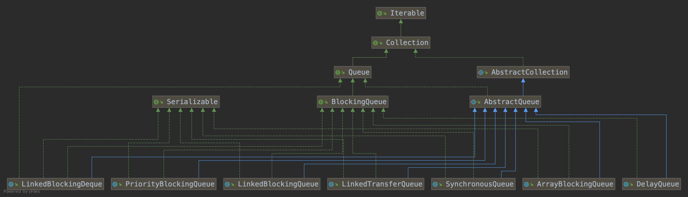

#  阻塞队列、原子类原理分析

## 一、常用阻塞队列

		### 1.1 使用场景

​		阻塞队列比较普遍的使用场景是生产者、消费者, 以便于服务解耦，提高应用性能; 而分布式架构应用比较频繁的是消息队列比如:Kafka、Rocketmq, 阻塞队列类似于broker, 生产者和消费者类似于服务生成逻辑和消费逻辑，基于阻塞队列解耦。同时阻塞队列是一个FIFO队列, 对于需要实现目标服务顺序访问的场景, 也可以使用。

- 实现逻辑的异步解耦
- 实现目标服务的顺序访问


### 1.2 常用的阻塞队列

​		下面是JDK提供的比较常用的阻塞队列

| 阻塞队列              | 说明                                                         |
| --------------------- | ------------------------------------------------------------ |
| ArrayBlockingQueue    | 基于数组实现的有界阻塞队列, 按照先进先出(FIFO)原则对元素进行排序。 |
| DelayQueue            | 基于优先级队列实现的阻塞队列                                 |
| LinkedBlockingDeque   | 基于链表实现的双向阻塞队列                                   |
| LinkedBlockingQueue   | 基于链表实现的有界阻塞队列, 默认最大长度是Integer.MAX_VALUE, 按照先进先出(FIFO)原则排序 |
| LinkedTransferQueue   | 基于链表实现的无界阻塞队列                                   |
| PriorityBlockingQueue | 基于优先级排序的无界阻塞队列, 默认采用升序排序, **<font color="#f00">自定义排序规则实现方式</font>**,  1) 覆盖compareTo方法实现  2) 初始化PriorityBlockingQueue时, 指定构造参数Comparator对元素进行排序 |
| SynchronousQueue      | 不存储元素的阻塞队列, 每个put操作必须对应一个take操作, 否则不能继续添加元素 |




### 1.3 阻塞队列的常用方法

- 插入操作
  - add(e), 添加元素到队列中, 如果队列满了, 继续插入元素会报IllegalStateException异常
  - offer(e), 添加元素到队列中，返回元素是否插入成功, true -- 成功, false -- 失败
  - offer(e, unit), 如果阻塞队列满了, 再继续添加元素会被阻塞指定时间, 超时后线程直接退出
  - put(e), 如果阻塞队列满了, 再继续添加元素, 线程会被阻塞, 直到队列可用
- 移除操作
  - remove(), 当队列为空时, 删除会返回false；如果删除元素成功, 返回true
  - poll(), 如果队列存在元素, 则从队列取出一个元素, 如果队列为空, 返回null
  - poll(time, unit), 如果队列为空, 会等待指定超时时间再去获取元素
  - take()，如果队列为空，再获取元素线程会被阻塞, 直到队列可用


## 二、ArrayBlockingQueue原理分析

​		ArrayBlockingQueue是基于数组、ReentrantLock、Condition实现的阻塞队列, 它的**<font color="#f00000">数据结构是 数组 + 等待队列</font>**构成, 下面看下构造方法

```java
public ArrayBlockingQueue(int capacity, boolean fair) {
  if (capacity <= 0)
    throw new IllegalArgumentException();
  this.items = new Object[capacity];
  lock = new ReentrantLock(fair); // 重入锁, 添加、获取元素需要获得这把锁
  notEmpty = lock.newCondition(); // 初始化非空等待队列
  notFull =  lock.newCondition(); // 初始化非满阻塞队列
}
```

- capacity: 表示数组长度,  也就是队列长度
- fair: 表示是否为公平的阻塞队列, 默认false, 表示基于非公平锁实现的阻塞队列


### 2.1 添加操作

**<font color="#f00">add(e)</font>**

```java
//1. 添加元素, 返回boolean结果
public boolean add(E e) {
  return super.add(e); // 调用父类add方法
}

//2. AbstractQueue添加元素的方法
public boolean add(E e) {
  if (offer(e)) // 添加成功返回true
    return true;
  else // 添加失败, 抛出异常
    throw new IllegalStateException("Queue full");
}
```

​		这里使用了模版设计模式, 以ArrayBlockingQueue的add方法作为入口, 实际调用的是父类的add方法, 这样做的目的是解决通用型问题。

​		add内部调用了offer方法, 用于判断队列是否满了, 如果offer返回true表示添加成功, 如果返回false,表示队列满了，会抛出IllegalStateException异常	


**<font color="#f00">offer(e)</font>**

```java
public boolean offer(E e) {
  checkNotNull(e); // 检查元素e是否为空
  final ReentrantLock lock = this.lock; // 添加重入锁
  lock.lock();
  try {
    if (count == items.length) // 列表满了, 返回false, 不用等待, 注意和put区别
      return false;
    else { // 队列没满, 进行入队操作
      enqueue(e);
      return true;
    }
  } finally {
    lock.unlock(); // 释放锁
  }
}
```

​		offer方法根据是否添加成功返回对应的逻辑值, true -- 成功, false -- 失败

- 校验添加的元素是否为空
- 添加重入锁, 进行加锁、解锁操作
- 校验阻塞队列是否已经满了,
  - 如果满了返回false
  - 如果没满进行入队操作(enqueue)
- 释放获取的锁


**<font color="#f00">enqueue(e)</font>**

```java
/**
	* Inserts element at current put position, advances, and signals.
  * Call only when holding lock.
  */
private void enqueue(E x) {
  // assert lock.getHoldCount() == 1;
  // assert items[putIndex] == null;
  final Object[] items = this.items; 
  items[putIndex] = x; // 通过putIndex索引对数据赋值
  if (++putIndex == items.length) // 当putIndex等于数组长度时, 将putIndex重置为0, 避免数组下标越界
    putIndex = 0;
  count++; // 记录队列中元素个数
  notEmpty.signal(); // 元素入队列成功, 发出signal通知
}
```

​		add、offer方法添加元素到阻塞队列中的核心处理方法, 线程持有锁后, 通过putIndex索引直接将元素添加到数组items, 这里有两个核心地方

- putIndex == item.length时, 需要将putIndex重置为0, 避免下标越界
- 添加元素后需要通过 notEmpty.signal发送通知, 让等待的消费线程可以继续执行, 因为获取(take)元素时, 如果队列为空会执行notEmpty.await进行等待


**<font color="#f00">put(e)</font>**

```java
public void put(E e) throws InterruptedException {
  checkNotNull(e); // 检查元素是否为空
  final ReentrantLock lock = this.lock; // 获得锁
  /**
  	* 注意和lock.lock()方法的区别
  	* lockInterruptibly方法允许在等待时, 由其它线程调用interrupt进行中断
  	* lock方法是尝试获得锁成功后才响应中断
  	*/
  lock.lockInterruptibly();
  try {
    while (count == items.length) // 检查队列是否已经满了, 如果满了notFull进行等待
      notFull.await();
    enqueue(e); // 队列未满, 进行入队操作
  } finally {
    lock.unlock(); // 释放锁
  }
}
```

​		put方法和offer、add方法一样都是添加元素的方法, 注意它们之间的区别

- add方法, 内部调用的是offer, 如果队列满了, 抛出IllegalStateException异常, 即offer返回false
- offer方法, if检测, 如果队列满了, 会直接返回false; 如果是offer(e, time, unit)队列满时需等待
- put方法, while循环检测, 如果队列满了, notFull.await()等待, 当队列未满时继续执行入队操作


### 2.2 删除操作


**<font color="#f00">remove</font>**

```java
//AbstractQueue.remove
public E remove() {
  E x = poll(); // 内部调用poll获取队列第一个有效元素
  if (x != null) // 元素x不为空, 直接返回这个元素
    return x;
  else // x==null，抛出异常
    throw new NoSuchElementException();
}
```

​		内部调用poll方法, 如果获取到元素直接返回这个元素, 如果没有获取到元素抛出NoSuchElementException异常


**<font color="#f00">poll</font>**

```java
//1. 获取元素
public E poll() {
  final ReentrantLock lock = this.lock; // 获取锁对象
  lock.lock();
  try {
    return (count == 0) ? null : dequeue(); // 如果队列不为空, dequeue返回元素, 否则返回null
  } finally {
    lock.unlock(); // 释放占有的锁
  }
}

//2. 带超时时间的获取元素
public E poll(long timeout, TimeUnit unit) throws InterruptedException {
  long nanos = unit.toNanos(timeout);
  final ReentrantLock lock = this.lock; // 获取重入锁
  /**
  	* 注意和lock.lock()方法的区别
  	* lockInterruptibly方法允许在等待时, 由其它线程调用interrupt进行中断
  	* lock方法是尝试获得锁成功后才响应中断
  	*/
  lock.lockInterruptibly();
  try {
    while (count == 0) {
      if (nanos <= 0)
        return null;
      nanos = notEmpty.awaitNanos(nanos); // 超时等待, notEmpty等待nanos时间
    }
    return dequeue(); // 入队操作
  } finally {
    lock.unlock(); // 释放持有的锁
  }
}
```


- 获取重入锁, 进行加锁、解锁操作
- 校验阻塞队列是否为空
  - 如果为空， 返回null
  - 如果不为空, 进行dequeue操作, 返回对应元素
- 释放获取的锁

NOTE: 分析上面代码, 需要注意poll()和poll(time, unit)的区别, poll(time, unit)会进行超时等待, 而poll会直接返回。


**<font color="#f00">take</font>**

```java
public E take() throws InterruptedException {
  final ReentrantLock lock = this.lock; // 获取锁
  /**
  	* 注意和lock.lock()方法的区别
  	* lockInterruptibly方法允许在等待时, 由其它线程调用interrupt进行中断
  	* lock方法是尝试获得锁成功后才响应中断
  	*/
  lock.lockInterruptibly();
  try {
    while (count == 0) // 队列为空, 进行等待操作
      notEmpty.await();
    return dequeue(); // 队列非空, dequeue获取元素
  } finally {
    lock.unlock(); // 释放持有的锁
  }
}
```

​		阻塞式获取队列中元素的方法, 注意和poll()、poll(time, unit)的区别, 这个阻塞是可中断的, 这点和poll(time, unit)一样, 如果队列没有元素会notEmpty.await阻塞, 当队列中有元素时会继续执行; 这里可以和入队操作相对应， 在入队时会调用enqueue, 如果入队成功会调用notEmpty.signal进行通知，唤醒take阻塞的线程继续执行。


**<font color="#f00">dequeue</font>**

```java
/**
 * Extracts element at current take position, advances, and signals.
 * Call only when holding lock.
 */
private E dequeue() {
    // assert lock.getHoldCount() == 1;
    // assert items[takeIndex] != null;
    final Object[] items = this.items;
    @SuppressWarnings("unchecked")
    E x = (E) items[takeIndex]; // 默认获取下标为0的数据
    items[takeIndex] = null; // 将该位置的元素设置为null
    if (++takeIndex == items.length) // 当takeIndex == 数组长度是, 重置takeIndex, 避免数组越界
        takeIndex = 0;
    count--; // 数组数量减1
    if (itrs != null)
        itrs.elementDequeued(); // 更新迭代器中的元数据
    notFull.signal(); // 发送数组未满的信号, 让因为数组满而阻塞的线程可以继续执行添加操作
    return x;
}
```

​		dequeue是出队列的核心方法, 主要是删除队列头部元素,并返回给调用者, takeIndex记录获取数据的索引值，可以和putIndex进行比较。

​		itrs.elementDequeued, 更新迭代器中的元数据, 从前面阻塞方法类结构图可以看出, ArrayBlockingQueue的父类AbstractCollection含有抽象方法iterator, ArrayBlockingQueue对这个方法进行了实现, 所以实现了迭代器的功能。


## 三、原子操作类

​		操作的原子性, 是指一个操作或者一系列操作要么同时成功, 要么同时失败, 不允许部分成功，部分失败，比如我们常见的 i++, 是一个非原子操作。

### 3.1 原子类的分类

- 原子更新基本类型
  - AtomicBoolean、AtomicInteger、AtomicLong
- 原子更新数组
  - AtomicIntegerArray、AtomicLongArray、AtomicReferenceArray
- 原子更新引用
  - AtomicReference、AtomicReferenceFieldUpdater、AtomicMarkableReference
- 原子更新字段
  - AtomicIntegerFieldUpdater、AtomicLongFieldUpdater、AtomicStampedReference


### 3.2 原理分析

**<font color="#f00">unsafe</font>**

​		unsafe在很多场景中都有使用, 比如:

- 多线程同步(MonitorEnter)
- CAS操作(compareAndSwap)
- 线程的挂起和恢复(park、unpark)
- 内存屏障(loadFence、storeFence)
- 原子类操作(getAndIncrement、getAndAdd)

​		

​		这里以AtomicInteger为例说明原子操作的实现原理, 原子操作的实现是基于unsafe来实现基本操作的, 具体查看下面内容

**<font color="#f00">getAndIncrement</font>**

```java
public final int getAndIncrement() {
  return unsafe.getAndAddInt(this, valueOffset, 1);
}
```


**<font color="#f00">getAndAdd</font>**

```java
public final int getAndAdd(int delta) {
  return unsafe.getAndAddInt(this, valueOffset, delta);
}
```


**<font color="#f00">compareAndSet</font>**

```java
public final boolean compareAndSet(int expect, int update) {
  return unsafe.compareAndSwapInt(this, valueOffset, expect, update);
}
```

