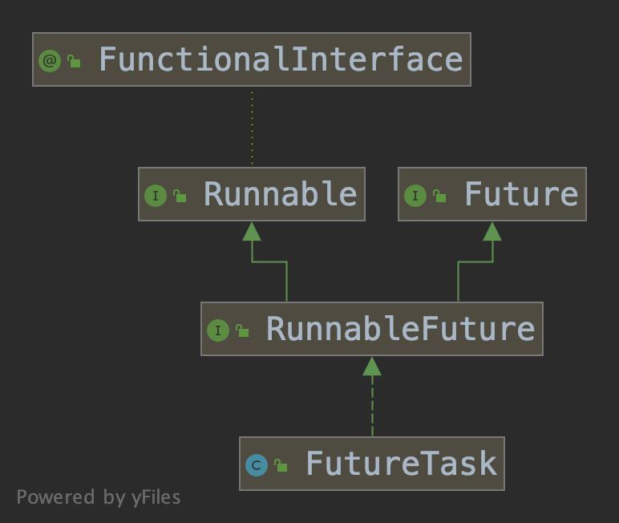
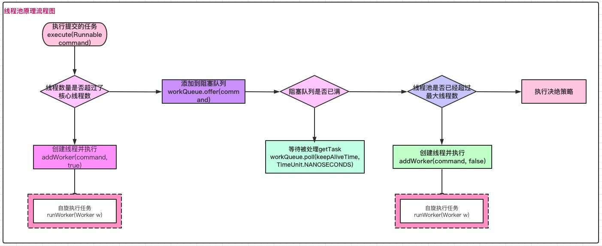

# 线程池的使用原理分析

## 一、包含的知识点

- 为什么需要线程池
- 线程池API
- 线程池创建方式
- 线程池创建方式
- 线程池ThreadPoolExecutor
- 线程池原理分析
- Callable/Future原理分析


## 二、为什么需要线程池

​		线程是任务执行的基本单位, 但是计算机能够执行的线程数是有一定限制的, 创建过多的线程会引起系统资源不足, 原因如下:

- 线程的创建、销毁需要消耗过多的系统资源
- 线程上下文切换频繁, 造成系统资源严重消耗


​		为了解决上面的问题, 提出了**<font color="#f00">线程池</font>**概念, 那么线程池具有哪些优点呢 ?

- 降低创建线程、销毁线程带来的性能开销
- 合理的线程数，一定程度的提高了响应速度,  当有新任务需要执行时, 不需要等待线程创建可以立即执行
- 合理的设置线程池大小, 避免线程数过多造成系统资源问题


## 三、线程池API

### 3.1 创建线程的方式

​		在前面关于并发的文章中，有提到创建线程的方式, 这里再提一下

- 继承Thread

  复写run方法, 没有返回值

- 实现Runnable

  复写run方法, 没有返回值, 可以没有run方法之外的其它方法

- 实现Callbale、Future

  复写call方法(类似run方法), 带有返回值,

- 线程池

  提供线程队列, 队列中包含所有等待状态的线程, 减少了创建、销毁开销, 提高了响应速度


​		这里我们将讲解使用线程池创建线程的方式

### 3.2 创建线程池的方式

​		为了方便对线程池的使用, Executors提供了创建线程池的工厂方法, 包含:

- newSingleThreadExecutor, 创建线程数为1的线程池, 若存在空闲线程则执行, 若不存在空闲线程, 则暂缓在任务队列中
- newFixedThreadPool，创建线程数为固定大小的线程池, 任务提交时如果有空闲线程则立即执行，如果没有空闲线程, 暂缓在任务队列中, 等待空闲的线程再继续执行。
- newCachedThreadPool，根据实际情况调整线程数量的线程池, 最大线程池个数为Integer.MAX_VALUE, 任务提交时, 如果有空闲的线程则执行任务, 如果无任务执行则不创建线程, 并且线程再空闲60s之后会自动回收**(可能引起创建线程过多的问题)**
- newScheduledThreadPool, 创建指定线程数量的线程池,  其除了具有其它线程功能, 还带有延迟、周期性执行任务的功能, 类似定时器。


### 3.3 线程统一封装类型ThreadPoolExecutor

​		ThreadPoolExecutor有多个构造函数, 这里我们看下最全参数的构造函数, 其它构造函数都会派生成这个构造函数

```java
public ThreadPoolExecutor(int corePoolSize, // 核心线程数量
                          int maximumPoolSize,  // 最大线程数量
                          long keepAliveTime, // 超时时间, 超出核心线程数量之外的线程空闲存活时间
                          TimeUnit unit, // 时间单位
                          BlockingQueue<Runnable> workQueue, // 保存执行任务的队列
                          ThreadFactory threadFactory, // 创建新线程使用的工厂
                          RejectedExecutionHandler handler) { // 拒绝策略, 任务无法执行时处理方式
  if (corePoolSize < 0 ||
      maximumPoolSize <= 0 ||
      maximumPoolSize < corePoolSize ||
      keepAliveTime < 0)
    throw new IllegalArgumentException();
  if (workQueue == null || threadFactory == null || handler == null)
    throw new NullPointerException();
  this.acc = System.getSecurityManager() == null ?
    null :
  AccessController.getContext();
  this.corePoolSize = corePoolSize;
  this.maximumPoolSize = maximumPoolSize;
  this.workQueue = workQueue;
  this.keepAliveTime = unit.toNanos(keepAliveTime);
  this.threadFactory = threadFactory;
  this.handler = handler;
}
```

​		从构造函数看出, ThreadPoolExecutor创建时没有创建线程, 当有任务需要执行时才会创建线程(线程的初始化和普通线程初始化方式一样),  在完成任务后线程不会销毁而是以挂起的状态返回线程池, 直到应用程序再次发出请求, 挂起的线程会再次被使用, 这种方式节省了大量的系统资源开销。


<font color="#f00">**newFixedThreadPool**</font>

​		创建线程数量只有一个的线程池，它只会用唯一的工作线程来执行任务，保证所有任务按照指定 顺序(FIFO, LIFO, 优先级)执行

```java
public static ScheduledExecutorService newSingleThreadScheduledExecutor() {
  return new DelegatedScheduledExecutorService
    (new ScheduledThreadPoolExecutor(1));
}

public ScheduledThreadPoolExecutor(int corePoolSize) {
  super(corePoolSize, Integer.MAX_VALUE, 0, NANOSECONDS,
        new DelayedWorkQueue());
}
```


<font color="#f00">**newFixedThreadPool**</font>

​		**<font color="#908754">用途: newFixedThreadPool用于负载较大的服务器, 需要限制线程数量, 便于资源的合理利用</font>**

```java
public static ExecutorService newFixedThreadPool(int nThreads, ThreadFactory threadFactory){
  return new ThreadPoolExecutor(nThreads, nThreads,
                                0L, TimeUnit.MILLISECONDS,
                                new LinkedBlockingQueue<Runnable>(),
                                threadFactory);
}
```

newFixedThreadPool线程池的参数说明

- corePoolSize、maximumPoolSize线程数都是指定的nThreads, 当线程数量大于核心线程数之后会放入阻塞队列中
- keepAliveTime=0, 超出核心线程数量外的线程存活时间为0, 也就是立即销毁
- 阻塞队列是LinkedBlockingQueue, 使用的是默认构造函数, 其容量大小是Integer,MAX_VALUE, 相对于没有限制, <font color="#f00">**这可能导致过度创建任务, 造成系统资源问题**</font>


newFixedThreadPool执行流程

- 执行线程数小于corePoolSize时，创建新线程执行任务
- 线程数等于corePoolSize时, 将任务存入阻塞队列中
- 阻塞队列LinkedBlockingQueue容量是无限制的, 新建的任务会一直存入阻塞队列中
- 执行线程会一直从阻塞队列中获取任务来执行


<font color="#f00">**newCachedThreadPool**</font>

​		原理: newCachedThreadPool线程池是一个可缓存的线程池, 如果线程池长度超过处理需要, 超过60s后会被回收, 如果没有回收会继续创建线程

```java
public static ExecutorService newCachedThreadPool() {
  return new ThreadPoolExecutor(0, Integer.MAX_VALUE,
                                60L, TimeUnit.SECONDS,
                                new SynchronousQueue<Runnable>());
}
```


newCachedThreadPool线程池的参数说明

- corePoolSize核心线程数大小为0, 直接向SynchronousQueue提交任务
- maximumPoolSize最大线程数的大小为Integer.MAX_VALUE, 缓存时间未过期内可任意创建线程， <font color="#f00">**这可能导致过度创建任务, 造成系统资源问题**</font>
- 阻塞队列SynchronousQueue, 不存储元素的阻塞队列, 每个put操作必须对应一个take操作, 否则不能继续添加元素 


newCachedThreadPool执行流程

- 没有核心线程数, 直接向SynchronousQueue提交任务
- 如果有空闲线程, 取出任务执行, 如果没有空闲线程, 新建一个新线程
- 执行完任务的线程有60s的存活时间, 如果存活期间内没有新的任务会被销毁


## 四、线程池原理分析

​		在进行原理分析之前, 再整理一下关键api的作用

- Executers, 工具类, 主要用来创建线程池对象
- ThreadPoolExecutor, 线程池的核心, 提供线程池的实现
- ScheduledThreadPoolExecutor, 继承自ThreadPoolExecutor, 支持定时、周期任务


### 4.1 线程执行入口execute

```java
public void execute(Runnable command) {
  if (command == null) // 执行任务不能为空, 如果为空抛出异常
    throw new NullPointerException();
  int c = ctl.get();
  if (workerCountOf(c) < corePoolSize) { // 当前执行的线程数量比corePoolSize小, 新建线程来执行任务
    if (addWorker(command, true))
      return;
    c = ctl.get();
  }
  if (isRunning(c) && workQueue.offer(command)) {//核心线程数已满, 阻塞队列未满, 添加任务到阻塞队列
    int recheck = ctl.get();
    //任务添加到队列后, 再次检查是否需要添加新的线程, 因为已存在的线程可能被销毁了
    if (! isRunning(recheck) && remove(command))
      reject(command);//如果线程池处于非运行状态, 且从阻塞队列移除当前线程成功, 则拒绝该任务
    else if (workerCountOf(recheck) == 0)
      addWorker(null, false); //如果线程已经被销毁, 新建一个新的线程执行任务
  }
  else if (!addWorker(command, false)) //队列已经满, 创建一个新的线程执行任务
    reject(command); // 如果创建线程失败, 拒绝任务(线程池已经满了或线程池已经关闭)
}
```


- 程序会先检测任务是否为空, 如果为空抛出异常
- 如果当前执行线程数 < 核心线程数, 创建一个新的线程
- 如果当前执行线程数=核心线程数, 将任务添加到阻塞队列, 任务添加到队列后再次检测是否需要添加新的线程
  - 如果线程处于非运行状态, 且从阻塞队列移除成功, 则拒绝该任务
  - 如果线程已经被销毁了, 新建一个新的线程来执行任务
- 如果核心线程数、阻塞队列已满, 则创建一个新的线程执行任务, 如果创建失败说明线程池已经被关闭了或整个线程池已经满了, 拒绝任务, 


### 4.2 创建工作线程addWorker

​		如果工作数小于核心线程数时, 调用addWorker创建新的线程执行任务

```java
private boolean addWorker(Runnable firstTask, boolean core) {
  retry: //goto语句, 不常用的跳出循环方式, 避免死循环
  for (;;) {//核心是对worker线程数 + 1
    int c = ctl.get();
    int rs = runStateOf(c);

    // Check if queue empty only if necessary.
    /**
    * 1. 线程处于非运行状态, 添加新任务, 拒绝
    * 2. SHUTDOWN状态不接受新任务, 但是对已经在队列中的任务仍然会执行; 
    * 如果状态为SHUTDOWN, firstTask任务==null, 任务队列不为空时, 是允许添加新线程的, 取反表示不满足这个条件, 也就不允许添加worker
    */
    if (rs >= SHUTDOWN &&
        ! (rs == SHUTDOWN &&
           firstTask == null &&
           ! workQueue.isEmpty()))
      return false;

    for (;;) { // 自旋作用
      int wc = workerCountOf(c); // 获得当前工作的线程数
      /**
      * 1. 如果工作线程大于默认的容量 CAPACITY = (1 << (Integer.SIZE - 3)) - 1, 不能继续添加worker
      * 2. 如果工作线程大于核心线程数(core=true)或大于最大线程数(core=false)， 不能继续添加worker
      */
      if (wc >= CAPACITY ||
          wc >= (core ? corePoolSize : maximumPoolSize))
        return false;
      if (compareAndIncrementWorkerCount(c)) // 通过CAS设置工作线程数, 如果失败跳到retry重试
        break retry;
      c = ctl.get();  // Re-read ctl
      if (runStateOf(c) != rs) //再次获取状态, 如果和历史状态不一样，说明状态发生了变更, 需要重试 
        continue retry;
      // else CAS failed due to workerCount change; retry inner loop
    }
  }

  // 核心是创建工作线程Worker
  boolean workerStarted = false; //工作线程是否已经启动的标识
  boolean workerAdded = false; //工作线程是否已经添加的标识
  Worker w = null;
  try {
    w = new Worker(firstTask); // 创建Worker对象, firstTask作为参数
    final Thread t = w.thread;
    if (t != null) {
      final ReentrantLock mainLock = this.mainLock; // 获得重入锁, 避免并发问题
      mainLock.lock();
      try {
        // Recheck while holding lock.
        // Back out on ThreadFactory failure or if
        // shut down before lock acquired.
        int rs = runStateOf(ctl.get());
				/**
				* 满足添加worker到workers集合的条件
				* 1. 线程池处于运行状态
				*	2. 线程池处于SHUTDOWN, 且firstTask == null
				*/
        if (rs < SHUTDOWN ||
            (rs == SHUTDOWN && firstTask == null)) {
          //刚创建的线程还没有start, 但是已经是alive状态, 说明存在问题, 抛出异常
          if (t.isAlive()) // precheck that t is startable
            throw new IllegalThreadStateException();
          workers.add(w); // 添加worker线程到workers集合中
          int s = workers.size();
          if (s > largestPoolSize) //如果集合中工作线程数 > 最大线程数(largestPoolSize表示上次最大线程数), 更新最大线程数
            largestPoolSize = s;
          workerAdded = true; // 表示worker线程创建成功了
        }
      } finally {
        mainLock.unlock(); // 释放持有的锁
      }
      if (workerAdded) { // worker线程创建成功, 启动线程, 并设置线程启动状态为true
        t.start(); 
        workerStarted = true;
      }
    }
  } finally {
    if (! workerStarted)
      addWorkerFailed(w); //如果线程添加失败, 移除刚创建worker, 和workers.add(w)相反的操作
  }
  return workerStarted; // 返回创建结果
}
```


<font color="#f00">**Worker**</font>

​		在上面分析addWorker代码逻辑中, 创建Worker的逻辑如下，它仅仅是构造了一个Worker, 并且把firstTask封装到worker中, 

```java
w = new Worker(firstTask);
```


​	首先看下Worker源码

```java
private final class Worker
        extends AbstractQueuedSynchronizer
        implements Runnable
{
  /**
         * This class will never be serialized, but we provide a
         * serialVersionUID to suppress a javac warning.
         */
  private static final long serialVersionUID = 6138294804551838833L;

  /** Thread this worker is running in.  Null if factory fails. */
  final Thread thread;
  /** Initial task to run.  Possibly null. */
  Runnable firstTask;
  /** Per-thread task counter */
  volatile long completedTasks;

  /**
         * Creates with given first task and thread from ThreadFactory.
         * @param firstTask the first task (null if none)
         */
  Worker(Runnable firstTask) {
    setState(-1); // inhibit interrupts until runWorker
    this.firstTask = firstTask;
    this.thread = getThreadFactory().newThread(this);
  }

  /** Delegates main run loop to outer runWorker  */
  public void run() {
    runWorker(this);
  }

  // Lock methods
  //
  // The value 0 represents the unlocked state.
  // The value 1 represents the locked state.

  protected boolean isHeldExclusively() {
    return getState() != 0;
  }

  protected boolean tryAcquire(int unused) {
    if (compareAndSetState(0, 1)) {
      setExclusiveOwnerThread(Thread.currentThread());
      return true;
    }
    return false;
  }

  protected boolean tryRelease(int unused) {
    setExclusiveOwnerThread(null);
    setState(0);
    return true;
  }

  public void lock()        { acquire(1); }
  public boolean tryLock()  { return tryAcquire(1); }
  public void unlock()      { release(1); }
  public boolean isLocked() { return isHeldExclusively(); }

  void interruptIfStarted() {
    Thread t;
    if (getState() >= 0 && (t = thread) != null && !t.isInterrupted()) {
      try {
        t.interrupt();
      } catch (SecurityException ignore) {
      }
    }
  }
}
```

- Worker是final修饰的类, 继承自AQS类, 并且实现了Runnable接口 ，创建的每个worker都是一个线程, 包含的firstTask是初始化是被执行的任务

- thread字段是真正处理task的核心线程, firstWorker需要执行的task

- thread通过工厂方法创建, 以当前对象作为参数

  ```java
  this.thread = getThreadFactory().newThread(this);
  ```

- run方法内部调用的是runWorker方法, 它是执行处理逻辑的核心方法

- AQS的作用是实现了独占锁的功能

  ```java
  //1. 获取锁
  protected boolean tryAcquire(int unused) {
    if (compareAndSetState(0, 1)) {
      setExclusiveOwnerThread(Thread.currentThread());
      return true;
    }
    return false;
  }
  
  //2. 释放锁
  protected boolean tryRelease(int unused) {
    setExclusiveOwnerThread(null);
    setState(0);
    return true;
  }
  
  ```


<font color="#f00">**为什么不使用ReentrantLock来实现呢?**</font>

​		addWorker方法有重入锁的逻辑, Worker类自身继承自AQS, 内部tryAcquire、tryRelease方法实现了独占锁的逻辑, 那为什么ReentrantLock允许重入, 而tryAcquire不允许重入呢 ?

lock方法获取了独占锁之后，表示当前线程处于执行任务状态中, 其具有下面的作用

- 如果正在执行任务，则不应该中断线程
- 如果该线程现在不是独占锁的状态，也就是空闲的状态，说明它没有在处理任务，这时可以对该线程进行中断
- 线程池在执行 shutdown 方法或 tryTerminate 方法时会调用 interruptIdleWorkers 方法来 中断空闲的线程，interruptIdleWorkers 方法会使用 tryLock 方法来判断线程池中的线程 是否是空闲状态
- 之所以设置为不可重入，是因为我们不希望任务在调用像 setCorePoolSize 这样的线程池 控制方法时重新获取锁，这样会中断正在运行的线程


<font color="#f00">**addWorkerFailed**</font>

​		如果Worker线程启动失败，在finally中做后续处理,  这个方法的主要作用是

- 如果worker已经添加到workers集合中, 从集合中移除
- CAS方式减少工作线程数
- 尝试结束线程池

```java
private void addWorkerFailed(Worker w) {
  final ReentrantLock mainLock = this.mainLock;
  mainLock.lock();
  try {
    if (w != null)
      workers.remove(w);
    decrementWorkerCount();
    tryTerminate();
  } finally {
    mainLock.unlock();
  }
}
```


### 4.3 线程核心处理逻辑runWorker

```java
final void runWorker(Worker w) {
  Thread wt = Thread.currentThread();
  Runnable task = w.firstTask;
  w.firstTask = null;
  /**
  * 表示当前worker线程允许中断, new Worker()默认的state=-1, 而中断需要state>=0, unlock的执行最后会调用Worker的tryRelease方法, 设置state=0, 保证interruptIfStarted方法可以正常执行
  */
  w.unlock(); // allow interrupts
  boolean completedAbruptly = true;
  try {
    // 如果task不为空, 使用当前线程执行, 如果task为空, 通过getTask()方法获取任务
    // 这里实现了线程复用功能
    while (task != null || (task = getTask()) != null) {
      //加锁, 保证在shutDown()时不终止正在运行的worker
      w.lock();
      /** 
      * 因为线程为stop状态时, 不接受新任务, 不执行已经加入任务队列的任务, 
      * 需要对STOP及以上的状态线程进行中断
      * !wt.isInterrupted() 再一次检查确保线程需要设置中断标识位
      */
      if ((runStateAtLeast(ctl.get(), STOP) ||
           (Thread.interrupted() &&
            runStateAtLeast(ctl.get(), STOP))) &&
          !wt.isInterrupted())
        wt.interrupt();
      try {
        beforeExecute(wt, task); // 没有实现
        Throwable thrown = null;
        try {
          task.run(); // 执行任务
        } catch (RuntimeException x) {
          thrown = x; throw x;
        } catch (Error x) {
          thrown = x; throw x;
        } catch (Throwable x) {
          thrown = x; throw new Error(x);
        } finally {
          afterExecute(task, thrown); // 没有实现
        }
      } finally {
        task = null; // 置空task, 下次循环通过getTask()获取新的task
        w.completedTasks++;
        w.unlock();
      }
    }
    completedAbruptly = false;
  } finally {
    /**
    * 1. 将woker从workers中移除
    * 2. completedAbruptly确定是否补充新的Worker进入workers
    */
    processWorkerExit(w, completedAbruptly);
  }
}
```


<font color="#f00">**getTask**</font>

​		runWorker利用了线程复用功能, 执行task, task执行结束后会置空，然后通过getTask获取新的任务进行执行，下面是获取新task的逻辑

```java
private Runnable getTask() {
  boolean timedOut = false; // Did the last poll() time out?

  for (;;) { // 自旋
    int c = ctl.get();
    int rs = runStateOf(c);

    // Check if queue empty only if necessary.
    /**
    *	对线程状态进行判断，看是否需要对worker计数减1
    * 1. 线程状态为shutdown, 且workQueue为空(shutdown状态时如果workQueue不为空, 需要继续执行)
    * 2. 如果线程池状态 >= stop
    */
    if (rs >= SHUTDOWN && (rs >= STOP || workQueue.isEmpty())) {
      decrementWorkerCount();
      return null;
    }

    int wc = workerCountOf(c);

    // Are workers subject to culling?
    /**
    * timed变量用于控制判断是否需要进行超时控制, 对于超过核心线程数量的线程, 需要进行超时控制
    *	1. allowCoreThreadTimeOut 默认false, 核心线程不允许进行超时
    * 2. wc > corePoolSize 表示当前线程池中线程数量 > 核心
    */
    boolean timed = allowCoreThreadTimeOut || wc > corePoolSize;
		/**
		*	1. 工作线程wc > maximumPoolSize可能是线程池运行时调用了 setMaximumPoolSize()方法改变了大小
		* 2. timed && timedOut 如果为true, 表示当前操作需要进行超时控制, 并且上次从阻塞队列中获取任务发生了超时, 体现了空闲线程的存活时间
		*/
    if ((wc > maximumPoolSize || (timed && timedOut))
        && (wc > 1 || workQueue.isEmpty())) {
      if (compareAndDecrementWorkerCount(c))
        return null;
      continue;
    }

    try {
      // 根据timed来判断, 如果timed为true, 通过poll(time,unit)控制超时, 否则通过take阻塞的方式获取队列中任务
      Runnable r = timed ?
        workQueue.poll(keepAliveTime, TimeUnit.NANOSECONDS) :
      workQueue.take();
      if (r != null)
        return r; // 如果拿到的任务不为空, 返回获取到的任务
      timedOut = true;
    } catch (InterruptedException retry) {
      timedOut = false; // 如果获取任务时, 当前线程发生了中断, 设置timeOUt=false, 继续重试
    }
  }
}
```

​		结合4.1节, 在执行 execute 方法时，如果当前线程池的线程数量超过了 corePoolSize 且小于 maximumPoolSize，并且 workQueue 已满时，则可以增加工作线程，如果超时没有获取到任务，也就是 timedOut 为 true 的情况，说明 workQueue 已经为空了，也就说明了 当前线程池中不需要那么多线程来执行任务了，可以把多于 corePoolSize 数量的线程销毁掉，保持线程数量等于corePoolSize 即可。


<font color="#f00">**processWorkerExit**</font>

​		runWorker 的 while 循环执行完毕以后，在 finally 中会调用 processWorkerExit，来销毁工作线程

<font color="#f00">**什么时候会销毁?**</font>

​		runWorker 方法执行完之后，也就是 Worker 中的 run 方法执行完，由 JVM 自动回收


### 4.4 拒绝策略

​		Executors创建线程池默认的拒绝策略是AbortPlocy, 也可以通过RejectedExecutionHandler handler参数直接指定, 拒绝策略包含下面几种情况

```jav
private static final RejectedExecutionHandler defaultHandler =
        new AbortPolicy();
```


- AbortPolicy:直接抛出异常，默认策略
- CallerRunsPolicy:用调用者所在的线程来执行任务
- DiscardOldestPolicy:丢弃阻塞队列中最前的任务，并执行当前任务
- DiscardPolicy:直接丢弃任务


### 4.5 线程池注意事项

> 1. 线程池的构建不允许使用 Executors 去创建，而是通过 ThreadPoolExecutor 的方式 

		Executors 让用户不需要关心线程池的参数配置, 但是使用不当可能会带来OOM问题。
		1)newFixdThreadPool 或者 singleThreadPool允许的队列长度为 Integer.MAX_VALUE，如果使用不当会导致大量请求堆积到队列中导致 OOM 的风险。 
		2) newCachedThreadPool，允许创建线程数量为 Integer.MAX_VALUE，这也可能会导致大量线程的创建出现 CPU 使用过高或者 OOM 的问题。


> 2. 如何合理配置线程池的大小

```
1. 需要分析线程池执行的任务的特性: CPU 密集型还是IO密集型
2. 每个任务执行的平均时长，任务的执行时长是否涉及到网络传输或底层系统资源
```

- 如果是CPU密集型, 响应时间很快，CPU一直执行, 利用率很高, 线程数的配置应尽量根据系统核数相匹配
- 如果是IO密集型函数, 主要是IO操作, CPU长时间处于空闲状态, CPU利用率不高，可以通过计算时长来评估, <font color="#f00">**CPU数目 * (线程池等待时长 + 线程池执行时长)/线程池执行时长**</font>


> 3. 如何提前初始化线程

在3.3节中我们分析了创建ThreadPoolExecutor逻辑, 线程池创建之后, 线程池中没有线程, 需要提交任务之后才会创建线程。但是比较常见的情况是, 线程池创建之后需要立即创建线程，那么有什么方法可以立即创建线程呢 ？

- prestartCoreThread()，初始化一个核心线程
- prestartAllCoreThread()，初始化所有核心线程


> 4. 动态调整线程池容量

ThreadPoolExecutor提供了动态调整线程池容量大小方法

- setCorePoolSize(), 设置核心线程池大小
- setMaximumPoolSize(), 设置最大线程数目


> 5. beforeExecute、afterExecute的应用


## 五、Callable/Future原理分析

​		在4.1 节中我们提到了执行任务的方法execute, 除了execute外, 还有submit方法用于执行任务, 那么这两种方法有什么区别呢 ？

- execute只接收Runnable作为参数, submit可以接收Runnable、Callable作为参数
- execute如果出现问题会抛出异常, submit没有异常抛出, 除非调用Future.get()
- execute没有返回值, submit有返回值, 返回值类型是Future


### 5.1 Callable/Future原理分析

<font color="#f00">**Callable**</font>

```Callable
@FunctionalInterface
public interface Callable<V> {
    V call() throws Exception;
}
```

​		Callable是一个函数式接口, 只有一个带有返回值的call方法, 子类需要重写这个方法。


<font color="#f00">**FutureTask**</font>

​		在进行讲解前, 请先看下类继承关系图示



​		FutureTask实现了RunnableFuture接口，而RunnableFuture同时继承了Runnable、Future接口, 这使得FutureTask不仅具有线程Runnable特性，也同时具有Future特性, 那么Future具有什么作用呢 ?

​		Future表示一个任务的生命周期, 并提供了相应方法来判断是否完成或取消，也提供了方法获取执行结果, 下面是类代码

```java
public interface Future<V> {
		//取消当前Future
    boolean cancel(boolean mayInterruptIfRunning);
		//判断当前Future是否被取消, ture-取消, false-未取消
    boolean isCancelled();
		/**
    * 当前Future是否已结束，执行结束情况包含：
    * 运行完成、抛出异常、取消
    */
    boolean isDone();
		//获取Future执行结果, 如果Future没结束, 当前线程就等待, 直到Future结束, 再唤醒等待结果值的线程
    V get() throws InterruptedException, ExecutionException;
		//获取Future的执行结果, 如果Future没结束, 等待超时时间timeout
    V get(long timeout, TimeUnit unit)
        throws InterruptedException, ExecutionException, TimeoutException;
}

```


​		FutureTask使用了生产者消费者模型, Runnable属于生产者, Future属于消费者，Runnable通过run方法计算结果, Future通过get获取结果, 如果生产者还没有准备好, 消费者会被阻塞, 当生产者准备好后会唤醒消费者继续执行。

### 5.2 FutureTask状态分类


```java
private volatile int state;
//NEW 新建状态，表示这个 FutureTask 还没有开始运行
private static final int NEW          = 0;
// COMPLETING 完成状态， 表示 FutureTask 任务已经计算完毕了, 但是还有一些后续操作，例如唤醒等待线程操作，还没有完成
private static final int COMPLETING   = 1;
// FutureTask任务完结，正常完成，没有发生异常
private static final int NORMAL       = 2;
// FutureTask任务完结，因为发生异常
private static final int EXCEPTIONAL  = 3;
// FutureTask任务完结，因为取消任务
private static final int CANCELLED    = 4;
// FutureTask任务完结，也是取消任务，不过发起了中断运行任务线程的中断请求
private static final int INTERRUPTING = 5;
// FutureTask任务完结，也是取消任务，已经完成了中断运行任务线程的中断请求
private static final int INTERRUPTED  = 6;

```


### 5.3 run方法执行

```java
public void run() {
  /**
  * 如果状态state不是NEW, 或者设置runner值失败,
  * 表示有别的线程在此之前调用 run 方法，并成功设置了 runner 值
  */
  if (state != NEW ||
      !UNSAFE.compareAndSwapObject(this, runnerOffset,
                                   null, Thread.currentThread()))
    return;
  try {
    Callable<V> c = callable;
    if (c != null && state == NEW) { // 只有c不为null且状态state为NEW的情况
      V result;
      boolean ran;
      try {
        result = c.call(); // 调用Callable的call方法执行逻辑
        ran = true;
      } catch (Throwable ex) {
        result = null;
        ran = false;
        setException(ex); // 设置异常结果
      }
      if (ran)
        set(result); // 无异常, 设置结果result
    }
  } finally {
    // runner must be non-null until state is settled to
    // prevent concurrent calls to run()
    runner = null;
    // state must be re-read after nulling runner to prevent
    // leaked interrupts
    int s = state;
    if (s >= INTERRUPTING)
      handlePossibleCancellationInterrupt(s);
  }
}
```

​		run方法实现是调用Callable的call方法, 返回结果值result, 根据是否发生异常， 调用set(result)或setException(ex)方法表示FutureTask完成


### 5.4 get方法执行

```java
public V get() throws InterruptedException, ExecutionException {
  int s = state;
  if (s <= COMPLETING) // 判断当前状态 <= COMPLETING, 表示热舞还没有结束
    s = awaitDone(false, 0L); // 还没有结束, 进行等待
  return report(s); // report返回结果
}


 public V get(long timeout, TimeUnit unit)
        throws InterruptedException, ExecutionException, TimeoutException {
   if (unit == null)
     throw new NullPointerException();
   int s = state;
   if (s <= COMPLETING &&
       (s = awaitDone(true, unit.toNanos(timeout))) <= COMPLETING)
     throw new TimeoutException();
   return report(s);
 }
```

​		get方法是以阻塞的方式获取执行结果

- 判断当前状态, 如果状态小于等于COMPLETING，表示FutureTask任务还没有完结, 会调用awaitDone方法, 让当前线程等待
- report返回结果或者抛出异常


### 5.5 awaitDone方法执行

```java
private int awaitDone(boolean timed, long nanos)
        throws InterruptedException {
  final long deadline = timed ? System.nanoTime() + nanos : 0L;
  WaitNode q = null;
  boolean queued = false; // queued表示节点是否已经添加, false-否, true-是
  for (;;) { // 自旋
    // 如果当前线程的中断标识是true, 从列表移除节点q, 并抛出InterruptedException异常
    if (Thread.interrupted()) {
      removeWaiter(q);
      throw new InterruptedException();
    }

    int s = state;
    if (s > COMPLETING) { // 当状态大于 COMPLETING 时，表示 FutureTask 任务已结束
      if (q != null)
        q.thread = null;
      return s;
    }
    else if (s == COMPLETING) // 表示还有一些后序操作没有完成，当前线程让出执行权
      Thread.yield();
    else if (q == null) // 表示状态NEW，当前线程需要阻塞等待, 将它插入等待线程链表中
      q = new WaitNode();
    else if (!queued) // 使用CAS函数将新节点添加到链表中，如果添加失败，那么queued为false, 下次循环时会继续添加, 直到成功
      queued = UNSAFE.compareAndSwapObject(this, waitersOffset,
                                           q.next = waiters, q);
    else if (timed) {// timed是bool值, 为ture时表示需要设置超时情况
      nanos = deadline - System.nanoTime();
      if (nanos <= 0L) {
        removeWaiter(q);
        return state;
      }
      LockSupport.parkNanos(this, nanos); // 调用parkNanos方法等待nanos时间，被阻塞的线程在等到run方法执行结束后被唤醒
    }
    else
      LockSupport.park(this);
  }
}

```

​		被阻塞的线程在等到run方法执行结束后被唤醒


### 5.6 report方法执行

​		report方法根据传入状态值s, 来决定是抛出异常还是返回结果值, 这两个情况都是表示FutureTask完结了

```java
private V report(int s) throws ExecutionException {
  Object x = outcome; // 表示call返回值
  if (s == NORMAL) // 表示正常完结状态, 返回结果值
    return (V)x;
  /**
  *	>= CANCELLED, 表示手动取消FutureTask任务, 会抛出CancellationException异常
  */
  if (s >= CANCELLED)
    throw new CancellationException();
  // 如果不是上面的情况, 说明发生了异常, 这里需要抛出异常
  throw new ExecutionException((Throwable)x);
}
```


## 六、线程池原理流程图

​		经过上面的分析, 这里我们对线程池原理概括如下图示

