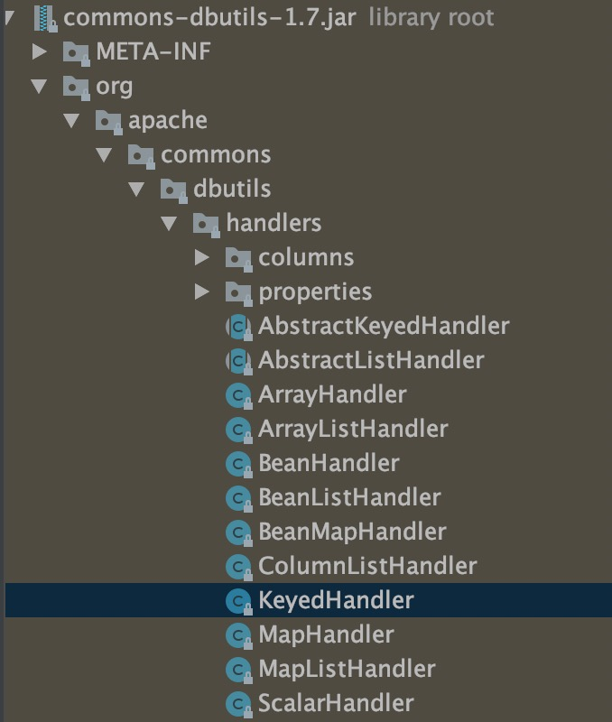
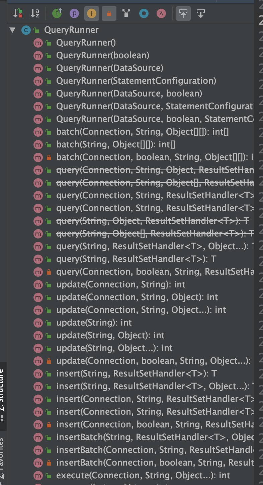
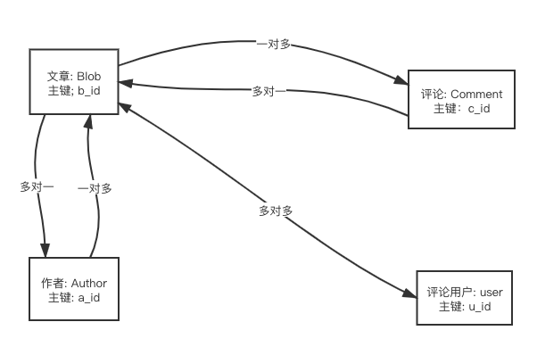

## Mybatis核心原理和常用方式

### 零、文章知识内容

- Mybatis 应用背景和相关特性
- Mybaits编程开发方式和核心对象
- Mybatis核心配置含义
- Mybatis高级用法和扩展方式


### 一、Mybatis 产生背景

#### 1.1 传统数据库JDBC连接方式

​		传统开发背景下, Java通过Jdk提供的 java.sql.* API常见数据库连接和执行对应的SQL语句, 可参考下面代码示例

```java
//1. 注册驱动
Class.forName("com.mysql.jdbc.Driver");
//2. 创建连接(打开链接)
conn = DriverManager.getConnection("jdbc:mysql://localhost:3306/mysql-start", "root", "senga");
//3. 创建语句集
stmt = conn.createStatement();
//4. 执行语句集
ResultSet rs = stmt.executeQuery(sql);
//5. 获取结果集
while (rs.next()) {
  Integer bid = rs.getInt("bid");
  String name = rs.getString("name");
  Integer authorId = rs.getInt("author_id");
  blog.setAuthorId(authorId);
  blog.setBid(bid);
  blog.setName(name);
}
//6. 关闭资源链接
rs.close();
stmt.close();
conn.close();
//7. 返回结果
return blog ;
```

​	操作步骤具体如下:

- 第一步, 通过添加的mysql依赖mysql-connector-java, 注册驱动依赖 Class.forName("com.mysql.jdbc.Mysql")

  ```java
  <dependency>
      <groupId>mysql</groupId>
      <artifactId>mysql-connector-java</artifactId>
      <version>5.1.21</version>
  </dependency>
  ```

- 第二步、通过jdk的java.sql.DriverManger创建连接 conn = DriverManager.getConnection(URL, user, pwd)

    **<font color="#f00">conn = DriverManager.getConnection("jdbc:mysql://localhost:3306/mysql-mybatis", "root", "root");</font>**

  - URL: 数据库连接地址 jdbc:mysql://localhost:3306/mysql-mybatis
  - user: root
  - password: root

- 第三步, 通过创建的conn创建语句集 stmt = conn.createStatement();

- 第四步, 执行语句集 ResultSet rs = stmt.executeQuery("Select * from blog where id = 10086")

- 第五步, 解析结果集

``` java
while (rs.next()) {
  Integer bid = rs.getInt("bid");
  String name = rs.getString("name");
  Integer authorId = rs.getInt("author_id");
  blog.setAuthorId(authorId);
  blog.setBid(bid);
  blog.setName(name);
}
```

- 第六步、关闭资源连接, 最好在finally进行资源处理
- 第七步、返回结果 return blog 


​	<font color="#f0f">**NOTE: 从上面操作步骤来看,执行流程比较固定, 如果每个连接处理都完全执行上述操作, 效率会非常低下, 如果存在多表联合处理，会更加的复杂, 代码的维护会非常艰难, 从上面代码执行流程, 有以下建议:**</font>

- 通过模版模式, 统一封装固定流程逻辑代码
- 创建连接池, 将连接资源统一维护, 避免连接的创建、关闭操作
- 剥离业务逻辑、数据逻辑, 降低耦合
- 针对不同的数据库, 对上层提供统一入口, 屏蔽底层连接不同数据源的方式
- 对结果集(ResultSet)封装统一处理方式, 屏蔽不同POJO造成的处理差异


#### 1.2 DbUtils 解决结果集映射

​	DbUtils解决的核心问题就是结果集的映射, 可以将ResultSet封装成JavaBean

- 解决方式: **反射**方式
- 存在问题: JavaBean定义的字断必须和表结构的字段保持一致, 不然反射会失败, 对应的字段值为 **null**

- DbUtils封装数据源的方式

```java
//1. 获取配置信息
HikariConfig config = new HikariConfig(PROPERTY_PATH);
//2. 创建数据源
dataSource = new HikariDataSource(config);
//3. 创建查询Runner
queryRunner = new QueryRunner(dataSource);
```

- DbUtils怎么把结果集转换成对象 ？

```
DbUtils里面提供了支持泛型的 ResultSetHandler, 对实体类Bean, List, Map可以进行转换
```



- QueryRunner提供的接口及ResultSetHandler使用方式




```java
//传入sql, 并添加处理ResultSet的Handler处理器
queryRunner.query(sql, new BeanListHandler<>(BlogDto.class))
```


#### 1.3 Spring JDBC管理Mybatis

​		Spring提供了模板方法JdbcTemplate, 来简化数据的操作, JdbcTemplate提供了下面的几个功能

-  解决了资源管理问题
- 结果集的处理(Spring提供了RowMapper, 可以把结果集转化为Java对象)

##### 1.3.1 RowMapper处理结果集

​		实现RowMapper接口, 充血rowMap方法转换ResultSet为JavaBean对象

```java
//Spring提供了RowMapper进行结果集处理
public class UserRowMapper implements RowMapper {
    @Override
    public Object mapRow(ResultSet resultSet, int i) throws SQLException {
        User user = new User();
        user.setId(resultSet.getInt("id"));
        user.setUserName(resultSet.getString("user_name"));
        user.setGender(resultSet.getString("gender"));
        user.setEmail(resultSet.getString("email"));

        return user;
    }
}

//DAO层调用时传入自定义的 RowMapper 类, 返回需要的结果集类型
public List<User> query(String sql){
    new JdbcTemplate( new DruidDataSource());
    return jdbcTemplate.query(sql,new UserRowMapper());
}
```


<font color="#f0f">**NOTE: 存在的问题, 每一个实体类对象, 都需要定义一个Mapper对象, 然后再编写每个字段映射的getString(), getInt() 字段转换代码, 增加了类的数量**</font>

##### 1.3.2 BaseRowMapper处理结果集

​		从1.3.1 中我们了解到, 存在下面需要处理的问题

- 针对每个不同的Bean对象需要分别定义RowMapper对象
- 字段下划线转驼峰, 需要字段映射时, 显示指定处理

下面定义通用的BaseRowMapper处理上面的问题

```java
public class BaseRowMapper<T> implements RowMapper<T> {

    private Class<?> targetClazz;
    private HashMap<String, Field> fieldMap;

    public BaseRowMapper(Class<?> targetClazz) {
        this.targetClazz = targetClazz;
        fieldMap = new HashMap<>();
        Field[] fields = targetClazz.getDeclaredFields();
        for (Field field : fields) {
            fieldMap.put(field.getName(), field);
        }
    }

    @Override
    public T mapRow(ResultSet rs, int arg1) throws SQLException {
        T obj = null;

        try {
            obj = (T) targetClazz.newInstance();

            final ResultSetMetaData metaData = rs.getMetaData();
            int columnLength = metaData.getColumnCount();
            String columnName = null;

            for (int i = 1; i <= columnLength; i++) {
                columnName = metaData.getColumnName(i);
                Class fieldClazz = fieldMap.get(camel(columnName)).getType();
                Field field = fieldMap.get(camel(columnName));
                field.setAccessible(true);

                // fieldClazz == Character.class || fieldClazz == char.class
                if (fieldClazz == int.class || fieldClazz == Integer.class) { // int
                    field.set(obj, rs.getInt(columnName));
                } else if (fieldClazz == boolean.class || fieldClazz == Boolean.class) { // boolean
                    field.set(obj, rs.getBoolean(columnName));
                } else if (fieldClazz == String.class) { // string
                    field.set(obj, rs.getString(columnName));
                } else if (fieldClazz == float.class) { // float
                    field.set(obj, rs.getFloat(columnName));
                } else if (fieldClazz == double.class || fieldClazz == Double.class) { // double
                    field.set(obj, rs.getDouble(columnName));
                } else if (fieldClazz == BigDecimal.class) { // bigdecimal
                    field.set(obj, rs.getBigDecimal(columnName));
                } else if (fieldClazz == short.class || fieldClazz == Short.class) { // short
                    field.set(obj, rs.getShort(columnName));
                } else if (fieldClazz == Date.class) { // date
                    field.set(obj, rs.getDate(columnName));
                } else if (fieldClazz == Timestamp.class) { // timestamp
                    field.set(obj, rs.getTimestamp(columnName));
                } else if (fieldClazz == Long.class || fieldClazz == long.class) { // long
                    field.set(obj, rs.getLong(columnName));
                }

                field.setAccessible(false);
            }
        } catch (Exception e) {
            e.printStackTrace();
        }

        return obj;
    }

    /**
     * 下划线转驼峰
     * @param str
     * @return
     */
    public static String camel(String str) {
        Pattern pattern = Pattern.compile("_(\\w)");
        Matcher matcher = pattern.matcher(str);
        StringBuffer sb = new StringBuffer(str);
        if(matcher.find()) {
            sb = new StringBuffer();
            matcher.appendReplacement(sb, matcher.group(1).toUpperCase());
            matcher.appendTail(sb);
        }else {
            return sb.toString();
        }
        return camel(sb.toString());
    }
}
```

#### 1.4 DbUtils和Spring Jdbc总结

​		<font color="#f0f">**这两个轻量级框架解决了什么问题 ？**</font>

- QueryRunner 和  JdbcTemplate，都维护了数据源, 连接资源的开启、关闭都交给了轻量级框架来处理, 不用人为手动创建、关闭

- 对通用的增删改查(CRUD)进行了封装, 不需要过多的写重复的代码

- 结果集的映射, 无论是JavaBean、List、Map

  

  <font color="#f0f">**存在的问题 ？**</font>	

- 存在硬编码问题, SQL语句写死在代码里面

- 由于参数通过占位符替换, 不能自动映射, 导致参数只能按照固定顺序传入(数组)

- 没有自动生成SQL功能, 仅支持结果集转JavaBean, 不支持JavaBean转SQL记录

- 查询没有换成功能


### 二、Hibernate(本片暂时不讲)

​		hibernate存在的问题

- 使用get()、save()、update()操作对象的方式, 实际操作的是所有字段, 不能指定部分字段, 不够灵活
- 全自动生成SQL, 如果要做一些优化的话, 非常困难, 可能出现性能问题
- 不支持动态SQL, 比如: 分表中的表名变化、条件、参数


### 三、MyBatis

​		“半自动化”的 ORM 框架 MyBatis 解决了第二节中提到的问题。“半自动化”是相对于 Hibernate 的全自动化来说的，它的封装程度没有 Hibernate 那么高，不会自 动生成全部的 SQL 语句，主要解决的是 SQL 和对象的映射问题; Mybatis设计思想之一, SQL和代码逻辑分离, 在开发效率、学习成本上面都有很大的优化。

​		**Mybatis解决的问题**

-  连接池对数据库连接的管理
- 业务逻辑和代码分离, 集中管理
- 参数映射和动态SQL生成
- 结果集映射JavaBean对象
- 重复SQL提取
- 查询结果的缓存管理
- plugin插件支持


#### 3.1 编程式使用Mybatis

​		**编程式方式对Mybatis使用, 需要包含下面的两个文件**

- 全局配置文件, mybatis-config.xml

- 接口映射文件mapper.xml

  **单独使用mybatis应用代码示例**

```java
//方式一 Statement ID
public void testStatement() throws IOException {
    String resource = "mybatis-config.xml";
    InputStream inputStream = Resources.getResourceAsStream(resource);
    SqlSessionFactory sqlSessionFactory = new SqlSessionFactoryBuilder().build(inputStream);

    SqlSession session = sqlSessionFactory.openSession();
    try {
      Blog blog = (Blog) session.selectOne("com.gupaoedu.mapper.BlogMapper.selectBlogById", 1);
      System.out.println(blog);
    } finally {
      session.close();
    }
}

//方式二 Mapper接口方式
public void testSelect() throws IOException {
    String resource = "mybatis-config.xml";
    InputStream inputStream = Resources.getResourceAsStream(resource);
    SqlSessionFactory sqlSessionFactory = new SqlSessionFactoryBuilder().build(inputStream);

    SqlSession session = sqlSessionFactory.openSession(); // ExecutorType.BATCH
    try {
        BlogMapper mapper = session.getMapper(BlogMapper.class);
        Blog blog = mapper.selectBlogById(1);
        System.out.println(blog);
    } finally {
      session.close();
    }
}

```

​		**statement ID方式和Mapper接口方式比较**

- StatementId方式存在硬编码问题
- StatementId方式不能在编译时进行类型检查
- Mapper接口方式都可以解决上面两种方式

#### 3.2 Mybatis核心对象生命周期

​		Mybatis存在SqlSessionFactoryBuiler、SqlSessionFactory、SqlSession、Mapper四大核心对象, 他们在Mybatis整个工作流程里面不同环节发挥重要作用

| 核心对象                | 创建时期                                                     |
| ----------------------- | ------------------------------------------------------------ |
| SqlSessionFactoryBuiler | 用来构建SqlSessionFactory, 全局只需要一个, 所以它的生命周期只存在于<font color="#f00">**方法内部**</font> |
| SqlSessionFactory       | 用来创建SqlSession, 每次对数据库的连接都需要创建SqlSession,所以他的生命周期是<font color="#f00">**应用作用域**</font> |
| SqlSession              | 非线程安全, 线程之间不能共享, 请求结束和方法执行完毕需要关闭连接, 所以它的生命周期是<font color="#f00">**单次请求操作中**</font> |
| Mapper                  | 代理对像从SqlSession获取, 发送SQL操作数据库数据, 作用域是<font color="#f0f">**SqlSession事务方法之内**</font> |

#### 3,3 Mybatis 一级标签

​		Mybatis提供了configuration、properties、settings、typeAliases、typeHandlers、objectFactory、plugins、environments(environment)、transactionManager、dataSource、mappers


#### 3.4 mybatis映射配置文件标签

​		cache、cache-ref、result-Map、sql、insert、update、delete、select

| 配置名称 | 配置含义 | 配置简介 |
| -------- | -------- | -------- |
|          |          |          |
|          |          |          |
|          |          |          |
|          |          |          |
|          |          |          |
|          |          |          |
|          |          |          |
|          |          |          |
|          |          |          |
|          |          |          |
|          |          |          |
|          |          |          |
|          |          |          |
|          |          |          |


### 四、Mybatis实践

​		本小节主要涉及Mybatis的高级用法和一些扩展方式, 以便更好的使用Mybatis

#### 4.1 为什么需要动态SQL

​		在进行SQL查询时, 前端传入的参数多数情况下会有多个, 进行SQL组装时, 根据参数的不同会存在很多的ifelse, 还需要注意SQL语句里面and，空格，逗号，转意符, 者是一件非常耗时的工作, 基于OGNL的动态SQL解决了这鳖问题

#### 4.2 动态分类

​		Mybatis主要分类四大类动态SQL标签, 如下:

​		if，choose(when、otherwise)，trim(where、set)，foreach

#### 4.3 动态SQL标签的用法

- if 标签 需要判断的时候, 判断条件写在test里面

```java
<select id="selectDept" parameterType="int" resultType="com.ityongman.model.Department">
  select * from tb_dept where 1=1
  <if test="deptId != null">
  		and dept_id = #{deptId,jdbcType=INTEGER}
  </if>
</select>
```

- choose(when, otherwise) 需要选择一个条件的时候

```java
    <select id="getEmpListChoose" resultMap="empMap" parameterType="com.ityongman.model.Employee">
        SELECT * FROM tb_emp e
        <where>
            <choose>
                <when test="empId !=null">
                    e.emp_id = #{emp_id, jdbcType=INTEGER}
                </when>
                <when test="empName != null and empName != ''">
                    AND e.emp_name LIKE CONCAT('%', #{emp_name, jdbcType=VARCHAR},'%')
                </when>
                <when test="email != null ">
                    AND e.email = #{email, jdbcType=VARCHAR}
                </when>
                <otherwise>
                </otherwise>
            </choose>
        </where>
    </select>
```

- trim(where、set)  用来指定或者去掉前缀、后缀，比如: where 、and、逗号(,) 之类符号的时候

```java
    <insert id="insertTrim" parameterType="com.ityongman.model.Employee">
        insert into tb_emp
        <trim prefix="(" suffix=")" suffixOverrides=",">
            <if test="empId != null">
                emp_id,
            </if>
            <if test="empName != null">
                emp_name,
            </if>
            <if test="gender != null">
                gender,
            </if>
            <if test="email != null">
                email,
            </if>
            <if test="dId != null">
                d_id,
            </if>
        </trim>
        <trim prefix="values (" suffix=")" suffixOverrides=",">
            <if test="empId != null">
                #{empId,jdbcType=INTEGER},
            </if>
            <if test="empName != null">
                #{empName,jdbcType=VARCHAR},
            </if>
            <if test="gender != null">
                #{gender,jdbcType=CHAR},
            </if>
            <if test="email != null">
                #{email,jdbcType=VARCHAR},
            </if>
            <if test="dId != null">
                #{dId,jdbcType=INTEGER},
            </if>
        </trim>
    </insert>

```

- foreach  需要便利集合的时候

```java
<delete id="deleteByList" parameterType="java.util.List">
		delete from tb_emp where emp_id in
    <foreach collection="list" item="item" open="(" separator="," close=")"> 
  			#item.empId,jdbcType=VARCHAR}
    </foreach>
</delete>
```


#### 4.4 批量操作(插入、更新、删除)

​		在进行批量操作的业务场景中, 比如通过文件批量添加用户、批量修改商户信息 , <font color="#f0f">**错误的做法是**: 通过for循环对数据进行伪批量插入、更新</font>, 其实这种方式是强烈不推荐的，如果存在成千上万条数据, 那么需要进行成千上万次数据库的连接、关闭操作, 这是非常消耗性能的操作, 即使使用连接池, 也是非常消耗性能的操作， 会使得数据库不堪重负。

​		Mybatis支持数据的批量操作， 包括批量插入、批量更新、批量删除

- 批量插入

批量插入是在values后面批量添加需要插入的数据, foreach标签格式如下，这种格式需要使用进行构造

```java
insert into tb_emp (emp_id, emp_name, gender,email, d_id) values ( ?,?,?,?,? ) , ( ?,?,?,?,? ) , ( ?,?,?,?,? ) , ( ?,?,?,?,? ) , ( ?,?,?,?,? ) , ( ?,?,?,?,? ) , ( ?,?,?,?,? ) , ( ?,?,?,?,? ) , ( ?,?,?,?,? ) , ( ?,?,?,?,? ) ;
```

```java
<insert id="batchInsert" parameterType="java.util.List" useGeneratedKeys="true">
    <selectKey resultType="long" keyProperty="id" order="AFTER">
    		SELECT LAST_INSERT_ID()
    </selectKey>
    insert into tb_emp (emp_id, emp_name, gender,email, d_id)
    values
    <foreach collection="list" item="emps" index="index" separator=",">
    	( #{emps.empId},#{emps.empName},#{emps.gender},#{emps.email},#{emps.dId} )
    </foreach>
</insert>
```

- 批量更新

批量更新是通过需要操作记录的主键或索引作进行匹配来指定的

```java
<update id="updateBatch">
    update tb_emp set
    emp_name =
    	<foreach collection="list" item="emps" index="index" separator=" " open="case emp_id" 			close="end">
    		when #{emps.empId} then #{emps.empName}
  		</foreach>
    ,gender =
    	<foreach collection="list" item="emps" index="index" separator=" " open="case emp_id" 			close="end">
    		when #{emps.empId} then #{emps.gender}
  		</foreach>
    ,email =
    	<foreach collection="list" item="emps" index="index" separator=" " open="case emp_id" 			close="end">
    		when #{emps.empId} then #{emps.email}
  		</foreach>
    where emp_id in
    	<foreach collection="list" item="emps" index="index" separator="," open="(" close=")">
    		#{emps.empId}
  		</foreach>
</update>
```

- 批量删除

批量删除是通过in来进行指定的, 格式如下:

```java
delete from table tb_emp where emp_id in (?,?,?,?) ;
```

```java
<delete id="deleteBatch">
  delete from table tb_emp where emp_id in
  <foreach collection="list" item="item" open="(" separator="," close=")"> 
  			#item.empId,jdbcType=VARCHAR}
  </foreach>
</delete>
```


<font color="#f0f">**NOTE:**</font>

​	MySQL对数据包的接收存在一定的限制，默认接收的数据包的大小为4M(max_allowed_packet), 在进行数据批量操作的时候, 拼接的SQL可能特别大, 可能会出现下面的报错, 针对这个问题， 我们需要默认配置才可以解决这个问题

```java
Caused by: com.mysql.jdbc.PacketTooBigException: Packet for query is too large (7188967 > 4194304). You can change this value on the server by setting the max_allowed_packet' variable
```

#### 4.5 Batch Executor(批量执行器)

​		执行器主要分为三种: **SIMPLE,  REUSE, BATCH** , 执行器的选择可以通过下面的方式进行配置

方式一、配置文件配置

```java
<setting name="defaultExecutorType" value="BATCH" />
```

方式二、创建会话的时候指定执行器类型

```java
SqlSession session = sqlSessionFactory.openSession(ExecutorType.BATCH) ;
```


#### 4.6 嵌套查询(关联)/N+1/延迟加载

​		在进行查询的时候, 必然会出现关联查询的情况，比如查询订单关联商品、查询用户关联部门、用户登陆关联权限

 

​	关联查询的配置方式：**嵌套结果、嵌套查询**

- 嵌套结果

```java
<!-- 根据文章查询作者，一对一查询的结果，嵌套查询 -->
<!-- 联合查询，将 author 的属性映射到 ResultMap -->
<resultMap id="BlogWithAuthorResultMap" type="com.ityongman.domain.Blog">
   <id column="bid" property="bid" jdbcType="INTEGER"/>
   <result column="name" property="name" jdbcType="VARCHAR"/>
   <association property="author" javaType="com.ityongman.domain.Author">
     <id column="author_id" property="authorId"/>
     <result column="author_name" property="authorName"/>
   </association>
</resultMap>
```


- 嵌套查询

```java
<!-- 另一种联合查询 (一对一)的实现，但是这种方式有“N+1”的问题 -->
<resultMap id="blogWithAuthorQueryMap" type="com.ityongman.domain.Blog">
  <id column="bid" property="bid" jdbcType="INTEGER"/>
  <result column="name" property="name" jdbcType="VARCHAR"/>
  <association property="author" javaType="com.gupaoedu.domain.Author"
  	column="author_id" select="selectAuthor"/>
</resultMap>
<!-- 嵌套查询 -->
<select id="selectAuthor" parameterType="int" resultType="com.gupaoedu.domain.Author">
	select author_id authorId, author_name authorName from author where author_id = 
  #{authorId}
</select>
```

​	<font color="#f0f">**N+1问题：嵌套查询**是分两次进行结果查询, 在进行一次文章查询(所谓的1), 如果返回了N条记录, 就会再发送N条查询到数据库进行作者信息查询, 这个就是所谓的 N+1问题 </font>

- 如何解决嵌套查询的N+1问题 ?  **懒加载**

可以通过延迟加载(懒加载)的方式解决N+1问题， 其中:

**lazyLoadingEnabled：决定了是否启用延迟加载**

**aggressiveLazyLoading: 决定了是不是对象的所有方法都会触发查询**

```java
<!--延迟加载的全局开关。当开启时，所有关联对象都会延迟加载。默认 false -->
<setting name="lazyLoadingEnabled" value="true"/> 
<!--当开启时，任何方法的调用都会加载该对象的所有属性。默认 false，可通过 select 标签的 fetchType 来覆盖-->
<setting name="aggressiveLazyLoading" value="false"/>
<!-- Mybatis 创建具有延迟加载能力的对象所用到的代理工具，默认 JAVASSIST -->
<setting name="proxyFactory" value="CGLIB" />
```

#### 4.7 逻辑分页、物理分页

- 逻辑分页

Mybaits提供了RowBounds逻辑分页对象, 里面提供了两个参数offset, limit

```java
public class RowBounds {
    public static final int NO_ROW_OFFSET = 0;
    public static final int NO_ROW_LIMIT = 2147483647;
    public static final RowBounds DEFAULT = new RowBounds();
    private final int offset;
    private final int limit;
  	//省略getter、 setter方法
}
```

在进行Mapper调用时, 引用的接口关联RowBounds参数即可, 不需要修改xml中SQL语句

```java
public List<Blog> selectBlogList(RowBounds rowBounds);

int start = 10; // offset，从第几行开始查询 int pageSize = 5; // limit，查询多少条 RowBounds rb = new RowBounds(start, pageSize); List<Blog> list = mapper.selectBlogList(rb); for(Blog b :list){
System.out.println(b); }
```

<font color="#00f">**mybatis底层是如何做到的呢 ？**</font>

Mybatis底层其实是对ResultSet的处理，它会舍弃前offset条数据, 再取后面limit条数据

```java
// DefaultResultSetHandler.java
private void handleRowValuesForSimpleResultMap(ResultSetWrapper rsw, ResultMap resultMap, ResultHandler<?> resultHandler, RowBounds rowBounds, ResultMapping parentMapping) throws SQLException {
        DefaultResultContext<Object> resultContext = new DefaultResultContext();
        ResultSet resultSet = rsw.getResultSet();
        this.skipRows(resultSet, rowBounds);

        while(this.shouldProcessMoreRows(resultContext, rowBounds) && !resultSet.isClosed() && resultSet.next()) {
            ResultMap discriminatedResultMap = this.resolveDiscriminatedResultMap(resultSet, resultMap, (String)null);
            Object rowValue = this.getRowValue(rsw, discriminatedResultMap, (String)null);
            this.storeObject(resultHandler, resultContext, rowValue, parentMapping, resultSet);
        }

    }
```

<font color="#00f">**mybatis逻辑分页存在的问题？**</font>

因为数据的处理是在内存中进行的, 如果数据量很大, 这种分页方式效率会很低下，推荐使用物理分页


- 物理分页

  物理分页是通过数据库支持的分页方式来进行分页的

  - **传统分页方式, 传入分页参数(或包装page信息)**

    ```java
    <select id="selectBlogPage" parameterType="map" resultMap="BaseResultMap"> 40
    咕泡出品，必属精品 www.gupaoedu.com
         select * from blog limit #{curIndex} , #{pageSize}
    </select>
    ```

    它存在两个问题:

    1. 需要java代码计算起止符
    2. 每个需要翻页的Statement都需要编写limit语句, 会造成Mapper存在很多冗余的代码

  - **分页插件PageHelper(拦截器实现)**

  ```java
  // pageSize 每一页几条
  PageHelper.startPage(pn, 10);
  List<Employee> emps = employeeService.getAll(); // navigatePages 导航页码数
  PageInfo page = new PageInfo(emps, 10);
  return Msg.success().add("pageInfo", page);
  ```

  

### 五、

### 六、

