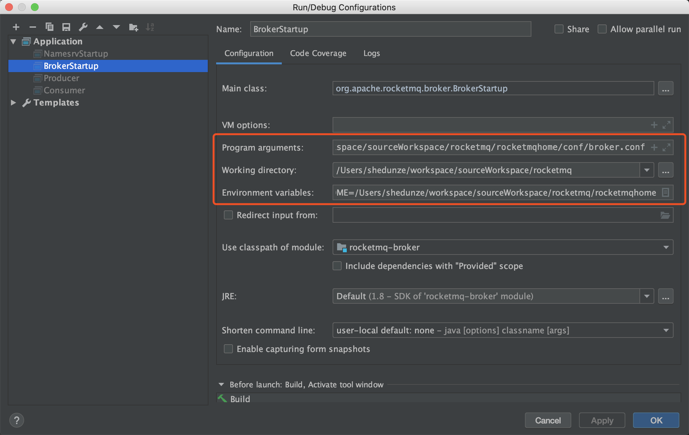

# Rocketmq源码调试环境搭建

​		研究一款优秀的开源中间件，了解它的整体架构以及如何在开发环境调试源代码是比不可少的, 了解使用方式、原理、代码逻辑， 才能快速熟悉一个开源项目, 才能抽丝剥茧理解透彻。本篇文章主要讲解如何搭建Rocketmq源码环境、如何调试Rocketmq源码、初步了解Rocketmq设计原理

- Rocketmq源代码的获取和调试
- RocketMq设计理念


## 一、Rocketmq源码的获取的调试

​		这里主要以Idea为编译环境，讲解Rocketmq源码环境的搭建, **eclipse暂时不提供, 后期补充**

### 1.1 Rocketmq 源码的获取

​		访问github仓库代码地址 https://github.com/apache/rocketmq , 可以看到下面的源码相关信息


#### 1.1.1 下载源代码

- 方式一、直接下载

从上面仓库地址截图中直接复制仓库链接地址 https://github.com/apache/rocketmq.git , 在需要存放代码的workspace通过git命令 git clone进行下载

- 方式二、在idea中直接引用下载地址


#### 1.1.2 源码导入idea

​	这里以方式一进行说明

- 进入指定目录， 通过git clone下载代码

``` shell
git clone https://github.com/apache/rocketmq.git
```


- idea导入刚刚下载的rocketmq源码


- 源码导入, 并下载相关的依赖包


- 执行命令

```shell
mvn clean package -Dmaven.test.skip=true // 开始时最好跳过test, 不然可能会报错
```


### 1.2 运行nameSvr

​	打开namesvr工程 NamesrvStartup.java 文件, 右键选择 Run As 或 Debug As运行, 输出下面的运行结果

```java
Please set the ROCKETMQ_HOME variable in your environment to match the location of the RocketMQ installation
Disconnected from the target VM, address: '127.0.0.1:60842', transport: 'socket'

Process finished with exit code 254

```

按照下面的操作步骤配置rocketmq_namesrv相关的参数信息

- 打开Edit Configurations配置页面


- 选择需要配置的内容项


- 配置 ROCKETME_HOME参数


- 在ROCKETMQ_HOME目录下创建conf、stroe、logs目录
- 创建配置文件

将 distribution 工程目录conf下logback_broker.xml、breker.conf拷贝到 ROCKETMQ_HOME/conf目录下

- 修改配置文件信息

  - 修改logback_broker.xml文件存放位置, %ROCKETMQ_HOME%/logs
  - 修改logback_namesrv.xml文件存放位置, %ROCKETMQ_HOME%/logs
  - 修改broker.conf文件的配置信息如下

  ```java
  brokerClusterName = DefaultCluster
  brokerName = broker-a
  brokerId = 0
  #nameServer地址, 分号分割
  namesrvAddr=127.0.0.1:9876
  deleteWhen = 04
  fileReservedTime = 48
  brokerRole = ASYNC_MASTER
  flushDiskType = ASYNC_FLUSH
  #存储路径
  storePathRootDir=%ROCKETMQ_HOME%/store
  #commitLog存储路径
  storePathCommitLog=%ROCKETMQ_HOME%/store/commitlog
  #消费队列存储路径
  storePathConsumeQueue=%ROCKETMQ_HOME%/store/consumequeue
  #消息索引存储路径
  storePathIndex=%ROCKETMQ_HOME%/store/index
  #checkpoint 文件存储路径
  storeCheckpoint=%ROCKETMQ_HOME%/store/checkpoint
  #abort文件存储路径
  abortFile=%ROCKETMQ_HOME%/store/abort
  ```

- 运行namesrv

运行结果如下

```java
Connected to the target VM, address: '127.0.0.1:62459', transport: 'socket'
The Name Server boot success. serializeType=JSON
```


### 1.3 运行broker

​		展开broker模块,运行BrokerStartup.java文件, 右键选择Run As 或 Debug As, 运行结果如下:

```java
Connected to the target VM, address: '127.0.0.1:63027', transport: 'socket'
Please set the ROCKETMQ_HOME variable in your environment to match the location of the RocketMQ installationDisconnected from the target VM, address: '127.0.0.1:63027', transport: 'socket'

Process finished with exit code 254
```

按照下面的步骤配置broker的配置参数

- 打开Edit Configurations配置页面

  

- 选择需要配置的内容项(**注意配置参数不能缺少, 不然后面的测试可能会不通过**)




- 配置ROCKETMQ_HOME参数


- 修改配置参数

请参照1.1.3 中参数配置即可

- 运行broker

运行结果如下

```java
// 控制台输出下面的结果
Connected to the target VM, address: '127.0.0.1:63460', transport: 'socket'
The broker[shedunzedeMacBook-Pro.local, [fe80:0:0:0:3ae4:b4e7:ca9a:afbc%utun1]:10911] boot success. serializeType=JSON

// %ROCKETMQ_HOMT%/logs/rocketmqlogs/broker.log
  2020-02-12 15:34:41 INFO main - The broker[shedunzedeMacBook-Pro.local, [fe80:0:0:0:3ae4:b4e7:ca9a:afbc%utun1]:10911] boot success. serializeType=JSON
2020-02-12 15:34:51 INFO BrokerControllerScheduledThread1 - dispatch behind commit log 0 bytes
2020-02-12 15:34:51 INFO BrokerControllerScheduledThread1 - Slave fall behind master: 0 bytes
2020-02-12 15:35:41 INFO TransactionalMessageCheckService - create new topic TopicConfig [topicName=RMQ_SYS_TRANS_HALF_TOPIC, readQueueNums=1, writeQueueNums=1, perm=RW-, topicFilterType=SINGLE_TAG, topicSysFlag=0, order=false]
2020-02-12 15:35:51 INFO BrokerControllerScheduledThread1 - dispatch behind commit log 0 bytes
2020-02-12 15:35:51 INFO BrokerControllerScheduledThread1 - Slave fall behind master: 0 bytes
2020-02-12 15:36:51 INFO BrokerControllerScheduledThread1 - dispatch behind commit log 0 bytes
2020-02-12 15:36:51 INFO BrokerControllerScheduledThread1 - Slave fall behind master: 0 bytes
```


### 1.4 运行测试用例, 查看通信是否正常

- 运行Producer

```java
public class Producer {
    public static void main(String[] args) throws MQClientException, InterruptedException {
        DefaultMQProducer producer = new DefaultMQProducer("please_rename_unique_group_name");
        producer.setNamesrvAddr("127.0.0.1:9876");
        producer.start();

        for (int i = 0; i < 1000; i++) {
            try {
                Message msg = new Message("TopicTest" /* Topic */,
                    "TagA" /* Tag */,
                    ("Hello RocketMQ " + i).getBytes(RemotingHelper.DEFAULT_CHARSET) /* Message body */
                );
                SendResult sendResult = producer.send(msg);
              
                System.out.printf("%s%n", sendResult);
            } catch (Exception e) {
                e.printStackTrace();
                Thread.sleep(1000);
            }
        }
        producer.shutdown();
    }
}
```


- 运行Consume

```java
public class Consumer {
    public static void main(String[] args) throws InterruptedException, MQClientException {
        DefaultMQPushConsumer consumer = new DefaultMQPushConsumer("please_rename_unique_group_name_4");
        consumer.setNamesrvAddr("127.0.0.1:9876");
        consumer.setConsumeFromWhere(ConsumeFromWhere.CONSUME_FROM_FIRST_OFFSET);
        consumer.subscribe("TopicTest", "*");
        consumer.registerMessageListener(new MessageListenerConcurrently() {
            @Override
            public ConsumeConcurrentlyStatus consumeMessage(List<MessageExt> msgs,
                ConsumeConcurrentlyContext context) {
              
                System.out.printf("%s Receive New Messages: %s %n", Thread.currentThread().getName(), msgs);
                return ConsumeConcurrentlyStatus.CONSUME_SUCCESS;
            }
        });
        consumer.start();
        System.out.printf("Consumer Started.%n");
    }
}
```


## 二、rocketmq项目结构

### 2.1 项目结构

​	首先查看下吗目录结构图示


### 2.2 核心目录说明

- broker：broker模块(broker启动进程)
- namesrv: NameServer实现相关类
- remoting: 远程通信模块
- store: 消息存储实现相关类
- Openmessaging: 消息开放标准
- client: 消息客户端, 包含消息生产者、消费者相关的类
- filter：消息过滤相关的基础类
- filtersrv： 消息过滤服务器实现相关类(Filter启动进程)
- test: 工具类, 监控工具相关实现类
- srvutil: 服务器工具类
- common; 公共包
- distribution: 部署实例文件夹
- example: RocketMQ示例代码


## 三、Rocketmq相关基础知识

### 3.1 Rocketmq设计体现

​	Rocketmq基于主题的发布订阅模式, 核心功能包含消息发送、消息消费、消息存储啊(broker), 整体追求简单与性能, 体现在下面三个部分

- NameServer设计简单

摒弃了业界常用的zookeeper作为注册中心的方式，通过自研的NameServer作为注册中心, 来管理元数据(Topic路由信息), Topic路由信息无需在集群中保持强一致, 只需保持最终一致性， 并能容忍一定程度的信息不一致, 这种情况保证了NameServer之间是互不通信的, 也降低了NameServer实现的复杂性, 性能也相对zookeeperyou了很大的提高。

- IO存储机制

Rocketmq追求消息发送高吞吐量, Rocketmq存储文件设计成<font color="#f0f">**文件组**</font>方式, 文件组内单个文件大小固定, 方便引入内存映射机制, 所有主题的消息存储都是基于顺序写, 很大程度提高了消息写能力; 引入的<font color="#0f0">**消息消费队列和索引文件**</font>, 也很大程度的提高了消息消费、消息查找能力

- 消息只一定被消费、消息只消费一次

Rocketmq提供了灵活的设计方式, 将某些工作交给Rocketmq使用者, 比如消息一定被消费、消息指消费一次, Rocketmq没有对这两个问题给出解决方案, 而是只保证消息被消费, 消息的重复问题通过幂等来处理, 这在一定程度上简化了消息中间件的内核， 使得消息发送高可用变得非常简单和高效


### 3.2 Rocketmq架构模式

​	采用发布订阅的模式, 参与组件包括:  消息发送者、消息消费者、路由发现、消息存储服务

### 3.3 顺序消费

​	消息消费者按照消息达到消息存储服务器顺序进行消费, Rocketmq可以严格保证消息顺序(commitlog)

### 3.4 消息过滤

​	消息消费者对同一主题下的消息按照一定的规则，只消费自己感兴趣那部分，Rockemq的过滤机制(Filter)支持服务端和消费端过滤机制

​	1) broker端过滤, broker只将消费者感兴趣的消息发送给消费端

​	2) 消息消费端过滤, 由消费端自己过滤, 问题: 会将很多无用的信息发送给消费端

### 3.5 消息存储

​	消息的存储能力包含: 消息堆积能力、消息存储性能, Rocketmq引入了内存映射机制, 所有主题的消息顺序存储在同一个文件中，为了避免消息的无限堆积, 引入了消息文件过期机制与文件存储空间报警机制。

### 3.6 消息高可用

影响消息可靠性情况

- Broker正常关机
- Broker异常Crash
- OS Crash
- 机器断电, 立即恢复供电情况
- 机器无法开机
- 磁盘损坏

上面1～4情况在**同步刷盘**机制下可以确保消息不丢失, **异步刷屏**模式下可能丢失部分信息, 5~6情况属于单点故障, 如果发生信息将不可回复

### 3.7 消息至少费消费一次

Rocketmq通过ACK的方式确保消息至少被消费一次

### 3.8 回朔消息

某些情况下，由于业务需要需要重新消费消息，rocketmq支持按照时间回朔，可以向前或向后回硕

### 3.9 定时消息

定时消息是指消息发送到broker之后, 在指定时间点或特定时间段之后才能消费消息, rocketmq不支持任意精读的定时消息, 这样需要对消息进行排序, 需要很大的性能开销。

### 3.10 消息重试机制

在消息发送异常时, ACK确认消息失败后, rocketmq支持消息重试机制，重新发送消息进行尝试