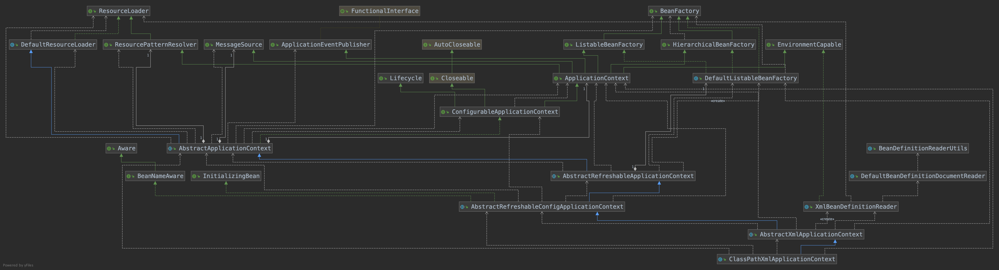

## Spring IOC容器初始化流程

### 一、概要

**	文章将会从定位、加载、注册三大步骤来说明IOC初始化流程(这里以Xml文件初始化方式进行说明)**

​	在进行详细流程讲解前, 请先看一下下面的类结构图; 这里IOC初始化流程中涉及到核心类包含:

- ClassPathXmlApplicationContext
- AbstractXmlApplicationContext
- AbstractRefreshableApplicationContext
- AbstractApplicationContext
- XmlBeanDefinitionReader
- DefaultBeanDefinitionDocumentReader
- BeanDefinitionParserDelegate
- BeanDefinitionReaderUtils
- DefaultListableBeanFactory (BeanDefinitionRegistry)

### 二、IOC容器相关知识点

#### 2.1 IOC和DI

- IOC(Inversion Of Control) 控制反转, 所谓控制反转, 是将传统**new方式创建对象和处理对象之间关系**的控制权交给Spring容器, 由Spring容器来控制**对象的创建和对象之间关系的处理**
- DI(Dependency Injection)依赖注入, 对象之间的依赖由容器来控制, 被动的接受依赖类, 而不是主动的去查找; **需要说明的是依赖的类是容器初始化的时候(lazyInit=false)或getBean(String beanName)时候容器主动注入进去, 而不是接口调用的过程中从容器中查询**
- DL(Dependency Lookup)依赖查询, 对象之间的关系可能需要调用者进行干预, 具有侵入性, 并且Spring容器主要使用的是DI, 不是DL,这里不对DL做详细说明, spring中DL和DI之间的区别可以参考下面这篇文章

https://stackoverflow.com/questions/28039232/what-is-the-difference-between-dependency-injection-and-dependency-look-up

### 三、IOC容器初始化流程

​	IOC初始化流程将通过定位、加载、注册三个步骤来说明

#### 3.1 资源定位

#### 3.2 资源加载

#### 3.3 资源注册

