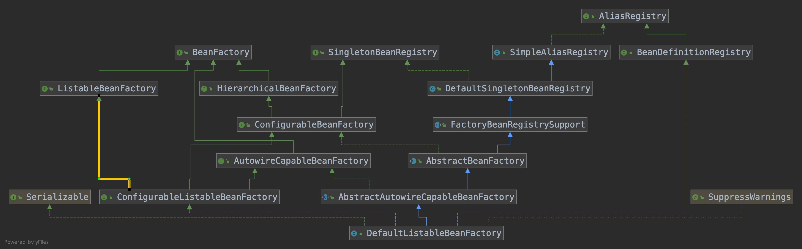

## Spring IOC容器初始化流程

### 一、概要

**<font color="#ff00">	文章将会从定位、加载、注册三大步骤来说明IOC初始化流程(这里以Xml文件初始化方式进行说明)</font>**

​	在进行详细流程讲解前, 请先看一下下面的类结构图; 这里IOC初始化流程中涉及到核心类包含:

- ClassPathXmlApplicationContext
- AbstractXmlApplicationContext
- AbstractRefreshableApplicationContext
- AbstractApplicationContext
- XmlBeanDefinitionReader
- DefaultBeanDefinitionDocumentReader
- BeanDefinitionParserDelegate
- BeanDefinitionReaderUtils
- DefaultListableBeanFactory (BeanDefinitionRegistry)


### 二、IOC容器相关知识点

#### 2.1 IOC和DI

- IOC(Inversion Of Control) 控制反转, 所谓控制反转, 是将传统**<font color="#ffoo">new方式创建对象和处理对象之间关系</font>**的控制权交给Spring容器, 由Spring容器来控制**<font color="#ffoo">对象的创建和对象之间关系的处理</font>**
- DI(Dependency Injection)依赖注入, 对象之间的依赖由容器来控制, 被动的接受依赖类, 而不是主动的去查找; <font color="#ff00">**需要说明的是依赖的类是容器初始化的时候(lazyInit=false)或getBean(String beanName)时候容器主动注入进去, 而不是接口调用的过程中从容器中查询**</font>
- DL(Dependency Lookup)依赖查询, 对象之间的关系可能需要调用者进行干预, 具有侵入性, 并且Spring容器主要使用的是DI, 不是DL,这里不对DL做详细说明, spring中DL和DI之间的区别可以参考下面这篇文章

https://stackoverflow.com/questions/28039232/what-is-the-difference-between-dependency-injection-and-dependency-look-up

#### 2.2 资源信息相关问题

- <font color="#ee33">对象和对象之间关系表示方式 ?--> xml、properties</font>
- <font color="#00e">描述对象之间关系的文件存放位置 ? --> classpath、filesystem、URL网络资源、ServletContext等</font>
- <font color="#aabb">如何统一不同配置文件中描述的对象? --> 存在统一的关于对象的定义, 所有外部的描述都必须转化成这个统一的对象</font>
- <font color="#00ff">对不同的配置文件如何进行解析 --> 不同的配置文件有不同的解析器, 根据策略模式, 采用对应的解析器</font>

#### 2.3 Spring核心类图

##### 2.3.1 BeanFactory

​	从类名可以知道, Bean的创建采用的是工厂模式, 可以查看下面图示, IOC容器为了方便管理对象和对象之间的关系, 提供了很多便利的基础服务



​	BeanFactory作为最顶层的接口, 定义了IOC容器基本功能规范, 接口包含的核心方法可以查看下面的代码, 其还包括下面三个核心实现类: <font color="#0ef">ListableBeanFactory、HierarchicalBeanFactory、AutowireCapableBeanFactory</font>, 从类图中可以看到它们统一的实现子类是DefaultListableBeanFactory, 它实现了所有的接口

​	Spring定义的这些核心类都有其使用场景, 它们共同定义了Bean集合、Bean之间的关系、Bean行为

- ListableBeanFactory, 表示这些Bean是可列表化的
- HierarchicalBeanFactory, 表示这些Bean有继承关系, 也就是这些Bean有可能有父Bean
- AutowireCapableBeanFactory, 定义这些Bean自动装配规则

```
public interface BeanFactory {
	String FACTORY_BEAN_PREFIX = "&";
	Object getBean(String name) throws BeansException;
	<T> T getBean(String name, Class<T> requiredType) throws BeansException;
	Object getBean(String name, Object... args) throws BeansException;
	<T> T getBean(Class<T> requiredType) throws BeansException;
	<T> T getBean(Class<T> requiredType, Object... args) throws BeansException;
	<T> ObjectProvider<T> getBeanProvider(Class<T> requiredType);
	<T> ObjectProvider<T> getBeanProvider(ResolvableType requiredType);
	boolean containsBean(String name);
	boolean isSingleton(String name) throws NoSuchBeanDefinitionException;
	boolean isPrototype(String name) throws NoSuchBeanDefinitionException;
	//... 省略其它的方法
	@Nullable
	Class<?> getType(String name) throws NoSuchBeanDefinitionException;
	String[] getAliases(String name);
}
```

##### 2.3.2 ApplicationContext

​	ApplicationContext是Spring提供的一个高级IOC容器, 查看下面类图, 它除了能够提供IOC的基本功能, 还提供了下面的功能

- 支持信息源，可以实现国际化(实现 MessageSource 接口)
- 访问资源(实现 ResourcePatternResolver 接口，后面章节会讲到)
- 支持应用事件(实现 ApplicationEventPublisher 接口)


##### 2.3.3 BeanDefinition

​	Spring IOC容器**管理**了我们定义的Bean对象和Bean对象之间的关系, 而Bean对象是通过BeanDefinition来描述的, 可以查看下面的类结构图


##### 2.3.4 BeanDefinitionReader

​	Bean的解析过程非常复杂, 功能分的很细, 为了应对可能的变化, 必须保持足够的灵活性, Bean的解析主要是对Spring配置文件的解析, 而这个过程主要是通过BeanDefinitionReader来实现的, 下面是类图


### 三、IOC容器初始化流程

​	IOC初始化流程将通过定位、加载、注册三个步骤来说明

#### 3.1 资源定位

​	ApplicationContext允许上下文嵌套, 以维持一个上下文体系, 对Bean的查找可以在这个上下文体系中进行查找, 先通过查找自己上下文, 再查找父上下文, 向上层层查找。

​	用过Spring的同学应该知道下面代码块的含义,创建一个上下文, 并指定定义Bean信息和Bean关系的配置文件路径

```java
ApplicationContext context = new ClasspathXmlApplicationContext("classpath:application.properties");
```

​	查询ClasspathXmlApplicationContext类的构造函数

```java
// ClassPathXmlApplicationContext构造方法
public ClassPathXmlApplicationContext(String... configLocations) throws BeansException {
		this(configLocations, true, null);
}

public ClassPathXmlApplicationContext(
			String[] configLocations, boolean refresh, @Nullable ApplicationContext parent)
			throws BeansException {

		super(parent);// 为容器设置 Bean 资源加载器
		setConfigLocations(configLocations); // 设置资源路径
		if (refresh) {
			refresh(); //加载、注册入口(通过装饰器、策略模式, 其它加载Bean方式也是这个入口)
		}
}
```

​	

```java
public AbstractApplicationContext(@Nullable ApplicationContext parent) {
		this();
		setParent(parent);
}

//获取一个Spring Source的加载器用于读入Spring Bean定义资源文件
protected ResourcePatternResolver getResourcePatternResolver() {
  //AbstractApplicationContext继承DefaultResourceLoader，因此也是一个资源加载器
  //Spring资源加载器，其getResource(String location)方法用于载入资源
  return new PathMatchingResourcePatternResolver(this);
}
```

​	AbstractApplicationContext默认构造方法中调用PathMatchingResourcePatternResolver构造方法创建资源加载器, 在设置资源加载器之后通过 setConfigLocations(configLocations)对配置资源的定位, IOC容器初始化时, 会将配置信息封装为Resource

```java
//解析Bean定义资源文件的路径，处理多个资源文件字符串数组
public void setConfigLocations(@Nullable String... locations) {
		if (locations != null) {
			Assert.noNullElements(locations, "Config locations must not be null");
			this.configLocations = new String[locations.length];
			for (int i = 0; i < locations.length; i++) {
				// resolvePath为同一个类中将字符串解析为路径的方法
				this.configLocations[i] = resolvePath(locations[i]).trim();
			}
		}
		else {
			this.configLocations = null;
		}
}

// 下面资源位置都是合理的
ClassPathResource res = new ClassPathResource("a.xml,b.xml");
ClassPathResource res =new ClassPathResource(new String[]{"a.xml","b.xml"});
```


#### 3.2 资源加载

​	<font color="#00ff">资源加载的入口是reresh()方法, refresh()方法使用了模版模式, 定义了IOC容器启动流程, 特定的逻辑交给子类去实现, 下面是具体的代码逻辑</font>

```java
public void refresh() throws BeansException, IllegalStateException {
		synchronized (this.startupShutdownMonitor) {
			// Prepare this context for refreshing.
			//调用容器准备刷新的方法，获取容器的当时时间，同时给容器设置同步标识
			prepareRefresh();

			// Tell the subclass to refresh the internal bean factory.
			//告诉子类启动refreshBeanFactory()方法，Bean定义资源文件的载入从
			//子类的refreshBeanFactory()方法启动
			ConfigurableListableBeanFactory beanFactory = obtainFreshBeanFactory(); //资源载入入口
			
      // 下面代码开始, 都是注册信息源和生命周期事件相关
			// Prepare the bean factory for use in this context.
			//为BeanFactory配置容器特性，例如类加载器、事件处理器等
			prepareBeanFactory(beanFactory);

			try {
				// Allows post-processing of the bean factory in context subclasses.
				//为容器的某些子类指定特殊的BeanPost事件处理器
				postProcessBeanFactory(beanFactory);

				// Invoke factory processors registered as beans in the context.
				//调用所有注册的BeanFactoryPostProcessor的Bean
				invokeBeanFactoryPostProcessors(beanFactory);

				// Register bean processors that intercept bean creation.
				//为BeanFactory注册BeanPost事件处理器.
				//BeanPostProcessor是Bean后置处理器，用于监听容器触发的事件
				registerBeanPostProcessors(beanFactory);

				// Initialize message source for this context.
				//初始化信息源，和国际化相关.
				initMessageSource();

				// Initialize event multicaster for this context.
				//初始化容器事件传播器.
				initApplicationEventMulticaster();

				// Initialize other special beans in specific context subclasses.
				//调用子类的某些特殊Bean初始化方法
				onRefresh();

				// Check for listener beans and register them.
				//为事件传播器注册事件监听器.
				registerListeners();

				// Instantiate all remaining (non-lazy-init) singletons.
				//初始化所有剩余的单例Bean
				finishBeanFactoryInitialization(beanFactory);

				// Last step: publish corresponding event.
				//初始化容器的生命周期事件处理器，并发布容器的生命周期事件
				finishRefresh();
			}

			catch (BeansException ex) {
				if (logger.isWarnEnabled()) {
					logger.warn("Exception encountered during context initialization - " +
							"cancelling refresh attempt: " + ex);
				}

				// Destroy already created singletons to avoid dangling resources.
				//销毁已创建的Bean
				destroyBeans();

				// Reset 'active' flag.
				//取消refresh操作，重置容器的同步标识.
				cancelRefresh(ex);

				// Propagate exception to caller.
				throw ex;
			}

			finally {
				// Reset common introspection caches in Spring's core, since we
				// might not ever need metadata for singleton beans anymore...
				resetCommonCaches();
			}
		}
}
```

​	<font color="#aabb">obtainFreshBeanFactory方法通过调用子类容器AbstractRefreshableApplicationContext.refreshBeanFactory()方法载入Bean配置信息</font>

```java
protected ConfigurableListableBeanFactory obtainFreshBeanFactory() {
		//这里使用了委派设计模式，父类定义了抽象的refreshBeanFactory()方法，具体实现调用子类容器的		refreshBeanFactory()方法
		refreshBeanFactory();
		ConfigurableListableBeanFactory beanFactory = getBeanFactory();
		if (logger.isDebugEnabled()) {
			logger.debug("Bean factory for " + getDisplayName() + ": " + beanFactory);
		}
		return beanFactory;
}
```

​	下面是AbstractRefreshableApplicationContext类真正实现Bean加载和注册的逻辑代码

- hasBeanFactory() 校验beanFactory之前是否已经创建过, 如果创建过则销毁
- 创建IOC容器DefaultListableBeanFactory, 并对容器进行定制化设置
- 调用方法loadBeanDefinitions(beanFactory), 进行资源加载, 具体信息参考下一步

```java
protected final void refreshBeanFactory() throws BeansException {
		//如果已经有容器，销毁容器中的bean，关闭容器
		if (hasBeanFactory()) {
			destroyBeans();
			closeBeanFactory();
		}
		try {
			//创建IOC容器
			DefaultListableBeanFactory beanFactory = createBeanFactory();
			beanFactory.setSerializationId(getId());
			//对IOC容器进行定制化，如设置启动参数，开启注解的自动装配等
			customizeBeanFactory(beanFactory);
			//调用载入Bean定义的方法，主要这里又使用了一个委派模式，在当前类中只定义了抽象的loadBeanDefinitions方法，具体的实现调用子类容器
			loadBeanDefinitions(beanFactory);
			synchronized (this.beanFactoryMonitor) {
				this.beanFactory = beanFactory;
			}
		}
		catch (IOException ex) {
			throw new ApplicationContextException("I/O error parsing bean definition source for " + getDisplayName(), ex);
		}
	}
```

​	<font color="#ff00">调用子类AbstractXmlAppliationContext.loadBeanDefinitions(beanFactory)方法进行资源加载**(委派模式)**</font>

```java
protected void loadBeanDefinitions(DefaultListableBeanFactory beanFactory) throws BeansException, IOException {
		// Create a new XmlBeanDefinitionReader for the given BeanFactory.
		//创建XmlBeanDefinitionReader，即创建Bean读取器，并通过回调设置到容器中去，容  器使用该读取器读取Bean定义资源
		XmlBeanDefinitionReader beanDefinitionReader = new XmlBeanDefinitionReader(beanFactory);

		// Configure the bean definition reader with this context's
		// resource loading environment.
		//为Bean读取器设置Spring资源加载器，AbstractXmlApplicationContext的
		//祖先父类AbstractApplicationContext继承DefaultResourceLoader，因此，容器本身也是一个资源加载器
		beanDefinitionReader.setEnvironment(this.getEnvironment());
		beanDefinitionReader.setResourceLoader(this);
		//为Bean读取器设置SAX xml解析器
		beanDefinitionReader.setEntityResolver(new ResourceEntityResolver(this));

		// Allow a subclass to provide custom initialization of the reader,
		// then proceed with actually loading the bean definitions.
		//当Bean读取器读取Bean定义的Xml资源文件时，启用Xml的校验机制
		initBeanDefinitionReader(beanDefinitionReader);
		//Bean读取器真正实现加载的方法
		loadBeanDefinitions(beanDefinitionReader); // 查看下面的代码
	}

//Xml Bean读取器加载Bean定义资源
	protected void loadBeanDefinitions(XmlBeanDefinitionReader reader) throws BeansException, IOException {
		//获取Bean定义资源的定位
		Resource[] configResources = getConfigResources(); // 委派模式
		if (configResources != null) {
			//Xml Bean读取器调用其父类AbstractBeanDefinitionReader读取定位
			//的Bean定义资源
			reader.loadBeanDefinitions(configResources);
		}
		//如果子类中获取的Bean定义资源定位为空，则获取FileSystemXmlApplicationContext构造方法中setConfigLocations方法设置的资源
		String[] configLocations = getConfigLocations();
		if (configLocations != null) {
			//Xml Bean读取器调用其父类AbstractBeanDefinitionReader读取定位
			//的Bean定义资源
			reader.loadBeanDefinitions(configLocations);
		}
	}

```

​	从上面的代码来看, 资源加载的方法是loadBeanDefinitions, 这里以XmlBeanDefinitionReader举例说明, loadBeanDefinitions(configResources)实际调用的是父类AbstractBeanDefinitionReader.loadBeanDefinitions(Resource... resources)方法, XmlBeanDefinitionReader覆盖了父类的loadBeanDefinitions(EncodedResource encodedResource), 子类通过该方法载入XML形式Bean定义资源文件, 实际上是下面的两点:

​	1) 调用资源加载器的获取资源方法 resourceLoader.getResource(location)，获取到要加载的资源

​	2) 真正执行加载功能是其子类 XmlBeanDefinitionReader 的 loadBeanDefinitions()方法

​    <font color="#bbcc">从2.3.2 类图中, 观察ApplicationContext、ResourceLoader之间的关系, 实际调用的是DefaultResourceLoader中getSource()方法定位Resource, ClasspathXmlApplicationContext本身是DefaultResourceLoader实现类, 此时又回到了ClasspathXmlApplicationContext中。</font>

​	<font color="#ff00">针对加载单个指定位置的Bean定义资源文件, XmlBeanDefinitionReader调用ClasspathXmlApplicationContext父类DefaultResourceLoader的getResource(String location)方法获取想要的资源</font>, 具体可以查看下面的代码

```java
//获取Resource的具体实现方法
public Resource getResource(String location) {
		Assert.notNull(location, "Location must not be null");

		for (ProtocolResolver protocolResolver : this.protocolResolvers) {
			Resource resource = protocolResolver.resolve(location, this);
			if (resource != null) {
				return resource;
			}
		}
		//如果是类路径的方式，那需要使用ClassPathResource 来得到bean 文件的资源对象
		if (location.startsWith("/")) {
			return getResourceByPath(location);
		}
		else if (location.startsWith(CLASSPATH_URL_PREFIX)) {
			return new ClassPathResource(location.substring(CLASSPATH_URL_PREFIX.length()), getClassLoader());
		}
		else {
			try {
				// Try to parse the location as a URL...
				// 如果是URL 方式，使用UrlResource 作为bean 文件的资源对象
				URL url = new URL(location);
				return (ResourceUtils.isFileURL(url) ? new FileUrlResource(url) : new UrlResource(url));
			}
			catch (MalformedURLException ex) {
				// No URL -> resolve as resource path.
				//如果既不是classpath标识，又不是URL标识的Resource定位，则调用
				//容器本身的getResourceByPath方法获取Resource
				return getResourceByPath(location);
			}
		}
}
```

​	为了支持对各种资源的加载, Spring提供了下面几种资源抽象

- ClasspathResource

- URLResource

- FileSystemResource

​     <font color="#0066">资源加载之后, 需要对资源内容进行读取, 具体逻辑在XmlBeanDefinitionReader的loadBeanDefinition(EncodedResource encodedResource)方法中; Spring IOC 容器根据定位的 Bean 配置信息，将资源加载读入并转换成为 Document 对象, 至此资源加载结束, 后面通过registerBeanDefinitions()进行解析</font>, 具体可以查看下面的代码

```java
//这里是载入XML形式Bean定义资源文件方法
public int loadBeanDefinitions(EncodedResource encodedResource) throws BeanDefinitionStoreException {
		Assert.notNull(encodedResource, "EncodedResource must not be null");
		if (logger.isInfoEnabled()) {
			logger.info("Loading XML bean definitions from " + encodedResource.getResource());
		}

		Set<EncodedResource> currentResources = this.resourcesCurrentlyBeingLoaded.get();
		if (currentResources == null) {
			currentResources = new HashSet<>(4);
			this.resourcesCurrentlyBeingLoaded.set(currentResources);
		}
		if (!currentResources.add(encodedResource)) {
			throw new BeanDefinitionStoreException(
					"Detected cyclic loading of " + encodedResource + " - check your import definitions!");
		}
		try {
			//将资源文件转为InputStream的IO流
			InputStream inputStream = encodedResource.getResource().getInputStream();
			try {
				//从InputStream中得到XML的解析源
				InputSource inputSource = new InputSource(inputStream);
				if (encodedResource.getEncoding() != null) {
					inputSource.setEncoding(encodedResource.getEncoding());
				}
				//这里是具体的读取过程
				return doLoadBeanDefinitions(inputSource, encodedResource.getResource());
			}
			finally {
				//关闭从Resource中得到的IO流
				inputStream.close();
			}
		}
		catch (IOException ex) {
			throw new BeanDefinitionStoreException(
					"IOException parsing XML document from " + encodedResource.getResource(), ex);
		}
		finally {
			currentResources.remove(encodedResource);
			if (currentResources.isEmpty()) {
				this.resourcesCurrentlyBeingLoaded.remove();
			}
		}
}

protected int doLoadBeanDefinitions(InputSource inputSource, Resource resource) {
    //将XML文件转换为DOM对象，解析过程由documentLoader实现
    Document doc = doLoadDocument(inputSource, resource);  // 资源加载的最后一步
    //这里是启动对Bean定义解析的详细过程，该解析过程会用到Spring的Bean配置规则
    return registerBeanDefinitions(doc, resource); // 资源解析
}
```

​	上面的逻辑可以分为两个步骤

<font color="#00f">1) 首先调用XML的解析器将Bean配置信息转为Document对象, 但是这些Document对象每有按照Spring的Bean规则进行解析</font>

<font color="#0af">2) 按照Spring Bean规则对Document进行解析, 其解析流程在BeanDefinitionDocumentReader的实现类DefaultBeanDefinitionDocumentReader中</font>

#### 3.3 资源注册

​	BeanDefinitionDocumentReader的实现类DefaultBeanefinitionDocumentReader调用registerBeanDefinitions(Document doc, XmlReaderContext context)方法进行Document资源解析, 具体的执行逻辑在doRegisterBeanDefinitions(Element ele)方法, 请看下面代码

```java
//根据Spring DTD对Bean的定义规则解析Bean定义Document对象
public void registerBeanDefinitions(Document doc, XmlReaderContext readerContext) {
		//获得XML描述符
		this.readerContext = readerContext;
		logger.debug("Loading bean definitions");
		//获得Document的根元素
		Element root = doc.getDocumentElement();
		doRegisterBeanDefinitions(root);
}

protected void doRegisterBeanDefinitions(Element root) {
		//... 其它逻辑
  	
		//在解析Bean定义之前，进行自定义的解析，增强解析过程的可扩展性
		preProcessXml(root);
		//从Document的根元素开始进行Bean定义的Document对象
		parseBeanDefinitions(root, this.delegate);
		//在解析Bean定义之后，进行自定义的解析，增加解析过程的可扩展性
		postProcessXml(root);

		this.delegate = parent;
	}
```

​	解析默认元素(自定义元素暂时不分析, 其实原理差不多), 详细标签解析流程请自己查看相关代码, 为了减少篇幅, 这里不提供相关代码

```
//使用Spring的Bean规则解析Document元素节点
private void parseDefaultElement(Element ele, BeanDefinitionParserDelegate delegate) {
		//如果元素节点是<Import>导入元素，进行导入解析
		if (delegate.nodeNameEquals(ele, IMPORT_ELEMENT)) {
			importBeanDefinitionResource(ele);
		}
		//如果元素节点是<Alias>别名元素，进行别名解析
		else if (delegate.nodeNameEquals(ele, ALIAS_ELEMENT)) {
			processAliasRegistration(ele);
		}
		//元素节点既不是导入元素，也不是别名元素，即普通的<Bean>元素，
		//按照Spring的Bean规则解析元素
		else if (delegate.nodeNameEquals(ele, BEAN_ELEMENT)) {
			processBeanDefinition(ele, delegate);
		}
		else if (delegate.nodeNameEquals(ele, NESTED_BEANS_ELEMENT)) {
			// recurse
			doRegisterBeanDefinitions(ele);
		}
}
```


​	通过上面解析可以看出，使用 Spring 时，在 Spring 配置文件中可以使用<import>元素来导入 IOC 容器所需要的其他资源，Spring IOC 容器在解析时会首先将指定导入的资源加载进容器中。使用<ailas>别名时，Spring IOC 容器首先将别名元素所定义的别名注册到容器中。

​	对于既不是<import>元素，又不是<alias>元素的元素，即 Spring 配置文件中普通的<bean>元素的 解析由 BeanDefinitionParserDelegate 类的 parseBeanDefinitionElement()方法来实现。具体的实现类如下

```java
//解析Bean定义资源文件中的<Bean>元素，这个方法中主要处理<Bean>元素的id，name和别名属性@Nullable
public BeanDefinitionHolder parseBeanDefinitionElement(Element ele, @Nullable BeanDefinition containingBean) {
		//获取<Bean>元素中的id属性值
		String id = ele.getAttribute(ID_ATTRIBUTE);
		//获取<Bean>元素中的name属性值
		String nameAttr = ele.getAttribute(NAME_ATTRIBUTE);
		// ... 省略部分逻辑
		//详细对<Bean>元素中配置的Bean定义进行解析的地方
		AbstractBeanDefinition beanDefinition = parseBeanDefinitionElement(ele, beanName, containingBean); // 核心方法
		if (beanDefinition != null) {
			// ... 省略部分逻辑
			return new BeanDefinitionHolder(beanDefinition, beanName, aliasesArray);
		}
		//当解析出错时，返回null
		return null;
}
```

​	阅读上面代码, 知道Spring使用过程中对bean标签相关配置在上面代码中都有相关解析,

<font color="#f00">注意:在解析<Bean>元素过程中没有创建和实例化 Bean 对象，只是创建了 Bean 对象的定义类 BeanDefinition，将<Bean>元素中的配置信息设置到 BeanDefinition 中作为记录，当依赖注入时才 使用这些记录信息创建和实例化具体的 Bean 对象。</font>

注：这里省略了对Spring各种标签细节的分析, 比如: property、set、list、map, 使用过Spring的小伙伴应该知道这些标签的具体含义和作用, 这里为了节省篇幅不分析了

​	

​	执行完parseBeanDefinitionElement(Element ele, BeanDefinition configBean)方法后会返回BeanDefinitionHolder对象, Spring 通过BeanDefinitionReaderUtils.registerBeanDefinition(bdHolder, registry)方法进行Bean注册, 真正完成注册的是DefaultListableBeanFactory, 可以通过2.3.1查看类结构图, 具体代码如下

```java
//解析Bean定义资源Document对象的普通元素
protected void processBeanDefinition(Element ele, BeanDefinitionParserDelegate delegate) {
		BeanDefinitionHolder bdHolder = delegate.parseBeanDefinitionElement(ele);
		// BeanDefinitionHolder是对BeanDefinition的封装，即Bean定义的封装类
		//对Document对象中<Bean>元素的解析由BeanDefinitionParserDelegate实现
		// BeanDefinitionHolder bdHolder = delegate.parseBeanDefinitionElement(ele);
		if (bdHolder != null) {
			bdHolder = delegate.decorateBeanDefinitionIfRequired(ele, bdHolder);
			try {
				// Register the final decorated instance.
				//向Spring IOC容器注册解析得到的Bean定义，这是Bean定义向IOC容器注册的入口
				BeanDefinitionReaderUtils.registerBeanDefinition(bdHolder, getReaderContext().getRegistry());
			}
			catch (BeanDefinitionStoreException ex) {
				getReaderContext().error("Failed to register bean definition with name '" +
						bdHolder.getBeanName() + "'", ele, ex);
			}
			// Send registration event.
			//在完成向Spring IOC容器注册解析得到的Bean定义之后，发送注册事件
			getReaderContext().fireComponentRegistered(new BeanComponentDefinition(bdHolder));
		}
}
```

​	注册完成后, 会将BeanDefinition信息存储到Map中, 这里是beanDefinitionMap

```java
//存储注册信息的BeanDefinition
	private final Map<String, BeanDefinition> beanDefinitionMap = new ConcurrentHashMap<>(256);
```


### 四、小结

1、初始化的入口在容器实现中的 refresh()调用来完成。
2、对 Bean 定义载入 IOC 容器使用的方法是 loadBeanDefinition(),
其中的大致过程如下:通过 ResourceLoader 来完成资源文件位置的定位，DefaultResourceLoader 是默认的实现，同时上下文本身就给出了 ResourceLoader 的实现，可以从类路径，文件系统,URL 等 方式来定为资源位置。	如果是 XmlBeanFactory 作为 IOC 容器，那么需要为它指定 Bean 定义的资源，也就是说 Bean 定义文件时通过抽象成 Resource 来被 IOC 容器处理的，容器通过 BeanDefinitionReader 来完成定义信息的解析和 Bean 信息的注册,往往使用的是 XmlBeanDefinitionReader 来解析 Bean 的 XML 定义文件-实际的处理过程是委托给 BeanDefinitionParserDelegate 来完成的，从而得到 bean 的定义信息，这些信息在 Spring 中使用 BeanDefinition 对象来表示-这个名字可以让我们想到 loadBeanDefinition(),registerBeanDefinition() 这些相关方法。它们都是为处理 BeanDefinitin 服务的，容器解析得到 BeanDefinition 以后，需要把 它在 IOC 容器中注册，这由 IOC 实现 BeanDefinitionRegistry 接口来实现。注册过程就是在 IOC 容器 内部维护的一个 HashMap 来保存得到的 BeanDefinition 的过程。这个 HashMap 是 IOC 容器持有 Bean 信息的场所，以后对 Bean 的操作都是围绕这个 HashMap 来实现的。

​	然后我们就可以通过 BeanFactory 和 ApplicationContext 来享受到 Spring IOC 的服务了,在使用 IOC 容器的时候，我们注意到除了少量粘合代码，绝大多数以正确 IOC 风格编写的应用程序代码完全不用关 心如何到达工厂，因为容器将把这些对象与容器管理的其他对象钩在一起。基本的策略是把工厂放到已 知的地方，最好是放在对预期使用的上下文有意义的地方，以及代码将实际需要访问工厂的地方。Spring 本身提供了对声明式载入 web 应用程序用法的应用程序上下文,并将其存储在 ServletContext 中的框架 实现

3. BeanFactory 和 FactoryBean

​        在使用 Spring IOC 容器的时候我们还需要区别两个概念:BeanFactory 和 FactoryBean，其中 BeanFactory 指的是 IOC 容器的编程抽象，比如 ApplicationContext，XmlBeanFactory 等，这些都 是 IOC 容器的具体表现，需要使用什么样的容器由客户决定,但 Spring 为我们提供了丰富的选择。 FactoryBean 只是一个可以在 IOC 而容器中被管理的一个 Bean,是对各种处理过程和资源使用的抽 象,FactoryBean 在需要时产生另一个对象，而不返回 FactoryBean 本身,我们可以把它看成是一个抽象 工厂，对它的调用返回的是工厂生产的产品。所有的 FactoryBean 都实现特殊的 org.springframework.beans.factory.FactoryBean 接口，当使用容器中 FactoryBean 的时候，该容 器不会返回 FactoryBean 本身,而是返回其生成的对象。Spring 包括了大部分的通用资源和服务访问抽 象的 FactoryBean 的实现，其中包括:对 JNDI 查询的处理，对代理对象的处理，对事务性代理的处理， 对 RMI 代理的处理等，这些我们都可以看成是具体的工厂,看成是 Spring 为我们建立好的工厂。也就是 说 Spring 通过使用抽象工厂模式为我们准备了一系列工厂来生产一些特定的对象,免除我们手工重复的 工作，我们要使用时只需要在 IOC 容器里配置好就能很方便的使用了